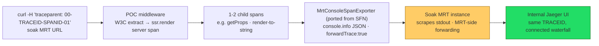

# POC Design: Distributed Tracing → MRT stdout → Jaeger (PWA Kit)

**Date:** 2026-06-10
**Status:** POC — throwaway, single PR, **not merged**. Validates the approach; clean implementation is broken into an epic + stories afterward.
**Repo:** `/Users/j.sheth/Documents/Salesforce/pwa/pwa-kit`
**Reference impl:** `storefront-next/packages/storefront-next-dev/src/otel/` (SFN)
**Related docs:** [Decision: Server Timing vs Distributed Tracing](./2026-06-10-server-timing-vs-distributed-tracing-decision.md) · HLD-264 · 1-Pager · `Odyssey/plans/2026-06-09-distributed-tracing-pwa-kit.md`

---

## 1. Goal

Prove the end-to-end distributed-tracing path for PWA Kit with the smallest possible change:

1. An incoming **W3C `traceparent`** is extracted from the request.
2. PWA Kit opens an `ssr.render` **server span parented onto it**, plus 1–2 example child spans.
3. Spans are emitted to **stdout** in the JSON shape MRT scrapes (SFN's `MrtConsoleSpanExporter`).
4. Once **deployed to the soak MRT instance** (which carries the MRT-side forwarding changes), the connected trace appears in **internal Jaeger** under the same trace ID.

**Non-goal:** production-quality code. This PR will not be merged. It exists to de-risk the approach and inform the story breakdown.

---

## 2. Key architectural facts (grounded in code + HLD)

- **PWA Kit does NOT POST to an OTLP collector.** Per the HLD export path, MRT heads write spans to **stdout**; MRT scrapes stdout and forwards them to the Gateway/Jaeger pipeline. There is **no ingest endpoint, no `:4318`, no exporter URL, no auth** for PWA Kit to configure. The exporter's only job is to print the right JSON shape. (HLD §3.7; SFN `mrt-console-span-exporter.ts`.)
- **OTel globals are process-wide singletons.** `provider.register()` and `propagation.setGlobalPropagator()` each have one winner. Today server_timing owns them (B3 + a no-exporter provider). The POC must **not** fight over them.
- **SFN's escape hatch:** get the tracer via `provider.getTracer()` (not the global `trace.getTracer()`) and use a propagator **instance** directly — never touch the global registry. This lets a second provider coexist with server_timing's globals. (SFN `setup.ts:66–82`.)
- **Outbound to SCAPI can't use `UndiciInstrumentation`.** `commerce-sdk-isomorphic` uses `require("node-fetch")` (v2.6.13), which does not emit the `diagnostics_channel` events Undici instrumentation hooks. Outbound propagation needs **manual injection** → deferred to a story, not in the POC.

---

## 3. Architecture



---

## 4. Components

### 4.1 New self-contained DT module — `packages/pwa-kit-react-sdk/src/ssr/server/distributed-tracing-poc.js`
- Own `NodeTracerProvider` with `resource: { 'service.name': 'pwa-kit-react-sdk' }`.
- `provider.addSpanProcessor(new SimpleSpanProcessor(new MrtConsoleSpanExporter()))`.
- Tracer obtained via **`provider.getTracer(...)`** — bypasses the global registry (SFN pattern).
- A module-local **`W3CTraceContextPropagator` instance** for extraction.
- **Never** calls `provider.register()` or `propagation.setGlobalPropagator()`.
- Initialized once, lazily, guarded against double-init.
- All OTel operations wrapped in try/catch — tracing failure must never break request handling.

### 4.2 `MrtConsoleSpanExporter` — ported from SFN
- Copy of `storefront-next-dev/src/otel/mrt-console-span-exporter.ts`, adapted to JS.
- Emits `console.info(JSON.stringify({traceId, parentId, name, id, kind, timestamp, duration, attributes, status, events, links, start_time, end_time, forwardTrace}))`.
- `forwardTrace` reflects the POC gate being on.
- This JSON shape is the MRT scrape contract.

### 4.3 Incoming extraction (extract-only)
- A wrapper/middleware at the SSR entry that:
  - calls `propagation.extract(context.active(), req.headers, /* W3C propagator instance */)`,
  - opens an active `ssr.render` server span via `tracer.startActiveSpan(...)` parented onto the extracted context,
  - sets a `traceparent` **response header** (browser-accessible trace id, mirrors SFN middleware),
  - ends the span on response close/finish (once-guard for both events).
- **Extract-only:** if no incoming `traceparent`, no DT span is created (no fresh-root minting in the POC).

### 4.4 Example child spans
- Hooked in at the existing `tracePerformance('ssr.render', …)` call site in `react-rendering.js` (`render()`), but behind a **new gate** (§4.5), independent of `?__server_timing`.
- Wrap ~2 existing phases (e.g. `getProps`/data fetch and render-to-string) as child spans of the server span to produce a visible waterfall.

### 4.5 Gate
- `process.env.OTEL_TRACING_ENABLED === 'true'`, always-on when set, no sampling.
- Distinct from server_timing's `shouldTrackPerformance` (`?__server_timing` / `SERVER_TIMING`), which is left exactly as-is.

### 4.6 Dependencies
- `@opentelemetry/sdk-trace-node`, `@opentelemetry/sdk-trace-base`, `@opentelemetry/resources`, `@opentelemetry/api`, `@opentelemetry/core` (W3C propagator) — all already present.
- **No new exporter dependency** (no OTLP HTTP/gRPC exporter — stdout is the transport).

---

## 5. What is explicitly NOT touched

`tracePerformance` · `initializeServerTracing` · `logSpanData` · `B3Propagator` / `x-b3-*` headers · `PerformanceTimer` · the `Server-Timing` response header. The POC is purely **additive** new code plus the new `OTEL_TRACING_ENABLED`-only gate at the render call site.

---

## 6. Verification

### 6.1 Local (span emission only)
```bash
OTEL_TRACING_ENABLED=true npm start   # http://localhost:3000
curl -H 'traceparent: 00-0af7651916cd43dd8448eb211c80319c-b7ad6b7169203331-01' \
     http://localhost:3000/
```
Confirm a `console.info` span-JSON line appears in stdout, with `traceId` = `0af7651916cd43dd8448eb211c80319c` and the child spans carrying matching `parentId`. **No Jaeger locally** — there is no MRT scraper on the laptop.

### 6.2 End-to-end (Jaeger)
```bash
pwa-kit-dev push --target <soak-env>   # generic placeholder; fill real target at run time
```
Then hit the soak URL (browser or curl with a `traceparent`), open the internal Jaeger UI, and find that exact trace ID rendered as a connected PWA Kit span waterfall.

> **Run-time confirmations (not blockers for writing the POC):** the soak MRT project slug + target name; that the soak instance's MRT-side forwarding to Jaeger is live.

---

## 7. Deferred to stories (NOT in this POC)

These are the clean-implementation items the POC deliberately leaves out:

1. Outbound `traceparent` → SCAPI/SLAS via **manual `node-fetch@2` injection** (not Undici), using `commerce-sdk-react`'s `headers` hook.
2. Full HLD attribute set (`service.instance.id`, `deployment.environment`, `service.namespace`, HTTP attrs, custom `site_name`/`client_id`/`realm`/`instance_type`).
3. Runtime-configurable sampling (head-sampling, per-path rates).
4. Flag-gate untangle cleanup + production-grade module structure.
5. Fresh-root minting when no incoming `traceparent`.
6. Real config for the enablement flag + deploy target (no hardcoded values).
7. B3 retirement + MRT cutover coordination (see the decision doc's "Critical dependency").

---

## 8. Proposed epic + story breakdown (for GUS)

**Epic:** Distributed Tracing for PWA Kit (W3C, MRT → Jaeger)

| # | Story | Summary |
|---|---|---|
| 1 | **DT provider + MRT console exporter** | Self-contained provider (non-global tracer) + ported `MrtConsoleSpanExporter`; converge span JSON shape with SFN. |
| 2 | **Incoming `traceparent` extraction + server span** | W3C extract, `ssr.render` server span, `traceparent` response header; extract + fresh-root minting. |
| 3 | **Per-phase child spans (always-on)** | Convert SSR performance phases to child spans gated on tracing (not `?__server_timing`); decouple gates cleanly. |
| 4 | **Outbound `traceparent` → SCAPI** | Manual injection through `commerce-sdk-react` headers hook; test asserting the header on a SCAPI call. |
| 5 | **HLD attributes** | Resource + HTTP + custom attributes per HLD; `url.path` only (no token/PII leakage). |
| 6 | **Runtime sampling** | Head-sampling decision from runtime-configurable rate; per-path rates in the config shape. |
| 7 | **B3 → W3C migration + MRT cutover** | Dual-header transition window, coordinate MRT reading `traceparent`, retire B3. |
| 8 | **Export-path alignment + convergence** | Confirm stdout reaches the gateway; converge schema with SFN; consider shared MRT-OTel package. |

> Story 1–3 roughly correspond to what this POC exercises in throwaway form; 4–8 are net-new clean work.
