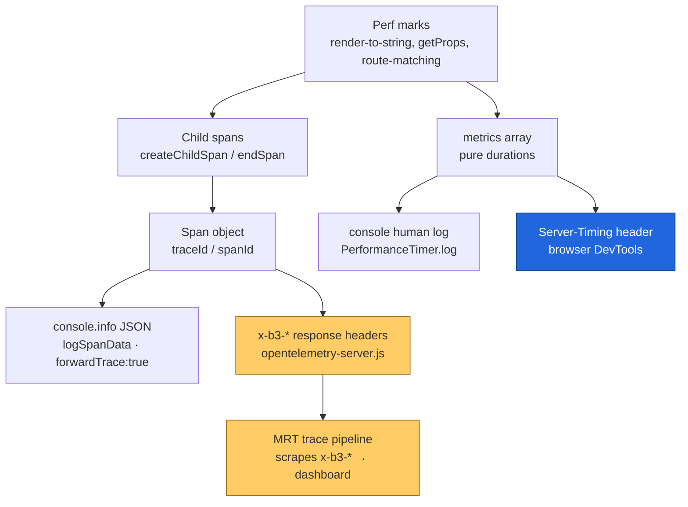
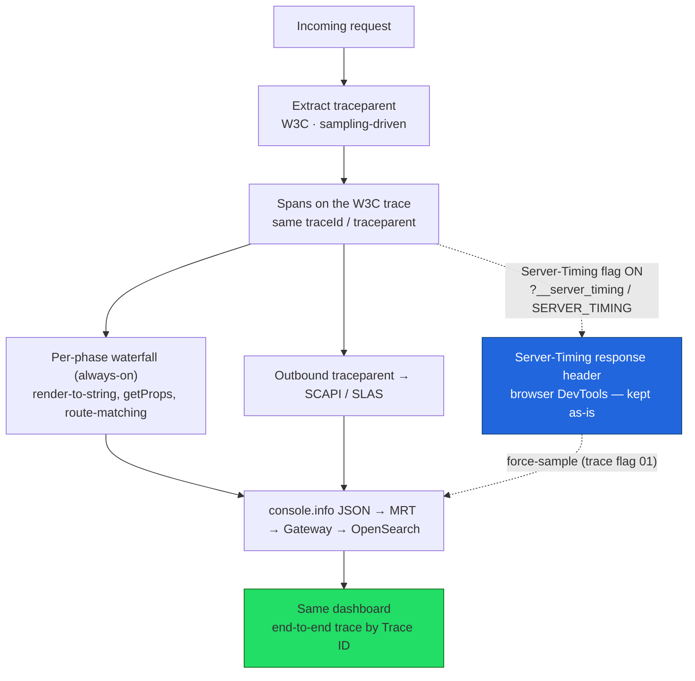

<!-- g-docs:doc_id=11mDLD-g52KuO1z8EV-qb0E9TyXtb_I6xXyHyMmv8iKc -->
**Google Doc:** https://docs.google.com/document/d/11mDLD-g52KuO1z8EV-qb0E9TyXtb_I6xXyHyMmv8iKc/edit

# Decision: Should `__server_timing` be its own tracing? (PWA Kit)

**Date:** 2026-06-10
**Scope:** PWA Kit only. This doc answers **one** question and intentionally excludes the overview/HLD (covered in the [1-Pager](https://docs.google.com/document/d/12jkIuwvVIFwr9tl9QjrlilL5XgMR9oTJRwhbBQw2jyk/edit) and [HLD-264](https://docs.google.com/document/d/142IjOc0LpbkY8xb3kVX3-3Yptz6M7rgbM1n2IUOMDzU/edit)).
**Verified against:** `packages/pwa-kit-react-sdk/src/` on `develop`.

---

## The question

We must choose before implementing distributed tracing:

1. **Keep B3 exclusively for `__server_timing`** — leave it as-is, reuse parts, and build W3C distributed tracing separately. Two propagators, two paths.
2. **Fold `__server_timing` into the new distributed-tracing implementation** — one W3C path, override the current implementation.

The deciding sub-question: *Is `__server_timing` tracing a **subset** of distributed tracing that can be unified onto W3C without losing functionality — or is it doing something genuinely different that must stay independent (even if migrated to W3C)?*

---

## Answer (TL;DR)

**`__server_timing` is NOT its own kind of tracing. Choose Option 2 — unify on a single W3C tracing layer and drop B3.**

- The span/timing layer under `__server_timing` is a **subset** of distributed tracing. It unifies onto W3C.
- The **only** genuinely distinct asset is the browser-facing **`Server-Timing` HTTP response header** (DevTools → Network → Timing). That is not "separate tracing" — it is a thin **derived view** over the same spans, and it is **propagator-independent**. We keep it as-is for easy local access.
- **B3 is currently load-bearing for export.** MRT scrapes the **`x-b3-*` response headers** to correlate traces. So the B3→W3C swap is **not free** — it needs MRT to switch to reading `traceparent`, which means a **transition window emitting both `traceparent` and `x-b3-*`** until MRT cuts over. The *end state* is still W3C-only (a temporary dual-header shim, then drop B3). **This is the headline cross-team dependency — see "Critical dependency" below.**
- Both outputs converge on **one W3C `traceparent`** and the **same dashboard**.

---

## How it works today (verified in code)

`__server_timing` currently bundles **several outputs** behind one switch, all derived from the same spans/marks. The one that matters most for migration: **MRT's trace pipeline ingests the `x-b3-*` response headers**, which makes B3 load-bearing for export.

| Output | Source in code | Role of B3 |
|---|---|---|
| **Human-readable phase log** — `ssr.render-to-string - 42ms` to console | `PerformanceTimer.log()` (`performance.js:59`), called at `react-rendering.js:279` | ❌ None. Reads `metrics[]` (pure durations). |
| **Span JSON** — `console.info(JSON.stringify(spanData))` with `forwardTrace:true` | `logSpanData()` (`opentelemetry.js:69`) | ❌ None. Reads `span.spanContext().traceId` **off the span object**, not any header. |
| **`Server-Timing` response header** — to the browser | `buildServerTimingHeader()` (`performance.js:43`) → `react-rendering.js:282` | ❌ None. Built from `metrics[]`. |
| **`x-b3-*` response headers** | `opentelemetry-server.js:138-140` | ✅ **Load-bearing — MRT scrapes these** to correlate the trace into the pipeline. |

**The `x-b3-*` headers are the trace-correlation contract with MRT.** Both the headers and the span JSON read `traceId` from the **same span object**, but they are independent sinks: the headers carry the B3 *format* (`x-b3-traceid` / `x-b3-spanid` / `x-b3-sampled`), and MRT's pipeline reads that format. Changing the propagator changes the **header format MRT receives** — so this is the piece that cannot change unilaterally.

### Will replacing the propagator break anything?

**The console logs: no. The MRT export correlation: yes — that's the dependency to manage.**

- **Console outputs are safe.** Swapping `B3Propagator` → `W3CTraceContextPropagator` does **not** touch `PerformanceTimer.log()` or `logSpanData()`. A span has a `traceId`/`spanId` regardless of which propagator is registered, so both console outputs fire identically after the swap.
- **MRT export is NOT safe to change unilaterally.** Because MRT scrapes the `x-b3-*` **response headers** to correlate traces, replacing those headers with `traceparent` in one step would **break correlation** until MRT is updated to read `traceparent`. This is the crux of the migration and the reason a transition shim is required (below).

### Are the metrics still "available somewhere"?

**Yes — and on a better surface.** The per-phase performance metrics are *already_ OTel spans: every `mark(name,'start')` calls `createChildSpan` (`performance.js:100`), and the `console.info(JSON.stringify(...))` line **is** the export path MRT scrapes. After the W3C migration:

- Today those child spans are **orphaned** — root-only, no incoming `traceparent` extraction — so they form a disconnected island.
- After migration they become a **span waterfall stitched into the full end-to-end trace** (eCDN → MRT → SCAPI → JWA → ECOM), correlated by one Trace ID.

The per-phase durations don't vanish; they graduate from "isolated debug spans + a browser header" to "child spans inside the real distributed trace."

> **Dependency (HLD open question #2):** "available on the dashboard" rests on MRT stdout forwarding `console.info` JSON to the Gateway/OpenSearch pipeline. Confirm this link; add an OTLP exporter only if stdout forwarding doesn't reach the gateway.

---

## The effort gap (the reuse argument)

The net-new distributed-tracing work — **incoming `traceparent` extraction, outbound `traceparent` to SCAPI/SLAS, sampling, HLD attributes, decoupling from the debug switch** — is **identical and unavoidable in both options.** The only delta between Option 1 and Option 2 is what happens to the existing B3/server-timing code.

| Component | Option 2 (unify on W3C) | Option 1 (keep B3 separate) |
|---|---|---|
| `opentelemetry-config.js` | ♻️ reuse | ♻️ reuse |
| `opentelemetry.js` (span creation, `logSpanData` JSON) | ♻️ reuse | ♻️ reuse — but now referenced by **two** pipelines |
| `performance.js` (`PerformanceTimer`, Server-Timing header, marks→spans) | ♻️ reuse as-is | ♻️ reuse as-is |
| Propagator | ✏️ B3 → W3C, behind a **transition window** (emit both, then drop B3) | ❄️ freeze B3 globally **+** stand up a 2nd W3C path |
| Response headers | ✏️ emit **both `traceparent` + `x-b3-*`** until MRT cuts over, then drop `x-b3-*` | ❄️ keep `x-b3-*` **+** add `traceparent` separately |
| **MRT cutover** (read `traceparent`) | ⚠️ **required once**, cross-team | ⚠️ still required for the W3C path |
| Provider lifecycle | ♻️ one provider | ❌ **two** provider/processor lifecycles to init + shut down |
| **Net-new DT work** (extraction, outbound, sampling, attrs) | build once | build once |

**Option 1 saves no reuse.** Every reusable piece is reused *equally* in both options, and the MRT cutover to `traceparent` is required either way. What Option 1 *adds* is the cost of freezing a B3 path and running a **second parallel span/provider pipeline** — exactly the duplication we want to avoid. And because OTel's global propagator is a singleton, "two separate paths" structurally forces a permanent dual-propagator.

**Effort gap:** Both options must (a) build the net-new DT work and (b) get MRT onto `traceparent`. Option 2 then does it with **one** pipeline and a **temporary** dual-header shim that retires once MRT cuts over. Option 1 does it with a **second permanent pipeline + frozen B3**. Option 2 is strictly less work and strictly more reuse — the dual-header is a short-lived migration aid, not a standing architecture.

---

## Proposed design

**One W3C tracing layer. B3 dropped. Two independent flags controlling two outputs, both riding the same spans and the same `traceparent`.**

### The two decoupled toggles

1. **Distributed tracing** — sampling-driven, production traffic, always-on per sample rate. Emits the **full per-phase waterfall** + outbound propagation → end-to-end trace on the dashboard. *(The per-phase detail is the most valuable part of MRT timing, so it is the rich default — not gated behind the debug flag.)*
2. **`Server-Timing` flag** (`?__server_timing` / `SERVER_TIMING`) — on-demand, browser-facing, **kept as-is** for easy DevTools access. Independent of the tracing sample rate. When enabled it:
   - emits the `Server-Timing` response header (unchanged behavior), **and**
   - **force-samples** the trace (sets trace flag `01`) so the developer's on-demand request **always** appears end-to-end on the dashboard, via the **same W3C `traceparent`**.

### Decisions locked

| Topic | Decision |
|---|---|
| Propagator | **W3C only at end state.** Temporary dual-header (`traceparent` + `x-b3-*`) during MRT cutover, then drop B3. No *permanent* dual-propagator. |
| `Server-Timing` header | **Keep as-is**, on its own flag, for browser DevTools access. |
| Per-phase span granularity | **Always-on** under distributed tracing (not gated behind the debug flag). |
| On-demand visibility | `?__server_timing` **force-samples** (trace flag `01`) so it always reaches the dashboard. |
| Convergence | Both outputs use the **same `traceparent`** and land on the **same dashboard**. |

---

## Critical dependency — MRT consumes `x-b3-*`

**MRT's trace pipeline scrapes the `x-b3-*` response headers** to correlate PWA Kit traces. This is the linchpin of the migration:

- It makes B3 **load-bearing for export today** — you cannot just swap the propagator and delete `x-b3-*` without breaking trace correlation on the dashboard.
- The migration therefore requires a **coordinated cutover with the MRT platform team**: PWA Kit emits **both `traceparent` and `x-b3-*`** during a transition window → MRT switches to reading `traceparent` → PWA Kit drops `x-b3-*`. End state is W3C-only.

> **Verification needed (this is the #1 open question, owned cross-team):** This behavior is **platform-side and not verifiable from the PWA Kit repo** — no in-repo code reads `x-b3-*` (the only references are the three `setHeader` writes). Confirm with the **MRT platform team**: (1) that MRT ingests `x-b3-*` for correlation, (2) whether/when MRT can read `traceparent`, and (3) the sequencing of the dual-header transition. The decision (Option 2, W3C end state) holds regardless of the answer, but the **rollout plan depends entirely on it.**

---

## Recommendation

**Option 2.** `__server_timing`'s span layer is a subset of distributed tracing and unifies onto W3C. Its one distinct asset — the browser `Server-Timing` header — stays as an independently-toggled derived view that, when enabled, force-samples onto the same W3C trace and the same dashboard.

The one caveat that shapes the **rollout** (not the decision): because **MRT scrapes `x-b3-*` today**, the B3→W3C swap is not unilateral. Ship a **temporary dual-header window** (`traceparent` + `x-b3-*`), coordinate MRT's cutover to `traceparent`, then retire B3 → W3C-only. Confirm MRT's behavior with the platform team as the #1 action item.
