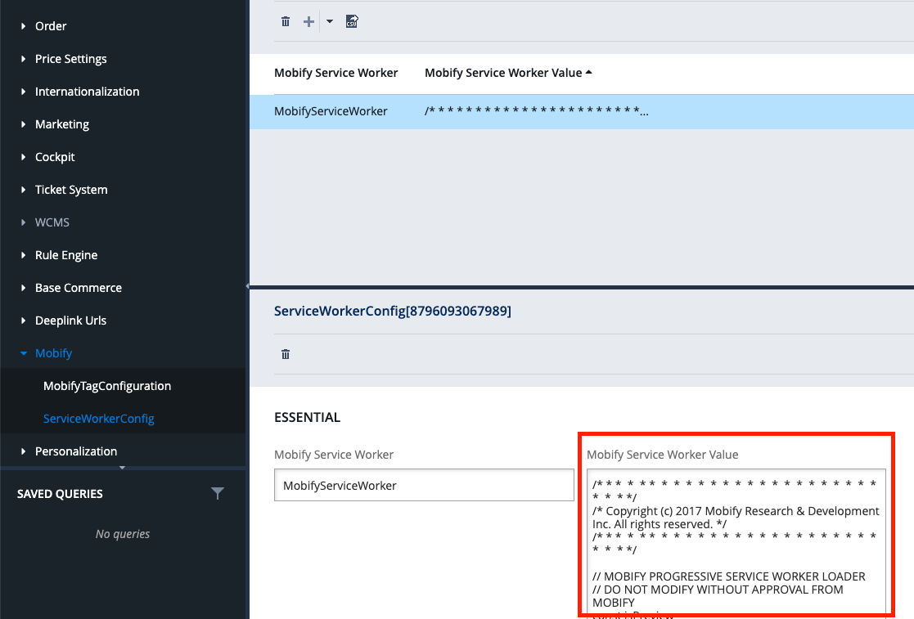

import Tabs from 'progressive-web-sdk/dist/components/tabs/tabs'
import TabsPanel from 'progressive-web-sdk/dist/components/tabs/tabs-panel'

## Introduction

Commerce Integrations is an SDK that provides a data layer for working with ecommerce backends.
It's based on an interface module, [CommerceConnector](/apis-and-sdks/commerce-integrations/connectors/interfaces),
that defines a standard set of methods for common actions and data access across different backends.
The SDK also includes prebuilt connector classes ([SalesforceConnector](/apis-and-sdks/commerce-integrations/connectors/sfcc)
and [HybrisConnector](/apis-and-sdks/commerce-integrations/connectors/hybris)) that implement the [CommerceConnector](/apis-and-sdks/commerce-integrations/connectors/interfaces) interface to communicate with popular ecommerce backends. You can create your own custom implementation of the interface for other backends, and you can customize the existing connectors by extending and overriding their methods. It also includes the [ScrapingConnector](/how-to-guides/categories/guides/web-scraping) that you can use as a starting point accessing data on an existing website.

The SDK is distributed via NPM ([@mobify/commerce-integrations](https://www.npmjs.com/package/@mobify/commerce-integrations)).

<figure class="u-text-align-center" style="background-color: #fafafa;">


<figcaption>
    Commerce Integrations provide a layer of abstraction between your PWA and your site’s ecommerce
    backend.
</figcaption>

</figure>

## Backend flexibility

Commerce Integrations gives you flexibility with your ecommerce backend. You can add new apps that use the same connector code or change ecommerce backends without making extensive changes to your application code!

For example, imagine you were using Salesforce B2C Commerce. You’d use the [SalesforceConnector](/apis-and-sdks/commerce-integrations/connectors/sfcc) to talk to it like this:

```javascript
import {SalesforceConnector} from '@mobify/commerce-integrations/dist/connectors/sfcc'

const connector = SalesforceConnector.fromConfig({
    basePath: 'https://zzrf-001.sandbox.us01.dx.commercecloud.salesforce.com/s/RefArch/dw/shop/v17_8',
    defaultHeaders: {
        'x-dw-client-id': 'aaaaaaaaaaaaaaaaaaaaaaaaaaaaaa'
    }
})

// Application code accesses the backend using the connector:
connector.getCategory('root').then((category) => {
    console.log(category)
})
```

Later, if you wanted to transition to another backend, you would just update your connector. Your application code remains the same:

```javascript
import {HybrisConnector} from '@mobify/commerce-integrations/dist/connectors/hybris

const connector = HybrisConnector.fromConfig({
    basePath: 'https://hybris.merlinspotions.com/rest/v2/apparel-uk/',
    catalogId: 'apparelProductCatalog',
    catalogVersionId: 'Online',
})

// Same application code
connector.getCategory('root').then((category) => {
    console.log(category)
})
```

## Essential concepts

To write a connector that successfully communicates with your backend, it's important that you understand the following before proceeding:

### Implementing interfaces

To use the Commerce Integrations SDK correctly, you should be familiar with how interfaces work.

An interface defines the signature of a class including its method names, expected arguments and return values. An interface **does not** define how those methods should work. That’s where you come in! You implement the connector by writing code for _all_ the methods that the connector interface defines.

To reduce bugs later, write your connector methods so that they perform data-centric fetches, not page-centric fetches. For example, rather than storing page-centric content in your state management system, store raw data, such as products and categories so that you can reuse the data on any page and avoid any duplication of the data.

<Callout type="warning">

**Important:** A common mistake is to add new methods to the connector rather than
implementing the methods of the [CommerceConnector](/apis-and-sdks/commerce-integrations/connectors/interfaces) interface. This limits your ability to switch between ecommerce backends in the future.

</Callout>

### Writing isomorphic JavaScript

The [CommerceConnector](/apis-and-sdks/commerce-integrations/connectors/interfaces) methods are intended to be run on both the server-side and the client-side. This means you’ll need to write **isomorphic** JavaScript, meaning JavaScript that can run both on the server and in a web browser.

Follow these rules to ensure that your connector runs in both contexts:

1. You must inject the `window` object into the connector’s constructor
2. You must access any browser globals on `this.window` within the connector
3. Avoid using any browser-specific API, such as the `window` object

By following these rules, you can swap `window` for a JSDOM instance, essentially giving you an API that you can use to build applications outside of the browser.

## Installation

First, install Commerce Integrations using npm:

```bash
npm install @mobify/commerce-integrations --save
```

Next, import the connector that corresponds to your backend:

-   For Salesforce B2C Commerce, import the [SalesforceConnector](/apis-and-sdks/commerce-integrations/connectors/sfcc)
-   For SAP Hybris Commerce Cloud, import the [HybrisConnector](/apis-and-sdks/commerce-integrations/connectors/hybris)

Mobify’s connector classes implement the [CommerceConnector](/apis-and-sdks/commerce-integrations/connectors/interfaces) interface using their respective backend APIs. [SalesforceConnector](/apis-and-sdks/commerce-integrations/connectors/sfcc) uses the Open Commerce API (OCAPI) client, and [HybrisConnector](/apis-and-sdks/commerce-integrations/connectors/hybris) uses the Hybris OCC client. These prebuilt connectors will require some modifications to work with the unique configuration of your backend systems.

If your site uses a backend other than Salesforce or SAP Hybris, you can implement our [CommerceConnector](/apis-and-sdks/commerce-integrations/connectors/interfaces) interface as a starting point for scraping your existing site, or using another API. You can also combine multiple connectors to facilitate a transition from one backend to another or from scraping to APIs.


## Setting up the Salesforce connector

<Callout type='info'>

**Note:** All new Salesforce Commerce projects should use the pre-built SalesforceConnector.

</Callout>

### Before you begin

Complete the following steps to ensure your setup goes smoothly:

- Complete our [Getting Started guide](../../get-started)
- Ensure you have Administrator-level access to your Salesforce Commerce site
- Brush up on your knowledge about the Salesforce API, OCAPI. Learning the underlying API is an important prerequisite to setting up your Connector. To review, access the [Salesforce docs](https://documentation.b2c.commercecloud.salesforce.com/DOC1/index.jsp).

### Make your API accessible

You’ll need to setup your backend API to ensure that all your endpoints are accessible.

The OCAPI client allows your Connector to communicate with Salesforce Commerce, supporting up to version 17.8. Here’s how to setup the OCAPI client:

1. Create a new OCAPI client ID, which is described in the [Salesforce docs](https://documentation.b2c.commercecloud.salesforce.com/DOC1/index.jsp?topic=%2Fcom.demandware.dochelp%2FAccountManager%2FAccountManagerAddAPIClientID.html). Be sure to record the client ID that gets created, as you will need it to configure OCAPI settings and the connector.

2. Update your OCAPI settings in the OCAPI configuration file. (OCAPI settings control which resources are accessible to an authorized user.) To do this, add a client to your OCAPI settings. This client should have access to the resources listed in this file. Here’s an example of a [settings file](./mobify-ocapi-settings.json) with the resources required for our Commerce Integrations.

<Callout type='warning'>

<strong>Important:</strong> When you set up your OCAPI client, never embed any secret values related to it (like its password) in the bundle.

</Callout>

### Installing the cartridge (for tag-loaded Salesforce B2C Commerce projects)

<Callout type='warning'>

<strong>Important:</strong> Installing the cartridge is only required for <strong>tag-loaded</strong> projects with a Salesforce B2C backend.

</Callout>

Our cartridge is a simple tool that installs the [Mobify tag](../../get-started/getting-started/installation#installing-the-mobify-tag) and [service worker](../../get-started/getting-started/installation#installing-the-service-worker/) for [tag-loaded](../../get-started/architecture/overview#two-types-of-pwas) projects using a Salesforce Commerce backend.

Download the cartridge from the [LINK Marketplace](http://www.demandware.com/link-marketplace/mobify). (This will require you to login with your Salesforce B2C Commerce account.) Once your download is complete, follow the instructions included with the download to configure the Mobify Tag and service worker for your Salesforce backend.

### Configuring your Salesforce connector instance

When your project gets generated, you get a starting point Connector, which you will be replacing.

To configure and instantiate your instance of the `Salesforce Connector`:

1. Go to `packages/connector/index.js` and import the `SalesforceConnector`.
2. Extend the connector class and make any customizations you’d like.
3. Modify the `getConnector` method to return a new instance of your extended connector.

### Common challenges working with Salesforce connector

In the spirit of acknowledging the challenging aspects up front, the most challenging parts of building Mobify Platform projects with a Salesforce backend include cases when:

- Something you want to access is not available in the Shop API
- The Shop API behavior diverges from the storefront behavior
- Your project requires using session bridging to sync OCAPI and storefront sessions

For more information check out our [Salesforce Commerce Concepts series](../../how-to-guides/categories/guides/salesforce-commerce-concepts-session-bridging), which is designed to help you tackle the most challenging topics you may encounter while working on a Mobify/Salesforce project.

## Setting up the SAP Hybris connector

<Callout type='info'>

<strong>Note:</strong> SAP Hybris Commerce Cloud projects should use the pre-built HybrisConnector.

</Callout>

### Before you begin

To ensure your SAP Hybris Connector setup goes smoothly, make sure you have:

- Administrator-level access to SAP Hybris Backoffice
- A running instance of SAP Hybris Commerce Suite with version 6.4 or higher
- Access to the [SAP Hybris OCC docs](https://help.hybris.com/6.4.0/hcd/8c39af1286691014b2daed4f092998ca.html). (You will need an account to access the docs.)

### SAP Hybris fundamentals

Before diving in, you should brush up on the SAP Hybris OCC APIs. If you know nothing about the OCC APIs, you should at least know this:

- SAP Hybris has an API that covers common shopper interactions, called Omni Commerce Connector (OCC) API.
- OCC is a RESTful HTTP API which uses OAuth2.
- [`HybrisConnector`](https://github.com/mobify/mobify-platform-sdks/blob/develop/packages/commerce-integrations/src/connectors/hybris.js) is built using the [`hybris-occ-client`](https://github.com/mobify/hybris-occ-client).
- Under the hood, OCC uses the Java Spring framework and can be heavily customized.
- Basic URLs look like this:

```javascript
https://$DOMAIN/rest/v2/$SITE/$ENDPOINT
https://www.example.com/rest/v2/apparel-uk/catalogs/
```

- OAuth requests look like this:

```javascript
curl https://hybris.merlinspotions.com/authorizationserver/oauth/token \
-X POST \
-d 'client_id=mobile_android&client_secret=secret&grant_type=client_credentials'
```

- Once you have the access token, you can send it.

This is just the start. To learn more, we recommend reviewing the [OCC docs](https://accounts.sap.com/saml2/idp/sso/accounts.sap.com?SAMLRequest=fZHLTsMwFER%2FJfK%2BcV60jdVECu2CSgWiJrBggxzHIpYcO%2Fg6QP%2BePECULrq%2BM8cz4w3QVnYk622jjvy952Cdr1YqINMhQb1RRFMQQBRtORDLSJHdH0jgeqQz2mqmJXIyAG6s0GqrFfQtNwU3H4Lxp%2BMhQY21HRCMGy47tzlVRoDLdIuLRlSVltw2LoDGIzbA%2BWNRImc35BCKjsQ%2FP2VM98qCC7SbAGPEAIu6w6P%2F8oyc%2FS5Br7Xn02UcRjysVvENZTVdr8PQj2gcLVm1jAcZQM%2F3CixVNkGB58cLL1wE69JfET8mfvCCnPyn6q1QtVBv13epZhGQu7LMF3OjZ25gajMIULoZo5PpYXO293Us%2FR0ZpRdTbvAZb4Z35GEA7He5loKdnExK%2Fbk1nFqeIB%2FhdLb8%2F%2Fn0Gw%3D%3D&RelayState=ss%3Amem%3Ab268ea5b13af0066058ba29a9c050a4b7cc041614e532f94f207418c9d38e209&SigAlg=http%3A%2F%2Fwww.w3.org%2F2000%2F09%2Fxmldsig%23rsa-sha1&Signature=C7PqXPbpwZ9ciX1EPgPd3qlnquc62Li1si071oj0w8zLBNeBcTG8C1YcBJhj0v65MbuM107cR4w4TH6GtgGzWtYA82ejoB8MLGp3kNxIE1ACyWiTf%2BIjOdj8SmUx6X7OI2%2FapG1lJ252FlTOqpeP5Khh7mfgdGIiuN1kWKt74XzS8wGR5zJISmuVkSSrCQu%2BT%2FtQpNNaKo44CpYrzA2538O9pCsoXeukwXvODKoNoGVNyY%2B7DqsAsXhlHeVbZq6oSUAGpkNRwriOW4rDtpEGQP8VbzNNBjGnNdUFNAU%2BXJ9jzq7iJv9QRGrcsYlnuO7QrMLg2nbWAj29kUPby%2FEW3bPzyUtBum9t6WwULCxgmbLGFv93UMxgUM0yfJrCrRTj35iXXmncr%2FpDxiNrxK3%2FTehnwnH%2FEiim3xFEZnPLno%2B8lcYA1tiWmqeyN8HlB47j7DivrDLW0exP1l7bnsrAasRXbLBfjyyE8ZLRcq43aSZLDMGfz67rksByRXOWT8s33eaVwi6LjAvZrQCgyI2xNTSn8QfBFdAR63kMYhYR50229y82loMxjsTtj62nQWa%2B0Nqzy9jSRE1tqsqywZyNZS5dROzR7M8t8m5lPI5z0FRA%2FPUugFC9er0KFK1Y68EwlQJIphYrXon0332lALuNC8JhLtceEfdXzaH01eocMcw%3D). (You will need to login to your SAP account to access the docs.)

### Installing the Mobify extensions

To simplify integration, we provide a set of **Mobify extensions** for SAP Hybris Commerce Suite. Setup for the extensions will differ depending on whether your PWA is [tag-loaded](../../get-started/architecture/overview#1-tag-loaded-pwas) or [server-side rendered](../../get-started/architecture/overview#2.-server-side-rendered-pwas):

<div onClick={(e) => {e.stopPropagation()}}>

<Tabs activeIndex={0} className="devcenter">
<TabsPanel title="Tag-loaded PWAs" onClick={(e) => {e.stopPropagation()}}>

For tag-loaded PWAs, you will use the full set of extensions:

1. **Mobify tag extension** installs the Mobify tag and service worker to your SAP Hybris Storefront. This extension includes the following SAP Hybris addons:

- `mobifystorefrontaddon`
- `mobifyconfigbackoffice`
- `mobifyconfig`

2. **Mobify Webservice extension** modifies the SAP Hybris Webservice to provide additional functionality for your PWA. It enables your PWA's guest users to change their email address, and also supports storing additional information from users, such as phone numbers. This extension includes the `mobifywebservices` addon.

### Installing the extensions

1. Download and unzip the [Mobify extension](https://s3.amazonaws.com/downloads.mobify.com/hybris-extension/MobifyExtension.zip) to your SAP Hybris file system: `/hybris/bin/custom/<project_name>`

2. In `/hybris/bin/custom/<project_name>`, you will find four Mobify extension folders:
    - `mobifystorefrontaddon`
    - `mobifyconfigbackoffice`
    - `mobifyconfig`
    - `mobifywebservices`

3. Add the following lines to `localextensions.xml`:

    ```xml
    <!--Mobify Extensions-->
    <extension name='mobifystorefrontaddon'/>
    <extension name='mobifyconfig'/>
    <extension name='mobifyconfigbackoffice'/>
    <extension name="oauth2" />
    <extension name="addonsupport" />
    <extension name="yoccaddon" />
    <extension name="mobifywebservices" />
    ```
4. If your project have **does not** have custom modifications in the master.tag file, use your command line interface to execute the following command from your Hybris platform folder (`/hybris/bin/platform`):

```sh
ant mobifyConfigTarget
```

This command will copy the contents of the `master.tag` file from `mobifystorefrontaddon` and input them into the `master.tag` file in `/hybris/bin/ext-template/yacceleratorstorefront/web/webroot/WEB-INF/tags/responsive/template/master.tag`

If your project **has custom modifications** in the `master.tag` file, then you will need to remove some xml code and install the Mobify Tag manually, so that you do not overwrite your project's customizations. To do this, remove the following code from the `buildcallbacks.xml` file in your `mobifystorefrontaddon` extension:

```xml
<copy file="${ext.mobifystorefrontaddon.path}/acceleratoraddon/web/webroot/WEB-INF/tags/responsive/template/master.tag" todir="${ext.custom-storefront-name.path}/web/webroot/WEB-INF/tags/responsive/template" overwrite="true"/>
```

After removing the xml code, run `ant all` from your command line interface.

Removing the xml code shown above will prevent your customized `master.tag` from being overwritten. Instead, you will need to manually add the Mobify tag to your `master.tag`, by adding the following code after the `head` tag in your custom `master.tag` file:

```html
<%-- mobifyConfig Tag Value from Database starts --%>

${mobifyTagValue}

<%-- mobifyConfig Tag Value from Database Ends --%>
```

The `master.tag` should look like this:

````html
<!DOCTYPE html>
<html lang="$currentLanguage.isocode}"
<head>
        <%-- mobifyConfig Tag Value from Database starts --%>

        ${mobifyTagValue}

        <%-- mobifyConfig Tag Value from Database Ends --%>
    <title>
        ${not empty pageTitle ? pageTitle : not empty cmsPage.title ? cmsPage.title : 'Accelerator Title'}
    </title>
</head>
</html>
````

5. Next, run `ant clean all`  in your command line tool.
6. Start the server for your Hybris instance. For example, we start the server for our Hybris instance by executing the following commands:

- Unix: `./hybrisserver.sh`
- Windows: `hybrisserver.bat`
7. After starting the server, open a browser and navigate to your **Hybris Administration Console**, then login. *(Note that the Hybris Administration Console is a different site than your SAP Backoffice.)*
8. Once you're logged in, click on **Platform** on the top menu, and then **Update** in the dropdown items. On the **Update** page, select the following options under the **General settings** heading:

- [x] Update running system
- [x] Clear the hMC configuration from the database
- [x] Localize types

At the bottom of the page, click on **update**. This will apply the changes to Hybris Backoffice.

### Configuring the extensions

1. After successfully installing the Mobify extensions, within **Hybris Backoffice** you will be able to see **Mobify**  under the various tools on the left side bar. This is where you can access your new extensions.

2. Within Backoffice under **Mobify** on the left side bar, you will see two options:
  - **MobifyTagConfiguration**: this is used to add or modify the Mobify tag script, which will be visible on all pages.
  - **ServiceWorkerConfig**: this is used to add or modify the Mobify service worker loader javascript.

3. To install the Mobify tag, click on **MobifyTagConfiguration** in the left side panel under **Mobify**. Next, select the `+` button to add a new property and enter your Mobify tag.

4. To configure your service worker, click on **ServiceWorkerConfig** in the left side panel under **Mobify**. Next, click on **MobifyServiceWorker**, which will show additional fields. Under the **Essential** heading, format the values in the field called **Mobify Service Worker Value**. Save the changes. This is how it will appear in Backoffice:

<figure class="u-text-align-center" style="background-color: #fafafa;">

  

</figure>

5. After saving the changes, verify the service worker is in place by going to `https://domain-name/service-worker-loader.js`.

</TabsPanel>

<TabsPanel title="Server-side rendered PWAs" onClick={(e) => {e.stopPropagation()}}>

For server-side rendered PWAs, you will use only the Webservice extension:

**Mobify Webservice extension** modifies the SAP Hybris Webservice to provide additional functionality for your PWA. It enables your PWA's guest users to change their email address, and also supports storing additional information from users, such as phone numbers.

### Installing the extension

1. Download and unzip the [Mobify extension](https://s3.amazonaws.com/downloads.mobify.com/hybris-extension/MobifyExtension.zip) to your SAP Hybris file system: `/hybris/bin/custom/<project_name>`

2. In `/hybris/bin/custom/:project_name`, you will find four Mobify extension folders. In your server-side rendered project, you will only be using the `mobifywebservices` addon.

3. Add the following lines to `localextensions.xml`:

```xml
<!--Mobify Extensions-->
<extension name="mobifywebservices" />
```
4. Next, run `ant clean all`  in your command line tool.
5. Start the server for your Hybris instance. For example, we start the server for our Hybris instance by executing the following commands:

- Unix: `./hybrisserver.sh`
- Windows: `hybrisserver.bat`

6. After starting the server, open a browser and navigate to your **Hybris Administration Console**, then login. *(Note that the Hybris Administration Console is a different site than your SAP Backoffice.)*

7. Once you're logged in, click on **Platform** on the top menu, and then **Update** in the dropdown items. On the **Update** page, select the following options under the **General settings** heading:

- [x] Update running system
- [x] Clear the hMC configuration from the database
- [x] Localize types

At the bottom of the page, click on **update**. This will apply the changes to Hybris Backoffice.

### Verifying your extension installed successfully

1. In your browser, navigate to your **Hybris Administration Console** and login. *(Note that this is a different site than your SAP Backoffice.)*
2. Once you're logged in, click on **Platform** on the top menu, and then **Extensions** in the dropdown items.
3. Locate the search tool and enter the keyword "mobify".
4. `mobifywebservices` will be listed in your extensions if you've installed it correctly.

</TabsPanel>
</Tabs>
</div>

### Make your API available to the connector

1. Login to your **SAP Hybris Backoffice**.
2. On the left side navigation panel, choose **System**, then select **OAuth**, and choose **OAuth Clients**.
3. Click the **+** button.
4. In the pop-up box, enter the **OAuth client ID** and **Client Secret**.
5. Click Next, and you’ll skip to the **Basic** page.
6. On the **Basic** page, find **Authorities** and click the **+** button.
7. In the text field that appears, enter **ROLE_CLIENT**, then Add.
8. Find **Client Grant Types** and click the **+** button.
9. In the text field that appears, enter three separate entries: **client_credentials**, **refresh_token**, and **password**. Click Add for each.
10. Click Next, which will skip you to the **Scopes** page.
11. On the **Scopes** page, enter the scope of your oauth client. For example, we would enter “merlinspotions” for our demo.
12. Click **Done**.

### Configure your SAP Hybris instance

When your project gets generated, you get a starting point SAP Hybris connector, which you will be replacing.

To configure and instantiate your instance of the SAP Hybris connector:

1. Go to the file `packages/connector/index.js` and import the SAP Hybris Connector.
2. Extend the connector class and make any customizations you’d like. For a list of all the utility functions we’ve already built, read our [`HybrisConnector` Reference docs](connectors/hybris).
3. Modify the `getConnector` method to return a new instance of your extended connector.

## Extending the Salesforce and SAP Hybris Connectors

Most ecommerce backends are customized, which means that existing Connectors will require some customization to match.

You can extend the existing Connectors any way you like, provided that you continue to implement the CommerceConnector interface.

<Callout type='info'>

<strong>Note:</strong> As a general rule, it’s safe to add properties to a return value, but do not remove them or change their types.

</Callout>

In this section, we will walk through two examples that show you how to customize your connector: overriding a parser, and adding a new method.

### Overriding a parser

It’s common for ecommerce backends to rename the properties of their response attributes. This breaks the connector's pre-built parsers.

For example, OCAPI's Product Search Result endpoint commonly moves, where images are defined.

To adjust, we will need to override the parser, as shown here:

```javascript
import {SalesforceConnector} from '@mobify/commerce-integrations/dist/connectors/sfcc'

class CustomSalesforceConnector extends SalesforceConnector {
    parseSearchProducts(ocapiProductSearchResult, searchParams) {
        const productSearch = super.parseSearchProducts(ocapiProductSearchResult, searchParams)

        productSearch.results.forEach((product, index) => {
            product.defaultImage = {
                src: ocapiProductSearchResult.hits[index].c_default_image
            }
        })

        return productSearch
    }
}
```

Alternatively, you can also override the entire method.

### Adding your own method to a connector

You can extend the Connector by adding your own methods. Let’s walk through an example of extending a `SalesforceConnector`:

```javascript
import {SalesforceConnector} from '@mobify/commerce-integrations/dist/connectors/sfcc'

/**
 * A custom Connector for a project.
 */
class CustomSalesforceConnector extends SalesforceConnector {

    /**
     * Override the default behavior to return only uppercase product names.
     */
    searchProducts(searchParams, opts = {}) {
        return super.searchProducts(searchParams, opts)
            .then(data => {
                data.results = data.results.map((result) => {
                    result.productName = result.productName.toUpperCase()
                    return result
                })
                return data
            })
    }
}
```

## Implementing a custom scraping connector

Many projects will not have access to a readily-available API on their ecommerce backend. In this situation, we recommend implementing a connector by scraping your existing desktop site.

A web scraping approach requires significant setup, because you’ll need to build a custom connector from scratch. You will also need to take care to avoid global browser dependencies in case you want to use your connector outside of a PWA.

Fortunately, we have a lot of experience building web scrapers, and we’ve packaged our utilities into a base connector that you can use as a starting point.

### Best practices

#### Implementing your interface

Your connector is an interface, which means that you will need to write implementations for all of the methods that the connector interface defines.

To reduce bugs later, write your connector methods so that they perform data-centric fetches, not page-centric fetches. For example, rather than storing page-centric content in your redux store, we encourage you to store raw data, such as products and categories. This will allow you to re-use the data on any page, and will avoid any duplication of the data. You will also see far fewer bugs with a data-centric architecture.

#### Writing isomorphic JavaScript

When you write your connector, you’ll need to write *isomorphic* JavaScript. Isomorphic means that your JavaScript must be able to run on both the client side and the server side. Follow these rules to ensure that your connector runs in both contexts:

1. You must inject the `window` object into the connector’s constructor
2. You must access any browser globals on `this.window` within the connector
3. Avoid using any browser-specific API, such as the `window` object

By following these rules, you can swap `window` for a JSDOM instance, essentially giving you an API that you can use to build applications outside of the browser.

### Example

Consider the following example, for a fictional store at example.com:

```javascript
import {ScrapingConnector} from '@mobify/commerce-integrations/dist/connectors/scraping-connector'

/**
 * A web scraping Connector for www.example.com.
 */
export class CustomWebScrapingConnector extends ScrapingConnector {

    constructor({window}) {
        super({window})
        this.basePath = 'https://www.example.com'
    }

    /**
     * A searchProducts implementation that uses this.agent and this.buildDocument
     * to fetch a HTML response, build a document and then parse search results
     * out of the page content.
     */
    searchProducts(params) {
        const url = `${this.basePath}/search/${params.filters.category}?count=${params.count}`
        return this.agent.get(url)
            .then((res) => this.buildDocument(res))
            .then((htmlDoc) => this.parseSearchProducts(htmlDoc))
    }

    /**
     * Typically we write parsers a separate methods that use DOM APIs
     * to parse content out of an HTML response.
     */
    parseSearchProducts(htmlDoc) {
        return {
            results: htmlDoc.querySelectorAll('.product').map((prod) => ({
                productName: prod.querySelector('.title').textContent.trim(),
                price: parseInt(prod.querySelector('.price').textContent.trim()),
            }))
        }
    }
}
```

Now, we can use the Connector in a browser:

```javascript
const connector = new CustomWebScrapingConnector({window: window})
const searchRequest = {filters: {categoryId: 'menswear'}}
connector.searchProducts(searchRequest)
    .then((result) => {console.log(result)})
```

Or on the server:
```javascript
import jsdom from 'jsdom'

jsdom.JSDOM.fromURL('https://www.example.com')
    .then((dom) => new CustomWebScrapingConnector({window: dom.window})
    .then((connector) => {
        const searchRequest = {filters: {categoryId: 'menswear'}}
        return connector.searchProducts(searchRequest)
    })
    .then((result) => {console.log(result)})
```

To continue learning about building a custom web scraping connector, you can find more hands-on code examples in our [Web Scraping guide](../../how-to-guides/categories/guides/web-scraping).

## Related How-To Guides

-   [Salesforce Commerce Concepts: General Troubleshooting](../../how-to-guides/categories/guides/salesforce-commerce-concepts-troubleshooting)
-   [Salesforce Commerce Concepts: Content Slots](../../how-to-guides/categories/guides/salesforce-commerce-concepts-content-slots)
-   [Salesforce Commerce Concepts: Session Bridging](../../how-to-guides/categories/guides/salesforce-commerce-concepts-session-bridging)
-   [Salesforce Commerce Concepts: Checkout](../../how-to-guides/categories/guides/salesforce-commerce-concepts-checkout)
-   [Working with Payment APIs](../../how-to-guides/categories/guides/payments)
