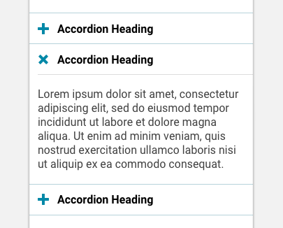

import Accordion from 'progressive-web-sdk/dist/components/accordion/accordion'
import AccordionItem from 'progressive-web-sdk/dist/components/accordion/accordion-item'
import Button from 'progressive-web-sdk/dist/components/button/'
import PropsTable from '../../../../src/components/propstable'
import Tabs from 'progressive-web-sdk/dist/components/tabs/tabs'
import TabsPanel from 'progressive-web-sdk/dist/components/tabs/tabs-panel'

<div class="component-intro">

Accordions are used to break up long and complex content into digestable sections that can be viewed at a glance. They are commonly used in sidebar navigation, forms, and FAQ pages.

The `Accordion` component is a wrapper that contains [AccordionItem](AccordionItem) components.

</div>

<div onClick={(e) => {e.stopPropagation()}}>
<Tabs activeIndex={0} className="devcenter">
<TabsPanel title="Code" onClick={(e) => {e.stopPropagation()}}>

### JavaScript import

```jsx
import {Accordion, AccordionItem} from 'progressive-web-sdk/dist/components/accordion'
```

### SCSS import

```scss
@import 'node_modules/progressive-web-sdk/dist/components/accordion/base';
```

### Props table

<PropsTable propMetaData={props.componentMetadata.childrenComponentProp} />

### Basic example

```jsx react-live=true
<Accordion>
    <AccordionItem header="Accordion Item #1" id="1">
        <div>Contrary to popular belief, Lorem Ipsum is not simply random text.</div>
    </AccordionItem>
</Accordion>
```

### Lifecycle callbacks

If these functions are provided directly to `AccordionItem`, they will override the ones passed to the `Accordion`.

| Callback   | Explanation                                                                                                                              |
| ---------- | ---------------------------------------------------------------------------------------------------------------------------------------- |
| `onOpen`   | Triggered by the user clicking on the header (`AccordionItem`). The `onOpen` function is called with the item's ID passed to it.         |
| `onOpened` | Triggered after the accordion is done opening.                                                                                           |
| `onClose`  | Triggered by the user clicking on the opened header (`AccordionItem`). The `onClose` function is called with the item's ID passed to it. |
| `onClosed` | Triggered after the accordion is done closing.                                                                                           |

```jsx react-live=true
<Accordion
    onOpen={() => {
        alert('Accordion is opening')
    }}
    onOpened={() => {
        alert('Accordion is open')
    }}
    onClose={() => {
        alert('Accordion is closing')
    }}
    onClosed={() => {
        alert('Accordion is closed')
    }}
>
    <AccordionItem header="Accordion Item" id="1">
        <div>Contrary to popular belief, Lorem Ipsum is not simply random text.</div>
    </AccordionItem>
</Accordion>
```

### Different icons

```jsx react-live=true
<Accordion>
    <AccordionItem
        header="Accordion Item #1"
        openIconName="caret-bottom"
        closeIconName="caret-top"
        iconPosition="end"
        id="1"
    >
        <div>Contrary to popular belief, Lorem Ipsum is not simply random text.</div>
    </AccordionItem>
    <AccordionItem
        header="Accordion Item #2"
        openIconName="caret-bottom"
        closeIconName="caret-top"
        iconPosition="end"
        id="2"
    >
        <div>Contrary to popular belief, Lorem Ipsum is not simply random text.</div>
    </AccordionItem>
</Accordion>
```

### Open/close animation

```jsx react-live=true
<Accordion duration={150} easing="ease-out">
    <AccordionItem
        header="Accordion Item #1"
        openIconName="caret-bottom"
        closeIconName="caret-top"
        iconPosition="end"
        id="1"
    >
        <div>Contrary to popular belief, Lorem Ipsum is not simply random text.</div>
    </AccordionItem>
    <AccordionItem
        header="Accordion Item #2"
        openIconName="caret-bottom"
        closeIconName="caret-top"
        iconPosition="end"
        id="2"
    >
        <div>Contrary to popular belief, Lorem Ipsum is not simply random text.</div>
    </AccordionItem>
</Accordion>
```

</TabsPanel>
<TabsPanel title="Design" class="markdown">

### Related components
- [AccordionItem](AccordionItem)

### Screenshot



### Potential uses

-   Nesting non-essential information
-   Collapsing large and complex pages into digestible sections
-   Filters with many grouped options
-   Navigation paradigms
-   Long forms that are clearly sectioned

### Accessibility

-   Do not rely on color alone to show the difference between open and closed states. Instead, use a different icon, or animate the icon to show the change.
-   Ensure the contrast between your background color and text passes a11y guides. [Use this handy tool](http://www.contrastchecker.com).

### Best practices

-   On touch, the Accordion heading/container should show visual feedback.
-   On touch, the Accordion should also visually change state into an `open` state.
-   On second touch, the Accordion should change back into a closed / initial state.
-   Use a `+` and `x` icon for closed and open states respectively. [Read more](https://www.viget.com/articles/testing-accordion-menu-designs-iconography).
-   Each accordion header should contain an icon on the left. When tapped, the icon will open an area below it which contains the expanded content.
-   Expanding the accordion should _not_ push the accordion label to the top of the viewport. Vertical positioning should be maintained to avoid disorientation.
-   Expanding the accordion _does_ push down the page.
-   Common visual affordances for the Accordion include encapsulation and heavy rules.

</TabsPanel>
</Tabs>
</div>