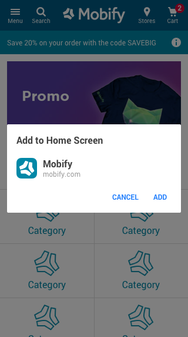
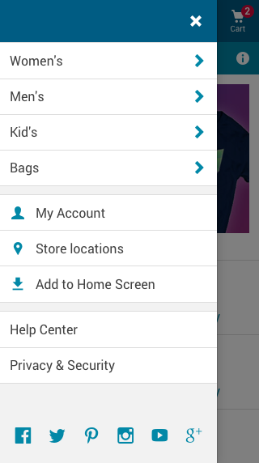

import AddToHomescreen from 'progressive-web-sdk/dist/components/carousel'
import PropsTable from '../../../../src/components/propstable'
import Tabs from 'progressive-web-sdk/dist/components/tabs/tabs'
import TabsPanel from 'progressive-web-sdk/dist/components/tabs/tabs-panel'

<div class="component-intro">

The `addToHomescreen` component is a higher-order component (HOC) that wraps
another component. It provides props to the wrapped component for interfacing
with a browser's `beforeinstallprompt` event.

</div>

<div onClick={(e) => {e.stopPropagation()}}>
<Tabs activeIndex={0} className="devcenter">
<TabsPanel title="Code" onClick={(e) => {e.stopPropagation()}}>

```js static
// import for the higher-order component
import addToHomescreen from 'progressive-web-sdk/dist/components/add-to-homescreen'

// import for the event handler helper
import {registerBeforeInstallPromptHandler} from 'progressive-web-sdk/dist/components/add-to-homescreen'

// import for the required reducer
import addToHomescreenReducer from 'progressive-web-sdk/dist/store/add-to-homescreen/reducer'
```

### Prerequisites

Before the `addToHomescreen` component can be used, you must set up a few things
first:

1. Add the `addToHomescreen` reducer
2. Register the required event handler with the
   `registerBeforeInstallPromptHandler()` function before components render

```jsx static
// Step 1: Add the reducer
//
// your-project/app/store/index.js

// ...
const reducer = combineReducers({
    addToHomescreen: addToHomescreenReducer,
    // ...
})
// ...


// Step 2: Register the required event handler
//
// your-project/app/containers/app/container.jsx

// ...
componentWillMount() {
    registerBeforeInstallPromptHandler()
}
// ...
```

### Example Usage

Assuming that the above prerequisites are met, here's how to use
`addToHomescreen` component:

```jsx static
// MyButton.jsx
//
// Now we use the higher-order component to wrap our own component, and call
// `props.prompt()`
const MyButton = (props) => (
    {props.status === addToHomescreen.ACTIVE &&
        <button onClick={() => props.prompt()}>
            Add to Home Screen!
        </button>
    }
)

export default addToHomescreen(MyButton)
```


### Registering the Event Handler

The `registerBeforeInstallPromptHandler()` function must be called for the
higher-order component to work. This function registers an event handler that
listens for the browser's `beforeinstallprompt` event to trigger. When the event
triggers, the higher-order component's state and functionality are enabled.
Because of this requirement, the `addToHomescreen` HOC only works in browsers
that support the `beforeinstallprompt` event. If used in unsupported browsers,
it simply renders nothing.

We recommend that you invoke `registerBeforeInstallPromptHandler()` as early in
your application's lifecycle as possible to help guarantee that it captures the
browser event.

### The Prompt Callback

The `addToHomescreen` HOC passes a callback prop to the wrapped component called
`prompt`. This callback causes the browser to show the user the Add to Home
Screen dialog after the `beforeinstallprompt` is triggered. This callback will
do nothing until the `beforeinstallprompt` event is triggered.

### The Status String

There are 4 status strings that the `addToHomescreen` HOC can be set to:

| Status | Order | Explanation |
| --- | --- | --- |
| UNSUPPORTED | 1 | This is the initial value and will remain this way if the current browser does not support the `beforeinstallprompt` event. |
| HIDDEN | 2 | If the current browser is supported, the initial status will change to HIDDEN. It will then stay this way until the browser triggers the `beforeinstallprompt` event. Also, the status will be set back to HIDDEN after a user accepts the prompt. |
| ACTIVE | 3 | The status will only be set to ACTIVE if the browser supports and triggers the `beforeinstallprompt` event. The status will remain this way until the user either accepts or declines the prompt. |
| INACTIVE | 4 | The status will only be set to INACTIVE if the user declines the prompt. The user cannot interact with the prompt again unless they refresh the page. |

The current status is passed to the wrapped component via props. The available
statuses can be accessed as constants on the `addToHomescreen` HOC. For example:

```jsx static
const MyButton = (props) => (
    const {status} = props

    // You can use the current status to render the UI in anyway you see fit.
    {status === addToHomescreen.UNSUPPORTED && /* ... */ }
    {status === addToHomescreen.HIDDEN      && /* ... */ }
    {status === addToHomescreen.ACTIVE      && /* ... */ }
    {status === addToHomescreen.INACTIVE    && /* ... */ }
)

export default addToHomescreen(MyButton)
```

</TabsPanel>
<TabsPanel title="Design" class="markdown">

#### Prompts for the Official Modal



If a user wants to add your PWA to their home screen, they will have to confirm
this action using an official modal that is built into the Chrome browser. The
user can bring up this modal through a few different prompts:

* A banner or "mini-infobar" that Chrome displays automatically if the PWA meets
  Google's criteria
* An option in Chrome's main options menu
* A custom prompt on the page (in Chrome 68 and later), usually a button

#### Browser Changes

In Chrome 67 for Android (and earlier versions), the browser displays a banner
automatically if the site meets Google's criteria for the Add to Home Screen
feature. In later versions, the browser displays a "mini-infobar" instead. More
importantly, the later versions of Chrome allow us to use a custom prompt to
show the official modal. This allows us to prompt the user to use Add to Home
Screen within the app itself, instead of relying on the browser's built-in
prompts.

More information on the different prompts for the Add to Home Screen feature can
be found on the [Google Developers
site](https://developers.google.com/web/updates/2018/06/a2hs-updates).


#### Presenting a Custom Prompt

Here's a mockup, created in Mobify's UI Kit, that shows a custom **Add to Home
Screen** prompt that is implemented as a button within the main menu drawer.
This provides high visibility and a permanent place for the feature that the
user can come back to if they decide to use it later.

 


#### If the User Clicks Cancel

The Chrome browser can only display the official modal for Add to Home Screen
once per session. If the user clicks **Cancel** in the official modal, we can
replace our custom prompt in the menu drawer with a message that asks the user
to refresh the page and try again.


## Best practices

#### Separate the Add to Home Screen button from category buttons

Place the **Add to Home Screen** button with other buttons, such as **My
Account** or **Store Locations** instead of with the main category buttons.
  
#### Consider placing the prompt elsewhere in the flow

Just placing a button within the main menu drawer is a subtle approach to
advertising the Add to Home Screen feature. You could also include a prompt on
other screens, such as after checkout confirmation or after logging in.

#### Test the wording of the prompt

The phrase "Add to Home Screen" still isn't widely recognized by users and may
  be confused with regular bookmarking. Google has been testing other phrases,
  such as "Install App," but they haven't shared any data yet that shows which
  phrase works best. We recommend that you run your own A/B tests to find the
  right wording.

### Flow Diagram

The diagram below shows in more detail the many routes the user can take to get
to the official modal for the Add to Home Screen feature—and what they can do
with it once they get there.


</TabsPanel>
</Tabs>
</div>
