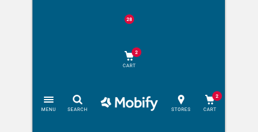

import Badge from 'progressive-web-sdk/dist/components/badge'
import PropsTable from '../../../../src/components/propstable'
import Tabs from 'progressive-web-sdk/dist/components/tabs/tabs'
import TabsPanel from 'progressive-web-sdk/dist/components/tabs/tabs-panel'

<div class="component-intro">

A badge is a simple, circular element used to display important information concisely to the user. It calls attention to an action and tells the user that there is important information related to that action, such as unread messages or items in a shopping cart.

</div>

<div onClick={(e) => {e.stopPropagation()}}>
<Tabs activeIndex={0} className="devcenter">
<TabsPanel title="Code" onClick={(e) => {e.stopPropagation()}}>

### JavaScript import

```jsx
import Badge from 'progressive-web-sdk/dist/components/components/badge'
```

### SCSS import

```scss
@import 'node_modules/progressive-web-sdk/dist/components/badge/base';
```

### Props table

<PropsTable propMetaData={props.componentMetadata.childrenComponentProp} />

### Basic example

```jsx react-live=true
<Badge title="1 Item in Cart">1</Badge>
```

### Expandable badge

The Badge should be able to stretch to accommodate its content.

```jsx react-live=true
<Badge title="1000 Item in Cart">1000</Badge>
```

</TabsPanel>
<TabsPanel title="Design" class="markdown">

### Screenshot



### Potential uses

-   A badge on top of the shopping cart icon can indicate the number of items remaining in the cart.
-   A badge on top of a particular list item can show there are new items to be found in that section.
-   A badge on top of a link can display the number of unread notifications.
-   A badge on top of a product option can show a successful selection, or that an item is in stock.

### Accessibility

-   Text size in badges often needs to be small, so ensure the color contrast between text and background color is as high as possible.
-   Ensure text size does not decrease below 8px.

### Best practices

-   Badges should be placed on top of action buttons, and should not contain independent interaction.
-   Badges need to attract attention and should use a high contrast color.
-   Users typically associate red with notifications, think carefully before deviating from this established mindset.
-   Typically a badge contains a number. If this number cannot be fetched then a colored badge without a number is enough to serve the purpose of attracting attention.
-   Numbers can grow to multiple digits, so ensure the badge can grow to fit multiple characters or restrict the value displayed. For example, anything over 3 digits can be made to fit using using a convention such as "99+" instead of expanding the actual number.
-   A badge is best positioned in the top or bottom right of the related action.

</TabsPanel>
</Tabs>
</div>
