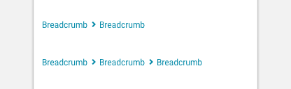

import Breadcrumbs from 'progressive-web-sdk/dist/components/breadcrumbs'
import PropsTable from '../../../../src/components/propstable'
import Tabs from 'progressive-web-sdk/dist/components/tabs/tabs'
import TabsPanel from 'progressive-web-sdk/dist/components/tabs/tabs-panel'

<div class="component-intro">

Breadcrumb links are a navigation tool: they provide users with the path they took to arrive at the current page. They are a common wayfinding pattern that provide users with a sense of where they are in a site's hierarchy and offer a quick way to move between levels of the hierarchy.

</div>

<div onClick={(e) => {e.stopPropagation()}}>
<Tabs activeIndex={0} className="devcenter">
<TabsPanel title="Code" onClick={(e) => {e.stopPropagation()}}>

### JavaScript import

```jsx
import Breadcrumbs from 'progressive-web-sdk/dist/components/breadcrumbs'
```

### SCSS import

```scss
@import 'node_modules/progressive-web-sdk/dist/components/breadcrumbs/base';
```

### Props table

<PropsTable propMetaData={props.componentMetadata.childrenComponentProp} />

### Basic example

```jsx react-live=true
<Breadcrumbs
    items={[
        {
            text: 'Home',
            href: 'http://www.mobify.com'
        },
        {
            text: 'Cat',
            href: 'http://www.mobify.com'
        },
        {
            text: 'Food'
        }
    ]}
/>
```

### With onClick

```jsx react-live=true
<Breadcrumbs
    items={[
        {
            text: 'Back',
            onClick: () => alert('Clicked')
        }
    ]}
/>
```

</TabsPanel>
<TabsPanel title="Design" class="markdown">

### Screenshot



### Potential uses

-   Typically displayed above the title of the page.
-   Especially effective when the user requires context about which part of the site they're browsing.
-   A valuable navigation tool for when a user deep links (from search or social media) into a page deep within the product catalogue.
-   Less valuable in apps where users typically browse linearly from the homepage and have access to built-in back buttons.

### Accessibility

-   Show that the breadcrumbs are links by using the site's link color or an underline.
-   Tappable links should be separated visually from non-interactive text.
-   Ensure the distance between links is at minimum one tap target (normally 44px), especially when breadcrumbs span over two lines.

### Best practices

-   Users can tap a link in the hierarchy to retreat to that level.
-   When the breadcrumbs take up more space than a single page width, an x-overflow can be enabled allowing users to swipe left or right to view the full hierarchy.
-   If you provide breadcrumbs, ensure each level in the hierarchy contains a link to the correct landing page.
-   If you're using an x-overflow, ensure there's a clear indication that content exists outside of the view. (For example, you can use an alpha -> white gradient at the end).
-   It's recommended to show the full hierarchy at all times if possible. If that results in too many levels, then you can restrict the full path, and use an ellipse to indicate that more levels exist beyond what's shown.
-   Separators can vary visually. Use an approach that shows a forward motion, such as > or /.

</TabsPanel>
</Tabs>
</div>