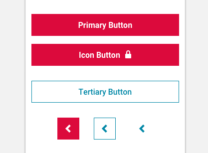

import Button from 'progressive-web-sdk/dist/components/button'
import PropsTable from '../../../../src/components/propstable'
import Tabs from 'progressive-web-sdk/dist/components/tabs/tabs'
import TabsPanel from 'progressive-web-sdk/dist/components/tabs/tabs-panel'

<div class="component-intro">

A button is a prominent control that triggers an action. This action can link to a page, open a modal, or it can change the state of the page UI. Buttons can contain multiple state variations and can be styled to present different levels of emphasis.

</div>

<div onClick={(e) => {e.stopPropagation()}}>
<Tabs activeIndex={0} className="devcenter">
<TabsPanel title="Code" onClick={(e) => {e.stopPropagation()}}>

### JavaScript import

```jsx
import Button from 'progressive-web-sdk/dist/components/button'
```

### SCSS import

```scss
@import 'node_modules/progressive-web-sdk/dist/components/button/base';
```

### Props table

<PropsTable propMetaData={props.componentMetadata.childrenComponentProp} />

### Basic example

```jsx react-live=true
<Button>Default Button (no styles)</Button>
```

### With modifiers

_Primary:_

```jsx react-live=true
<Button className="pw--primary">Blank Button</Button>
```

_Secondary:_

```jsx react-live=true
<Button className="pw--secondary">Secondary Button</Button>
```

_Tertiary:_

```jsx react-live=true
<Button className="pw--tertiary">Tertiary Button</Button>
```

_Link style button:_

```jsx react-live=true
<div>
    Hello <Button className="pw--link">Link style button</Button>
</div>
```

### Disabled

```jsx react-live=true
<div>
    <div className="u-width-full u-margin-bottom">
        <Button disabled>Disabled Default Button</Button>
    </div>

    <div className="u-width-full u-margin-bottom">
        <Button disabled className="pw--primary">
            Disabled Primary Button
        </Button>
    </div>

    <div className="u-width-full u-margin-bottom">
        <Button disabled className="pw--secondary">
            Disabled Secondary Button
        </Button>
    </div>

    <div className="u-width-full">
        <Button disabled className="pw--tertiary">
            Disabled Tertiary Button
        </Button>
    </div>
</div>
```

### Other examples

_`type="submit"`:_

```jsx react-live=true
<Button type="submit" className="pw--primary">
    Submit Type Button
</Button>
```

_Anchor Type (has `href="#"`):_

```jsx react-live=true
<div>
    <div className="u-margin-bottom">
        <Button href="#!/Button">Default Anchor Type Button</Button>
    </div>

    <div className="u-margin-bottom-lg">
        <Button href="#!/Button" className="pw--primary">
            Primary Anchor Type Button
        </Button>
    </div>

    <div className="u-margin-bottom">
        <Button href="#!/Button" className="pw--link">
            Link Anchor Type Button
        </Button>
    </div>
</div>
```

_Icon, with invisible (yet accessible) text:_

```jsx react-live=true
<Button
    icon="cart"
    title="Icon Button with hidden, but accessible text"
    className="pw--primary"
></Button>
```

_Icon, with visible text:_

```jsx react-live=true
<Button
    icon="cart"
    title="Icon Button with visible text"
    showIconText
    className="pw--primary"
></Button>
```

_Icon, with visible text AND invisible (yet accessible) text:_

```jsx react-live=true
<Button icon="cart" title="Hidden text!" className="pw--primary">
    Icon Button with hidden, but accessible text, and normal text
</Button>
```

_Social buttons:_

```jsx react-live=true
<div>
    <Button className="pw--facebook" icon="social-facebook" title="Facebook" />
    <Button className="pw--twitter" icon="social-twitter" title="Twitter" />
    <Button className="pw--instagram" icon="social-instagram" title="Instagram" />
    <Button className="pw--pinterest" icon="social-pinterest" title="Pinterest" />
    <Button className="pw--youtube" icon="social-youtube" title="youtube" />
    <Button className="pw--google-plus" icon="social-google-plus" title="Google Plus" />
    <Button className="pw--yelp" icon="social-yelp" title="Yelp" />
</div>
```

_Set in progress state to a button:_

```jsx react-live=true
class SimulateAddToCart extends React.Component {
    constructor() {
        this.state = {
            addingToCart: false
        }
    }

    simulateAddingToCart() {
        // Adding to cart
        this.setState({addingToCart: true})

        // Re-enable button after item has been added to cart
        setTimeout(() => {
            this.setState({addingToCart: false})
        }, 2000)
    }

    render() {
        return (
            <Button
                onClick={this.simulateAddingToCart.bind(this)}
                disabled={this.state.addingToCart}
                className="pw--primary"
            >
                {this.state.addingToCart ? (
                    <InlineLoader text="Adding to cart" />
                ) : (
                    <span>Add to Cart</span>
                )}
            </Button>
        )
    }
}
```

_Add hover events to a button:_

```jsx react-live=true
class StatefulExample extends React.Component {
    constructor() {
        this.state = {
            isHovering: false
        }
    }

    hoverOn() {
        this.setState({isHovering: true})
    }

    hoverOff() {
        this.setState({isHovering: false})
    }

    render() {
        return (
            <Button
                onMouseEnter={this.hoverOn.bind(this)}
                onMouseLeave={this.hoverOff.bind(this)}
                className="pw--primary"
            >
                {this.state.isHovering ? 'Hover Me! 🐭' : 'Hover Me! 🐹'}
            </Button>
        )
    }
}
```

</TabsPanel>
<TabsPanel title="Design" class="markdown">

### Screenshot



### Potential uses

-   Buttons are used in almost every template, often multiple per page.
-   Primary buttons are used to denote primary tasks such as adding to cart, or proceeding to the next step in a multi-step process, such as checkout.
-   Multiple icon buttons are used in the header navigation to link to primary site sections.

### Accessibility

-   A disabled state should rely on more than just color to differentiate them from the active button state.
-   Ensure the contrast between the button text color and the background color meets a11y contrast guidelines. [Use this handy tool as a guide](http://www.contrastchecker.com).
-   Buttons should be sized to fit minimal tap size (normally 44px).

### Best practices

-   There should only be one primary button visible to the user at one time.
-   Use a secondary button style when the action is less important, and a primary style when the action is more important. For example, use a primary button style for add to cart, and a secondary button style for add to wishlist.
-   Use tertiary buttons when the action is less important than other actions on the page (for example, a newsletter signup form in the footer).
-   All buttons should have active and disabled states to let the user know when they're clickable or not.
-   All buttons should have 'tapped' and 'loading' states to give the user feedback that they have been tapped, and that the corresponding action is working.
-   Icons can be added to buttons in order to bolster the messaging. For example, a lock icon can be added to the check out button, indicating security.

</TabsPanel>
</Tabs>
</div>
