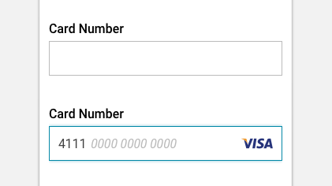
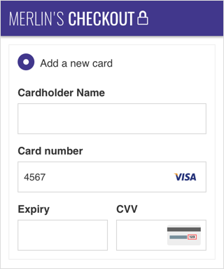

import CardInput from 'progressive-web-sdk/dist/components/card-input'
import PropsTable from '../../../../src/components/propstable'
import Tabs from 'progressive-web-sdk/dist/components/tabs/tabs'
import TabsPanel from 'progressive-web-sdk/dist/components/tabs/tabs-panel'

<div class="component-intro">

The CardInput component is used on the payment step of checkout as a dynamic form input field to capture credit card numbers. It is designed to save the user time by pre-detecting the card type based on the card number and formats the card number as it is displayed on a user's card.

Note that onChange and onBlur are called with the changed value, not an event. This is compatible with redux-form and allows the stored value to differ from the displayed one.

</div>

<div onClick={(e) => {e.stopPropagation()}}>
<Tabs activeIndex={0} className="devcenter">
<TabsPanel title="Code" onClick={(e) => {e.stopPropagation()}}>

### JavaScript import

```jsx
import CardInput from 'progressive-web-sdk/dist/components/card-input'
```

### SCSS import

```scss
@import 'node_modules/progressive-web-sdk/dist/components/card-input/base';
```

### Props table

<PropsTable propMetaData={props.componentMetadata.childrenComponentProp} />

### Example Usage

```jsx react-live=true
class StatefulExample extends React.Component {
    constructor() {
        this.state = {
            cc: "4111411141114111"
        }
    }

    render() {
        return (
            <CardInput
                value={this.state.cc}
                defaultValue={this.state.cc}
                onChange={(value)=>{this.setState({cc: value})}}
                onBlur={()=> {}}
            />
        )
    }
}
```

### Example Usage With ccType

```jsx react-live=true
class StatefulExample extends React.Component {
    constructor() {
        this.state = {
            cc: "5500000000000004"
        }
    }

    render() {
        return (
            <CardInput
                value={this.state.cc}
                defaultValue={this.state.cc}
                onChange={(value)=>{this.setState({cc: value})}}
                onBlur={()=> {}}
            />
   
        )
    }
}
```

### Example Usage With Custom Card

To add support for custom cards, you will need to register a custom format to the `CardInput` component's `registerCustomFormat` class method.

The `registerCustomFormat` class method accepts a `data` object which is a dictionary of credit card names and their formatting rules. Each dictionary item's key dictates which credit card image will be shown, and each value is an object that must match the following format (see the code below for a examples of the `data` object):

| Key | Type | Value |
| --- | --- | --- |
| match | `string` | A regex pattern matched against the input of the CardInput component. <br /> A rule of `^123` will match an input of `1234567890` but not `0123456789` |
| format | `object` | Defines a series of formatting rules for the credit card input. <br /> The keys are integers which match against a credit card numbers's length. A key of `default` applies its rule to all other credit card lengths. <br /> The values are arrays of integers that indicate number groups in the credit card number. For example: `[3, 4, 3]` formats an input of `1234567890` to `123 4567 890`. |
| cvv | `object` | Defines what type of CVV pattern should be used. <br /> The key `default`'s value is an array of integers (usually one integer) that defines the pattern of the CVV. <br /> The key `iconName`'s value is a string that defines which credit card CVV help image will be shown to the user. |

The below example shows what it looks like when multiple custom cards are registered:

```jsx react-live=true
class StatefulExample extends React.Component {
    constructor() {
        const customCards = {
            'card-1': {
                // Only matches credit cards with values that
                // **start** with the numbers `566`. A value
                // of `123 1234123412 566` will not be a match.
                match: '^566',
                format: {
                    // This credit card formats their numbers
                    // like `xxxx xxxxxxxxxx xxxx`
                    default: [4, 10, 4]
                },
                cvv: {
                    // The CVV number will be formatted as `xxx`
                    default: [3],
                    iconName: 'default-hint'
                }
            },
            'card-2': {
                // Only matches credit cards with values that
                // **start** with the numbers `633`. A value
                // of `123 1234123412 633` will not be a match.
                match: '^633',
                format: {
                    // This credit card formats their numbers
                    // like `xxxx xxxx xxxx xxxx`, just like
                    // Visa cards, etc.
                    default: [4, 4, 4, 4]
                },
                cvv: {
                    // The CVV number will be formatted as `xxxx`
                    default: [4],
                    iconName: 'default-hint'
                }
            }
        };

        CardInput.registerCustomFormat(customCards);

        this.state = {
            cc: "566864917026678234"
        }
    }

    render() {
        return (
            <CardInput
                value={this.state.cc}
                defaultValue={this.state.cc}
                onChange={(value)=>{this.setState({cc: value})}}
                onBlur={()=> {}}
            />
        )
    }
}
```
</TabsPanel>
<TabsPanel title="Design" class="markdown">

### Related components

- [CardVerification](CardVerification)
- [CheckoutPayment](CheckoutPayment)

### UI Kit



*Symbol Path: form -> Field*

### Potential uses

- In place of a basic field for capturing Card Number.
- In the payment step of checkout or anywhere where credit card number and card type is captured.

### User Interactions

- User enters their credit card number into the field via system keyboard

### Usage Tips & Best practices

- Input masks are utilized in the form field to visually separate 4 digits at a time, improving legibility.
- A number pad should be defined as the contextual keyboard.
- Use SVGs for card logos in order to maintain legibility at all screen sizes.
- Restrict characters to only accept numbers in order to reduce errors.
- Card is best positioned on the right of the form field.
- Ensure all card logos are the same width and height.

### Accessibility

- Ensure card logos are fully legible - use the logo of the company instead of a picture of the card in order to maximize legibility at a small size.

### Examples

#### Merlin's Potions:



### Lancome:


</TabsPanel>
</Tabs>
</div>
