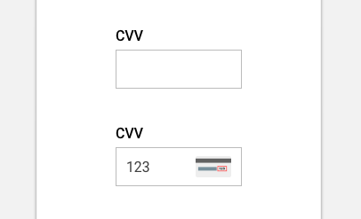

import CardVerification from 'progressive-web-sdk/dist/components/card-verification'
import PropsTable from '../../../../src/components/propstable'
import Tabs from 'progressive-web-sdk/dist/components/tabs/tabs'
import TabsPanel from 'progressive-web-sdk/dist/components/tabs/tabs-panel'

<div class="component-intro">

The CardVerification component is used on the payment step of checkout as a dynamic form input field. It is designed to present the user with a helpful image on where to fine their CVV number. The image changes depending on the card type defined in previous fields.

Card Verification Value (CVV). The number is displayed in front of the card for Amex and on the back for rest of credit cards

</div>

<div onClick={(e) => {e.stopPropagation()}}>
<Tabs activeIndex={0} className="devcenter">
<TabsPanel title="Code" onClick={(e) => {e.stopPropagation()}}>

### JavaScript import

```jsx
import CardVerification from 'progressive-web-sdk/dist/components/card-verification'
```

### SCSS import

```scss
@import 'node_modules/progressive-web-sdk/dist/components/card-verification/base';
```

### Props table

<PropsTable propMetaData={props.componentMetadata.childrenComponentProp} />

## Example Usage

```jsx
state = {cvv: ""};

<CardVerification
    cardNumber="4111111111111111"
    value={state.cvv}
    onChange={(value)=>{
        setState({cvv: value})
    }}
    onBlur={()=> {}}
/>
```

</TabsPanel>
<TabsPanel title="Design" onClick={(e) => {e.stopPropagation()}}>

### Related components

- [CardInput](#!/CardInput)
- [CheckoutPayment](#!/CheckoutPayment)

### UI Kit



*Symbol Path: form -> Field*

### Potential uses

- In place of a tooltip popup showing the user where to find their card security code.
- In the payment step of checkout or anywhere that a credit card number and card type is captured.

### User Interactions

- Image is automatically displayed after the user has entered their card number and a card type has been detected.

### Usage Tips & Best practices

- A number pad should be defined as the contextual keyboard.\
- Normally only 2 images; AMEX and not-AMEX.
- Use SVGs for images in order to maintain legibility at all screen sizes.
- Restrict characters to only accept numbers in order to reduce errors.
- Restrict to a maximum of 3 digits.
- Image is best positioned on the right of the form field.

### Accessibility

- Ensure images are as legible as possible by using clear vector graphics.

### Example


</TabsPanel>
</Tabs>
</div>
