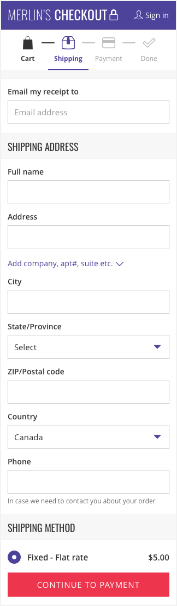

import Tabs from 'progressive-web-sdk/dist/components/tabs/tabs'
import TabsPanel from 'progressive-web-sdk/dist/components/tabs/tabs-panel'

Collects the customer’s email address and shipping details for an order. This includes both the shipping method and the postal address. A secondary purpose of the page is to understand whether the user is an existing customer and offer them the chance to log in.

<Callout type="info">
This is a design pattern made up of several components.
</Callout>

 {e.stopPropagation()}}>
<Tabs activeIndex={0} className="devcenter">
<TabsPanel title="Design" onClick={(e) => {e.stopPropagation()}}>

### Common Components

- [ProgressSteps](ProgressSteps)
- [Field](Field)
- [Banner](Banner)
- [Select](Select)
- [HeaderBar](HeaderBar)
- [Button](Button)

### UI Kit

### Potential uses

- The first step of the “full checkout” purchase flow.
- Normally the first screen a user sees after proceeding to checkout.
- A place where existing users can log in before completing the checkout.

### User Interactions

Primarily form inputs. Interactions vary if a user is logged in.

#### Sign in
Guest users can sign in from this page.

#### Email lookup
After an email address is entered, and detected as a registered user, a password field appears allowing the user to sign in.

#### Forgot Password
If a user has forgotten their password an interaction exists to initiate the password recovery flow.

#### Add additional address info
Add optional company name, apartment#, suite etc. by revealing additional input fields.

#### Select shipping method
Choose from multiple shipping options, default to cheapest option.

#### Select a saved address (logged in)
Choose from multiple addresses saved under a user account.

#### Add a new address (logged in)
Enter a new address not saved under the user account.

### Usage Tips & Best practices

- Use a dedicated checkout header and footer, removing all links other than customer service information.
- Use [Banner](#!/Banner) component to inform the user of a detected email address.
- If a user signs in and they already have items in their cart from a previous session, use a dialogue modal to make them aware of this .
- Reduce number of fields to only those that are 100% necessary.
- If optional fields must be included, consider hiding these fields behind a reveal action using the view-more component.
- Use contextual keyboards where appropriate - email address zip code and phone number for example.
- Use input masks where applicable to ensure data is inputted correctly. For example, add brackets () and spaces to the phone number input field.
- Use best practice error messaging to ensure the erroneous field is highlighted and a note of the error appears next to it.
- Ensure a user can tab directly to the next field using the native keyboard.
- Consolidate first and last name form fields into a single full name field.
- Use what location features are available to pre-select the Country and if possible State/Province.
- Update field labels for State and ZIP code to Province and Postal Code if country is not United States.
- Inline validation should be utilized reduce post submit errors.
- Display the cost and delivery time (if available) to help user decide on shipping method.
- Use address lookup features (if available) to allow the quick completion of the rest of the form based on the first address line.
- Default logged in user’s saved addresses to the last used address.
- Ensure the browser or device’s back button navigates back to the cart.

### Variations & States

#### Logged in
Logged in user’s email defaults to the registered email address. Saved addresses are presented as radio buttons.

#### Registered email detected
If an email is detected as belonging to a registered user, add additional password field and sign in button.

### Example Implementations

#### Merlin's Potions:

#### Babista:

</TabsPanel>
</Tabs>

