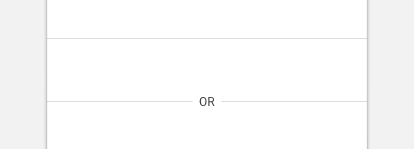

import Divider from 'progressive-web-sdk/dist/components/divider'
import PropsTable from '../../../../src/components/propstable'
import Tabs from 'progressive-web-sdk/dist/components/tabs/tabs'
import TabsPanel from 'progressive-web-sdk/dist/components/tabs/tabs-panel'

<div class="component-intro">

A horizontal rule element that can display an optional label as a heading. 

</div>

<div onClick={(e) => {e.stopPropagation()}}>
<Tabs activeIndex={0} className="devcenter">
<TabsPanel title="Code" onClick={(e) => {e.stopPropagation()}}>

### JavaScript import

```jsx
import Divider from 'progressive-web-sdk/dist/components/divider'
```

### SCSS import

```scss
@import 'node_modules/progressive-web-sdk/dist/components/divider/base';
```

### Props table

<PropsTable propMetaData={props.componentMetadata.childrenComponentProp} />

### Basic example

```jsx react-live=true
<Divider />
```

### With label

```jsx react-live=true
<Divider label="Hear me roar!" />
```

### With long label

```jsx react-live=true
<Divider label="Looooooooooooooooooooong Label" />
```

</TabsPanel>
<TabsPanel title="Design" class="markdown">

### Screenshot



### Potential uses

-   To visually provide a break in content sets, letting the user know the content and actions below are not related to content above.

### Accessibility

-   Dividers are often light in color. Ensure the contrast is high enough to pass accessibility guides.

### Best practices

-   A divider should not contain any interactions.
-   Use the text divider to separate 2 options to complete a task such as Login or Register.
-   The UI Kit provides variations in spacing below the dividers to create more or less separation.
-   Dividers can be full width to the edge of the browser, or they can have side margins.
-   Some components have bottom borders already and do not need the divider component to separate them.

</TabsPanel>
</Tabs>
</div>
