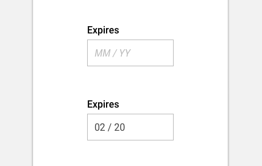

import ExpiryDate from 'progressive-web-sdk/dist/components/expiry-date'
import PropsTable from '../../../../src/components/propstable'
import Tabs from 'progressive-web-sdk/dist/components/tabs/tabs'
import TabsPanel from 'progressive-web-sdk/dist/components/tabs/tabs-panel'

<div class="component-intro">

An input field to capture credit card's expiry dates

Expiry dates are used to verify card data, typically when completing the checkout.

</div>

<div onClick={(e) => {e.stopPropagation()}}>
<Tabs activeIndex={0} className="devcenter">
<TabsPanel title="Code" onClick={(e) => {e.stopPropagation()}}>

### JavaScript import

```jsx
import ExpiryDate from 'progressive-web-sdk/dist/components/expiry-date'
```

### Props table

<PropsTable propMetaData={props.componentMetadata.childrenComponentProp} />

### Example usage

```jsx react-live=true
class StatefulExample extends React.Component {
    constructor() {
        this.state = {
            expiry: "2119"
        }
    }
    render() {
        return (
            <ExpiryDate
                value={this.state.expiry}
                placeholder="MM/YY"
                onChange={(value)=>{
                    this.setState({expiry: value})
                }}
                onBlur={()=> {}}
            />
        )
    }
}

```

</TabsPanel>
<TabsPanel title="Design" class="markdown">

### Related components

- [CheckoutPayment](CheckoutPayment).

### UI Kit



*Symbol Path: form -> Field*

### Potential uses

- On the payment step of the checkout when a user is inputting their card details to pay.

### User Interactions

- User will use the number pad on the native keyboard to input 2 numbers for day and 2 or 4 numbers for the year.

### Accessibility
- Ensure the form has placeholder values to indicate to the user how many digits to enter for year (yy or yyyy).

### Usage Tips & Best practices

- Ensure the keyboard is contextual and set to numbers only.
- Validate the form to only accept numbers.
- Use an input mask to automatically input the / sign.
- Validate the form to only accept the defined number of digits (e.g 4 for dd/yy or 6 for dd/yyyy).

### Example Implementations

#### Merlin's Potions:


</TabsPanel>
</Tabs>
</div>