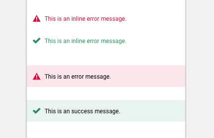

import Feedback from 'progressive-web-sdk/dist/components/feedback'
import PropsTable from '../../../../src/components/propstable'
import Tabs from 'progressive-web-sdk/dist/components/tabs/tabs'
import TabsPanel from 'progressive-web-sdk/dist/components/tabs/tabs-panel'

<div class="component-intro">

Accessible feedback component that includes error and success styles. Typically used within a page template to provide information on whether a form was submitted successfully or not.

</div>

<div onClick={(e) => {e.stopPropagation()}}>
<Tabs activeIndex={0} className="devcenter">
<TabsPanel title="Code" onClick={(e) => {e.stopPropagation()}}>

### JavaScript import

```jsx
import Feedback from 'progressive-web-sdk/dist/components/feedback'
```

### SCSS import

```scss
@import 'node_modules/progressive-web-sdk/dist/components/feedback/base';
```

### Props table

<PropsTable propMetaData={props.componentMetadata.childrenComponentProp} />

### Basic example

```jsx react-live=true
<Feedback text="Hear me roar!" />
```

### Error text

```jsx react-live=true
<Feedback isError icon="caution" title="caution" text="This is an inline error message." />
```

### Success text

```jsx react-live=true
<Feedback isSuccess icon="check" title="check" text="This is an inline success message." />
```

</TabsPanel>
<TabsPanel title="Design" class="markdown">

### Screenshot



### Potential uses

-   Use the component as a block at the top of the page to provide a success/failure message for the entire form submission.
-   Or, use it inline throughout a form to provide a valid/invalid message for individual inputs.

### Accessibility

-   Don't rely on color alone to indicate success or failure. Use clear messaging and add icons.
-   Blocks work well when they are a tint of the error/success color, however beware of using red-on-red or green-on-green as this is not accessible. [Use this handy tool](http://www.contrastchecker.com) to test the contrast.

### Best practices

-   Feedback typically provides contextual information and doesn't contain any interactive elements.
-   Typically there are 2 states: success and failure.
-   Valid/invalid messaging can be supported with visual indicators such as icons and color to draw attention and give context.
-   Inline feedback should appear next to (usually below) the affected field.
-   Inline feedback should be contextual and clearly describe the issue. For example, "Not a valid email address" addresses the problem concisely.
-   Block feedback normally appears at the top or bottom of the form and contains information about the submission in general. For example, you could use feedback in a Block to communicate "Form not submitted".

</TabsPanel>
</Tabs>
</div>
