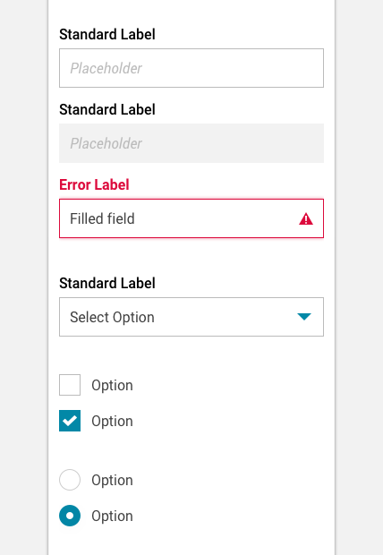
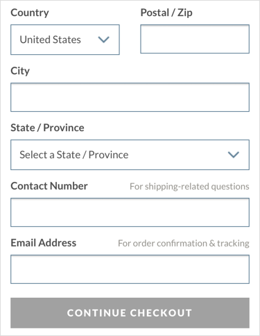

import PropsTable from '../../../../src/components/propstable'
import Tabs from 'progressive-web-sdk/dist/components/tabs/tabs'
import TabsPanel from 'progressive-web-sdk/dist/components/tabs/tabs-panel'
import FieldRow from 'progressive-web-sdk/dist/components/field-row'
import Field from 'progressive-web-sdk/dist/components/field'
import CardInput from 'progressive-web-sdk/dist/components/card-input'
import ExpiryDate from 'progressive-web-sdk/dist/components/expiry-date'
import Button from 'progressive-web-sdk/dist/components/button/'

<div class="component-intro">

FieldRow is used to group multiple Fields on one line of a form.

Fields are used to create Form UI and allow the capturing of user inputted data.

</div>

<div onClick={(e) => {e.stopPropagation()}}>
<Tabs activeIndex={0} className="devcenter">
<TabsPanel title="Code" onClick={(e) => {e.stopPropagation()}}>

### JavaScript import

```jsx
import Field from 'progressive-web-sdk/dist/components/field';
```

### SCSS import

```scss
@import 'node_modules/progressive-web-sdk/dist/components/field/base';
```

### Props table

<PropsTable propMetaData={props.componentMetadata.childrenComponentProp} />

### Basic example

```jsx react-live=true
<form>
    <FieldRow>
        <Field
            label="Email"
            idForLabel="email" >

            <input type="email" name="email" required />

        </Field>
    </FieldRow>
</form>
```

### With optional attributes

```jsx react-live=true
<form>
    <FieldRow>
        <Field
            label="Email"
            idForLabel="email"
            hint="Won't be displayed to other users"
            caption="Must be an @mobify.com email address"
        >

            <input type="email" name="email" placeholder="Placeholder text" required />

        </Field>
    </FieldRow>
</form>
```

### Disabled field styles

```jsx react-live=true
<form>
    <FieldRow>
        <Field
            label="Email"
            idForLabel="email"
            hint="Won't be displayed to other users"
            caption="Must be an @mobify.com email address"
        >
            <input type="email" name="email" disabled required />
        </Field>
    </FieldRow>

    <FieldRow>
        <Field>
            <select disabled>
                <option>1</option>
                <option>2</option>
            </select>
        </Field>
    </FieldRow>
    <FieldRow>
        <Field label="Sign up to the newsletter?">
            <input type="checkbox" disabled />
        </Field>
    </FieldRow>

    <FieldRow>
        <Field label="Sign up to the newsletter?">
            <input checked type="checkbox" disabled />
        </Field>
    </FieldRow>

    <FieldRow>
        <Field label="Sign up to the newsletter?">
            <input type="radio" disabled />
        </Field>
    </FieldRow>

    <FieldRow>
        <Field label="Sign up to the newsletter?">
            <input checked type="radio" disabled />
        </Field>
    </FieldRow>
</form>
```

### With validation errors

```jsx react-live=true
<form>
    <FieldRow>
        <Field
            label="Email"
            idForLabel="email"
            error="This is an invalid email address"
        >

            <input type="email" name="email" value="not-an-email-address" required onChange={()=>{}} />

        </Field>
    </FieldRow>
</form>
```

### Redux Select Example

```jsx react-live=true
<form>
    <FieldRow>
        <Field>
            <select>
                <option>1</option>
                <option>2</option>
            </select>
        </Field>
    </FieldRow>
</form>
```

### Redux Form Example

Integration with redux-form requires wrapping each Field in a ReduxForm.Field instance which will pass the appropriate props given the current app state. The name of the input should be set on the ReduxForm.Field wrapper in order for values to be bound to the app state properly.

```jsx redux=true
// The form
const DemoForm = (props) => {
    const { handleSubmit } = props
    return (
        <div>
            <h3>Order Info</h3>
            <form onSubmit={handleSubmit}>
                <FieldRow>
                    <ReduxForm.Field label="Name" component={Field} name="name">
                        <input type="text" />
                    </ReduxForm.Field>
                </FieldRow>

                <FieldRow>
                    <ReduxForm.Field label="Email" component={Field} name="email">
                        <input type="email" />
                    </ReduxForm.Field>
                </FieldRow>

                <FieldRow>
                    <ReduxForm.Field
                        component={Field}
                        name="newsletterSignup"
                        label="Sign up to the newsletter?"
                        caption="Get exclusive deals!"
                        type="checkbox"
                    >
                        <input type="checkbox" />
                    </ReduxForm.Field>
                </FieldRow>

                <FieldRow>
                    <ReduxForm.Field label="Credit card" component={Field} name="creditCard">
                        <CardInput />
                    </ReduxForm.Field>
                </FieldRow>

                <FieldRow>
                    <ReduxForm.Field label="Expiry Date" component={Field} name="expirydate">
                        <ExpiryDate />
                    </ReduxForm.Field>
                </FieldRow>

                <FieldRow>
                    <ReduxForm.Field label="Preferred delivery time" component={Field} name="deliveryTime">
                        <select>
                            <option value="">Select</option>
                            <option value="morning">Morning</option>
                            <option value="afternoon">Afternoon</option>
                        </select>
                    </ReduxForm.Field>
                </FieldRow>

                <FieldRow>
                    <ReduxForm.Field label="Select Multiple" component={Field} name="select-multiple">
                        <select multiple>
                            <option value="one">one</option>
                            <option value="two">two</option>
                            <option value="three">three</option>
                            <option value="four">four</option>
                            <option value="five">five</option>
                        </select>
                    </ReduxForm.Field>
                </FieldRow>

                <FieldRow>
                    <ReduxForm.Field label="Delivery address" component={Field} name="address">
                        <textarea />
                    </ReduxForm.Field>
                </FieldRow>

                <FieldRow>
                    <p>Delivery options</p>
                </FieldRow>

                <FieldRow>
                    <ReduxForm.Field label="Ground mail" component={Field} type="radio" name="deliveryOption" value="ground">
                        <input type="radio" />
                    </ReduxForm.Field>
                </FieldRow>

                <FieldRow>
                    <ReduxForm.Field label="Air mail" component={Field} type="radio" name="deliveryOption" value="air">
                        <input type="radio" />
                    </ReduxForm.Field>
                </FieldRow>

                <FieldRow>
                    <Button type="submit">Submit</Button>
                </FieldRow>
            </form>
        </div>
    );
}

let StateDisplay = (props) => {
    return (
        <div>
            <h3>Form data</h3>
            <pre>
                {JSON.stringify(props.values, null, '  ')}
            </pre>
        </div>
    )
}

StateDisplay = ReactRedux.connect((state)=>{return {values: state.form.demo.values}})(StateDisplay)

const validate = (values) => {
    const errors = {}

    if ((values.email || '').search(/@mobify.com$/) < 0) {
        errors.email = "Must be a @mobify.com email address"
    }

    return errors
}

const DecoratedForm = ReduxForm.reduxForm({
    form: 'demo', // a unique name for this form
    validate: validate
})(DemoForm);

// Redux setup
const reducers = {
    form: ReduxForm.reducer,
};
const reducer = Redux.combineReducers(reducers);
const store = Redux.createStore(reducer);

render(
  <ReactRedux.Provider store={store}>
      <div style={{display: 'flex', flexDirection: 'column-reverse'}}>
          <div style={{flex: "1 0 auto"}}>
              <DecoratedForm />
          </div>
          <div style={{flex: "1 0 auto"}}>
               <StateDisplay />
          </div>
      </div>
  </ReactRedux.Provider>
)

```

</TabsPanel>
<TabsPanel title="Design" class="markdown">

### Related Components

- [FieldRow](FieldRow)
- [FieldSet](FieldSet)
- [Feedback](Feedback)

### UI Kit



_Symbol Path: form -> Field_

### Potential uses

- Anywhere a user is required to provide information to the site.
- Within the checkout pages to capture shipping and payment information.
- To obtain username and password information in order to sign in.
- This component is used for all form field components including text fields, select menus, radio buttons and check boxes.

### User Interactions

- A tap on an enabled field should always trigger an interaction.
- Tapping on an input field will typically trigger a native keyboard.
- Tapping on a select field will typically trigger the native select menu.
- Tapping on a checkbox field will toggle the option on or off.
- Tapping on an inactive radio button will toggle that action on and the previously active option off.

### Accessibility

- Screen readers do not pick up placeholder text in the same way form labels are read. Do not use placeholder text in place of form labels.
- Ensure form fields meet minimum tap target size (typically 44px).
- Do not rely solely on opacity or color changes to differentiate active from disabled form fields.
- Placeholder text should be a different color/style to input text, yet high enough in contrast to pass accessibility guides. Use this handy tool to test contrast.

### Usage Tips &amp; Best practices

- Users do not like filling out forms, therefore all fields in a form should be required. Any fields that are not required should be marked using the hint text as "Optional".
- All text fields should be accompanied by a label.
- Use placeholder content in text input fields to help the user understand what kind of data is expected.
- Valid/invalid messaging can be backed up with visual indicators such as icons and color to draw attention and give clear context.
- Inline feedback should appear next to (usually below) the affected field.
- Inline feedback should be contextual and clearly describe the issue (e.g. Not a valid email address).
- Block feedback normally appears at the top or bottom of the form and contains information about the submission in general (e.g. Form not submitted).
- When a field has an error, it is helpful to mark that form label using a color and/or an icon.
- When using a radio button, the first option should be selected by default.
- Use a check button when the user is required to select multiple options.
- Use the hint part of the component if the capturing of a field needs further explanation (e.g. explain why a checkout form is asking for the user's phone number)

### Example Implementations

#### Merlin's Potions:


#### Paula's Choice:



</TabsPanel>
</Tabs>
</div>