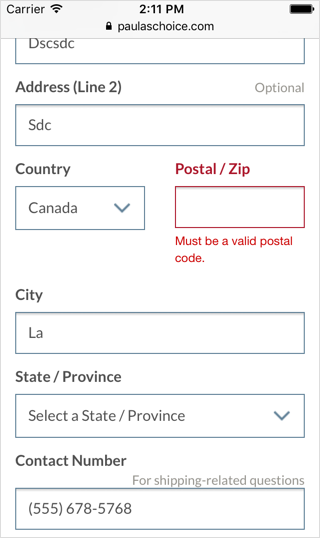

import PropsTable from '../../../../src/components/propstable'
import Tabs from 'progressive-web-sdk/dist/components/tabs/tabs'
import TabsPanel from 'progressive-web-sdk/dist/components/tabs/tabs-panel'
import FieldRow from 'progressive-web-sdk/dist/components/field-row'
import Field from 'progressive-web-sdk/dist/components/field'

<div class="component-intro">

FieldRow is used to group multiple fields on one line. It is a useful tool for saving vertical space, making forms appear less cumbersome and visually grouping similar datasets.

</div>

<div onClick={(e) => {e.stopPropagation()}}>
<Tabs activeIndex={0} className="devcenter">
<TabsPanel title="Code" onClick={(e) => {e.stopPropagation()}}>


### JavaScript import

```jsx
import FieldRow from 'progressive-web-sdk/dist/components/field-row'
```

### SCSS import

```scss
@import 'node_modules/progressive-web-sdk/dist/components/field-row/base';
```

### Props table

<PropsTable propMetaData={props.componentMetadata.childrenComponentProp} />

### Basic example

```jsx react-live=true
<form>
    <FieldRow>
        <Field label="Credit Card Number">
            <input type="tel" name="cc-number"/>
        </Field>
    </FieldRow>
    <FieldRow>
        <Field label="Expiration Date">
            <input type="text" name="exp-date" />
        </Field>
        <Field label="CVV">
            <input type="tel" name="cvv" maxLength={3} />
        </Field>
    </FieldRow>
</form>
```

</TabsPanel>
<TabsPanel title="Design" class="markdown">

### Related Components

- [Field](Field)
- [FieldSet](FieldSet)

### UI Kit


_Symbol Path: form -> Field_

### Potential uses

- Wherever two fields can be placed together on one line, so long as they will both be capturing a small number of characters.
- On the payment step of the checkout to group Expiry and Security code.
- On the shipping step of checkout to group Title and First Name.
- FieldRow can be used to space out any combination of input components; text fields, radio buttons, checkboxes etc.

### User Interactions

- FieldRow contains no interactions separate from that of the [Field](Field) component.

### Accessibility

- Inputs should be sized to reflect the amount of context expected. If an input is sized incorrectly then this can cause confusion as to what data the user is expected to input.

### Usage Tips &amp; Best practices

- Each field used in FieldRow will have the same attributes as the Field component, including hint text and inline messages. Be aware that these messages may cause spacing issues if activated.
- Fields can be spaced at the designers discretion. This should reflect the amount on context expected in each input.
- If the expected input is longer then the size of the input at smallest screen size (typically 320px) then FieldRow is not recommended.

### Example Implementations

#### Babista


#### Paula's Choice:



</TabsPanel>
</Tabs>
</div>