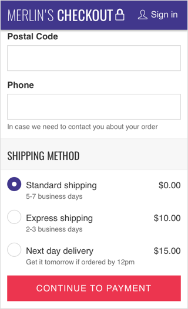

import PropsTable from '../../../../src/components/propstable'
import Tabs from 'progressive-web-sdk/dist/components/tabs/tabs'
import TabsPanel from 'progressive-web-sdk/dist/components/tabs/tabs-panel'
import FieldSet from 'progressive-web-sdk/dist/components/field-set'
import Field from 'progressive-web-sdk/dist/components/field'

<div class="component-intro">

FieldSet is used to group fields together that relate to the submission of a form. It is possible to have multiple FieldSets on a single template.

</div>

<div onClick={(e) => {e.stopPropagation()}}>
<Tabs activeIndex={0} className="devcenter">
<TabsPanel title="Code" onClick={(e) => {e.stopPropagation()}}>


### JavaScript import

```jsx
import FieldSet from 'progressive-web-sdk/dist/components/field-set'
```

### SCSS import

```scss
@import 'node_modules/progressive-web-sdk/dist/components/field-set/base';
```

### Props table

<PropsTable propMetaData={props.componentMetadata.childrenComponentProp} />

### Basic example

```jsx react-live=true
<FieldSet legend="Helpful Legend Text">
    <FieldRow>
        <Field label="Address">
            <input type="text" name="address" required />
        </Field>
    </FieldRow>
    <FieldRow>
        <Field label="City">
            <input type="text" name="city" required />
        </Field>
    </FieldRow>
    <FieldRow>
        <Field label="Postal Code">
            <input type="text" name="postal-code" required />
        </Field>
    </FieldRow>
</FieldSet>
```

</TabsPanel>
<TabsPanel title="Design" class="markdown">

### Related Components

- [Field](Field)
- [FieldRow](FieldRow)

### UI Kit


_Symbol Path: form -> Field_

### Potential uses

- Whenever a form contains separate sets of data that submit irrelevant of each other.
- To split the login/register forms on a single Sign In template.
- To group the different parts of a checkout form such as Shipping Address and Shipping Method.

### User Interactions

- FieldSet contains no interactions separate from that of the [Field](Field) component.
- A single action can be used to submit data from a specified FieldSet.

### Accessibility

- Ensure FieldSets are clearly shown/hidden depending on the action the user is performing (e.g. if a user chooses Register instead of Login, the Login set of fields should no longer be in view).

### Usage Tips &amp; Best practices

- FieldSet is a tool primarily used by developers to separate form submits.
- Ensure the submit button shown to the user is clearly relating to the fieldset (e.g a button should never read "Login or Register" it should change from Login to Register depending on the fieldset it references).

### Example Implementations

#### Lancome (Log in or Create account):


#### Merlin's Potions (shipping address and shipping method):



</TabsPanel>
</Tabs>
</div>