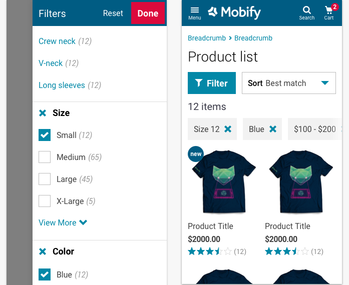

import PropsTable from '../../../../src/components/propstable'
import Tabs from 'progressive-web-sdk/dist/components/tabs/tabs'
import TabsPanel from 'progressive-web-sdk/dist/components/tabs/tabs-panel'

Filters allows users to refine a list of items by various facets: category, size, color, price range, etc. Results will only be returned if they match the options specified.

<Callout type="info">
This is a design pattern made up of several components.
</Callout>

 {e.stopPropagation()}}>
<Tabs activeIndex={0} className="devcenter">
<TabsPanel title="Design" onClick={(e) => {e.stopPropagation()}}>

### Common Components

- [Accordion](#!/Accordion)
- [Sheet](#!/Sheet)
- [Swatch](#!/Swatch)
- [Field](#!/Field)
- [ListTile](#!/ListTile)

### UI Kit

### Potential uses

- On a [product list pages](#!/Plp) to refine the number of items in a category.
- On search results pages to help refine the number of items returned.

### User Interactions

- Variable depending on the component used.
- Can include triggering a select menu, selecting a single item in a list of swatches, tapping on a list tile, selecting one or multiple check boxes or specifying a price range using a range slider.
- Either each individual selection will trigger the Submit Filter action, or a user can select multiple filters and trigger the Submit action through an Apply button.

### Accessibility

- Be clear with the action button that clears the filters. A trash icon is better suited to this interaction than an x symbol, and it should always have a text label to back it up.
- Ensure the applied filter is clearly labeled with the name of the attribute and the filter value (e.g. **Price:**$0-$10 as apposed to $0-$10)

### Usage Tips & Best practices

- Product catalogues that offer multiple filtering options work best within a focussed modal window. A [sheet](#!/sheet) which occupied the majority of the screen (not full screen) is best practice at giving the user context as to where they are in the user journey.
- Filters that reload the page upon each selection should have a 'loading' state before closing the modal window and applying the filter. Letting the user know that the modal window has closed before the filter is applied is important at maintaining an awareness of where they are.
- Filters that allow for multiple selections before 'Applying' should have clear active/not active states so that the user knows which filters are going to be added before they hit Apply.
- The PLP template should change when filters are applied. The number of results should appear below a list of the filters applied.
- Each applied filter should have a clear button with a single tap function to quickly remove that filter.

### Example Implementations

#### Babista

#### Paula's Choice

</TabsPanel>
</Tabs>

