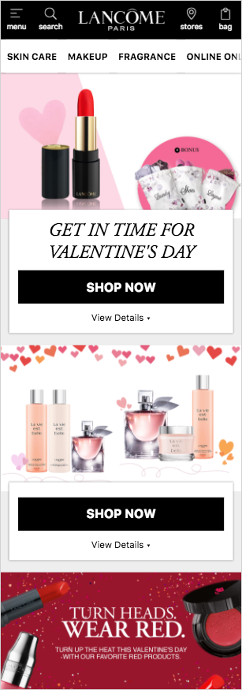

import Tabs from 'progressive-web-sdk/dist/components/tabs/tabs'
import TabsPanel from 'progressive-web-sdk/dist/components/tabs/tabs-panel'

Most commonly the first page a user lands on when entering a site. The homepage should effectively direct the user to the products, be clear as to what type of products the website is offering and visually engage the user enough that they want to continue browsing the site.

<Callout type="info">
This is a design pattern made up of several components.
</Callout>

 {e.stopPropagation()}}>
<Tabs activeIndex={0} className="devcenter">
<TabsPanel title="Design" onClick={(e) => {e.stopPropagation()}}>

### Common Components

- [Banner](Banner)
- [Carousel](Carousel)
- [CarouselItem](CarouselItem)
- [Sheet](Sheet)
- [Button](Button)
- [HeaderBar](HeaderBar)
- [HeaderBarActions](HeaderBarActions)
- [Nav](Nav)
- [NavMenu](NavMenu)

### UI Kit

### Potential uses

- To present the user with links to the high level product categories
- Presenting the user with the latest site promotions
- Showcasing the most popular and newest products
- Introduce the brand to the customer
- Deliver links to high priority site tasks (search, navigation, shopping cart, stores)

### User Interactions

#### Open site navigation
Typically a menu icon in the header bar, this opens a focussed view of all the product categories.

#### Search
Typically an icon in the header bar, this opens a focussed view where a user can enter keywords to search the site.

#### Cart
Icon in the header bar which navigates to the shopping cart.

#### Navigate to category
Tap on a high level product category to begin viewing products. Usually navigates to a PLP or CLP.

#### Navigate promotions
Usually either a carousel swipe or scroll down action to view more promotions.

#### View a promotion
Links to an area of the site of which a promotion applies. Usually either a dedicated content page or a PLP.

#### Navigate featured products
Usually either a carousel swipe or scroll down action to view more products in a featured group.

#### Sign up to newsletter
Usually a single form to input an email address and a submit button to instantly sign up to the newsletter.

#### Click to call
Often in the footer, a phone number can be tapped to call customer services direct from a mobile device.

#### Navigate to social media channel
Often in the footer, several icons may present the user with a direct tap to navigate to the customer’s social media channels.

#### Switch language
Often in the footer, a single tap offers the user a chance to navigate to a dedicated page, or a version of the homepage, presented in a different language.

### Usage Tips & Best practices

The homepage layout will often depend on the client’s existing content and company goals, but there some recommendations a designer can make:

- The visual design of the home page is more important than any other template and must be considered very closely to engage first time visitors.
- An offer carousel works best when a customer has a clear hierarchy of promotions - the highest priority will always be first in the carousel.
- If there are multiple promotions without an obvious hierarchy, consider making these visible top to bottom. This does’t hide promotions as much as a carousel but will increase page activity, reducing the visual impact of each promotion.
- Consider the ability of the customer to produce well designed mobile assets. If this will be problematic consider reducing the image these images will have on the page design.
- If a customer’s analytics shows a large skew towards one or two product categories (or if there are only a few of them) consider including direct links to these on the homepage.
- If a customer has a lot of product categories it may negatively impact the visual design of the homepage to list them all out. Consider using overflowing tabs (Lancome) or a grid layout (PureFormulas).
- Where possible, always include dynamic text and buttons instead of having these baked in to images to ensure best-practice accessibility and legibility.
- Email sign ups should always be supported by some incentive text.
- Consider the target audience when creating icons and their ability to decipher their meaning. Where possible, always use a label.
- Consider creating custom assets to visually enhance navigation items that will change rarely (e.g PureFormulas).
- If the navigation drawer has multiple levels, vary the style (such as text or color) to give the user a sense of navigation depth.

### Variations & States

#### Single/rotating promo + navigation (Merlins)
This solution naturally creates a cleaner homepage but can cause the page to suffer if the image is not vibrant enough, does not reflect the brand well enough or is not properly mobile optimized.

#### Stacked promotions (Lancome)
This approach creates a vibrant homepage, more suited to the exploring customer than those looking to find something in particular. It can create a busy homepage and an overload of UI if not handled with care and if the images are not properly mobile optimized.

#### Menu view
The navigation menu is a task the user has chosen to perform and should presented in a focussed view using a modal that covers most of the screen.

#### Search view
Searching is a task the user has chosen to perform and should presented in a focussed view. Common practice is to “disable” the other actions on the page using a transparent shade to ensure the appropriate level of focus.

### Example Implementations

#### Merlins Potions:

#### Lancome:

#### Pure Formulas:

</TabsPanel>
</Tabs>

