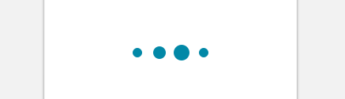

import InlineLoader from 'progressive-web-sdk/dist/components/inline-loader'
import PropsTable from '../../../../src/components/propstable'
import Tabs from 'progressive-web-sdk/dist/components/tabs/tabs'
import TabsPanel from 'progressive-web-sdk/dist/components/tabs/tabs-panel'

<div class="component-intro">

Inline loaders are designed to tell the user that an action is being performed, without altering the state of the current page.

The `InlineLoader` component does not contain any actions of its own but is often placed on top of actions to indicate a loading, disabled state.

Related components: [LazyLoader](LazyLoader) and [SkeletonBlock](SkeletonBlock).

</div>

<div onClick={(e) => {e.stopPropagation()}}>
<Tabs activeIndex={0} className="devcenter">
<TabsPanel title="Code" onClick={(e) => {e.stopPropagation()}}>

### JavaScript import

```jsx
import InlineLoader from 'progressive-web-sdk/dist/components/inline-loader'
```

### SCSS import

```scss
@import 'node_modules/progressive-web-sdk/dist/components/inline-loader/base';
```

### Props table

<PropsTable propMetaData={props.componentMetadata.childrenComponentProp} />

### Basic example

```jsx react-live=true
<InlineLoader />
```

### With custom settings

```jsx react-live=true
<InlineLoader title="Adding to cart" dotCount={5} animationDelayOffset={0.1} />
```

</TabsPanel>
<TabsPanel title="Design" class="markdown">

### Screenshot



### Potential uses

-   Within a button to show that the button has been tapped and the corresponding action has been triggered.
-   On top of a disabled page state to provide a state between the action and the subsequent loading of a new page or state.
-   During initial app load, before content is available.
-   In between page loads, when transitioning from one page to another.
-   As an alternative to placeholders during lazy loading. Use them as a user scrolls down the screen, while new content loads.

### Accessibility

-   The inline loader doesn't correlate to any timeframe, so the animation should be clear that it's rotating continuously rather than having a beginning and an end.

### Best practices

-   Use inline loading instead of full page disablement.
-   Use an inline loader to replace button text while the button's action is loading.
-   Initiate the loader after the tapped state of an add to cart button, while the product is being added to cart.
-   On slow connections, a user may see this state for some time before the JS script has finished adding to cart. To account for this, the loading graphic should be continuous.
-   On fast connections, the `InlineLoder` may only flash for a split second. It's important to ensure the design is simple so that users are not confused when this situation occurs.
-   If you're using a spinner, use native components instead of a custom spinner.
-   If you're using a loader during page transitions, it's best to place the spinner on the non-loaded second screen while content loads.
-   When deciding whether to use spinners, throbbers, or placeholder images, consider their placement and function: throbbers typically have a landscape orientation and work well on buttons, placeholders excel at simulating products and cards, and spinners are optimal when they're used in the middle of the page.

</TabsPanel>
</Tabs>
</div>
