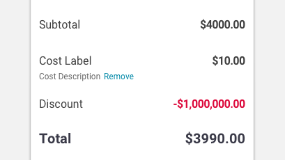

import Ledger from 'progressive-web-sdk/dist/components/ledger/ledger'
import LedgerRow from 'progressive-web-sdk/dist/components/ledger/ledger-row'
import PropsTable from '../../../../src/components/propstable'
import Tabs from 'progressive-web-sdk/dist/components/tabs/tabs'
import TabsPanel from 'progressive-web-sdk/dist/components/tabs/tabs-panel'

<div class="component-intro">

The `Ledger` component displays a line item description and a value displayed in a row. Typically the item description aligned left and the value is aligned right.

Related component: [LedgerRow](LedgerRow).

</div>

<div onClick={(e) => {e.stopPropagation()}}>
<Tabs activeIndex={0} className="devcenter">
<TabsPanel title="Code" onClick={(e) => {e.stopPropagation()}}>

### JavaScript import

```jsx
import {Ledger, LedgerRow} from 'progressive-web-sdk/dist/components/ledger'
```

### SCSS import

```scss
@import 'node_modules/progressive-web-sdk/dist/components/ledger/base';
```

### Props table

<PropsTable propMetaData={props.componentMetadata.childrenComponentProp} />

### Keys for the rows prop

The object should contain the following keys:

-   `label`: The label for the ledger entry.
-   `value`: The value for the ledger entry.
-   `isTotal`: A bool indicating if the ledger entry is the final total row. (This row will be styled differently than previous rows.)

### Basic example

```jsx react-live=true
<Ledger>
    <LedgerRow label="Name" value="test" />
</Ledger>
```

### Passing data to the ledger

```jsx react-live=true
<Ledger
    rows={[
        {
            label: 'Subtotal',
            value: '$12.99'
        },
        {
            label: 'Tax',
            value: '$0.00'
        },
        {
            label: 'Grand Total',
            value: '$12.99',
            isTotal: true
        }
    ]}
/>
```

### Defining actions for the label or value cells

```jsx react-live=true
<Ledger>
    <LedgerRow
        className="u-sale-color"
        label="Promo Code Applied"
        labelDescription="20% off all clothes"
        value="-$5.00"
        labelAction={<Button className="pw--link u-margin-start-sm" text="Remove" />}
    />

    <LedgerRow
        className="u-sale-color"
        label="Coupon Code"
        value="-$5.00"
        valueAction={<Button className="pw--link" text="Remove Promo" />}
    />

    <LedgerRow
        label="Shipping"
        labelAction={<Button className="pw--link u-margin-start-sm" text="More Info" />}
        labelDescription="Label description"
        value="$0.00"
    />

    <LedgerRow
        label="Tax"
        labelAction={<Button className="pw--link" text="More Info" />}
        value="$0.00"
    />
</Ledger>
```

</TabsPanel>
<TabsPanel title="Design" class="markdown">

### Screenshot



### Potential uses

-   In the shopping cart to display the item total, tax, discount and order total, along with their corresponding monetary values.
-   In the payment step of checkout to repeat the same content as the shopping cart before the final purchase decision.
-   Anywhere content is positioned left/right in this way, repeated vertically in a list.

### Accessibility

-   If a link is included within a LedgerRow, ensure it's clearly indicated by using the link color or underlining the text.
-   Include a description with any LedgerRow that's not self explanatory.

### Best practices

-   Some LedgerRows may contain actions that remove the row or trigger an action that will adjust the value. (For example, the calculate shipping button on the shopping cart).
-   A bottom border may be added to aid the visual separation between LedgerRows.
-   LedgerRow styling should be adjusted for any row that indicates a total of a row of items above. For example, Order Total has a larger font size to indicate a summary of the rows above.
-   Discounts should be styled to attract attention by using a callout color, typically red.

</TabsPanel>
</Tabs>
</div>
