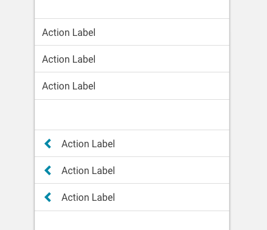

import List from 'progressive-web-sdk/dist/components/list'
import PropsTable from '../../../../src/components/propstable'
import Tabs from 'progressive-web-sdk/dist/components/tabs/tabs'
import TabsPanel from 'progressive-web-sdk/dist/components/tabs/tabs-panel'

<div class="component-intro">

Displays a collection of items all related to one another, grouped together in a vertical stack. Each item typically consists of a line of text or an icon (or both).

</div>

<div onClick={(e) => {e.stopPropagation()}}>
<Tabs activeIndex={0} className="devcenter">
<TabsPanel title="Code" onClick={(e) => {e.stopPropagation()}}>

### JavaScript import

```jsx
import List from 'progressive-web-sdk/dist/components/list'
```

### SCSS import

```scss
@import 'node_modules/progressive-web-sdk/dist/components/list/base';
```

### Props table

<PropsTable propMetaData={props.componentMetadata.childrenComponentProp} />

### Basic example

```jsx react-live=true
<List>
    <ListTile>I am a ListTile</ListTile>
    <ListTile>I am a ListTile</ListTile>
</List>
```

### With items prop

Using the `items` prop, you can pass an array of objects than can be parsed into
individual items.

```jsx react-live=true
<List
    items={[
        {
            title: 'Hear me roar!'
        },
        {
            title: 'Foobar'
        },
        {
            title: 'Quotes and stuff'
        },
        {
            title: 'Lorem ipsum'
        }
    ]}
/>
```

### With component prop

By default, each item in the `items` array will be parsed as a `ListTile`
component. This can be customized by passing a different component
into the `component` prop.

```jsx react-live=true
<List
    component={Button}
    items={[
        {
            text: 'Hear me roar!'
        },
        {
            text: 'Lorem ipsum',
            href: '#'
        }
    ]}
/>
```

</TabsPanel>
<TabsPanel title="Design" class="markdown">

### Related components
- [ListTile](ListTile)

### Screenshot



### Potential uses

-   To provide the user with a number of navigation options to find categories and sub-categories within the site.
-   Typically used on the home page to contain category and sub-category navigation.
-   Graphic elements representing each category are often included.

### Accessibility

-   Ensure ListTiles are separated with enough space to conform to minimum tap target requirements (usually 44px).

### Best practices

-   Text should be included on visual element links to improve the user's comprehension. Text should also appear near the top of the visual element so that users scrolling down the page can clearly read the text as they uncover the image link.
-   Clearly separate any unrelated lists appearing in the same space using dividers or negative space.

</TabsPanel>
</Tabs>
</div>
