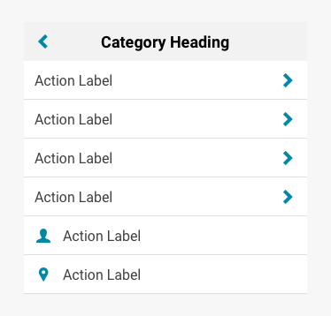

import Nav from 'progressive-web-sdk/dist/components/nav'
import NavItem from 'progressive-web-sdk/dist/components/nav-item'
import NavHeader from 'progressive-web-sdk/dist/components/nav-header'
import NavMenu from 'progressive-web-sdk/dist/components/nav-menu'
import PropsTable from '../../../../src/components/propstable'
import Tabs from 'progressive-web-sdk/dist/components/tabs/tabs'
import TabsPanel from 'progressive-web-sdk/dist/components/tabs/tabs-panel'

<div class="component-intro">

The `Nav` component is a panel that holds the site navigation, 
providing the user with a way to access all product categories and other important pages.
It provides an arbitrarily nested navigation
tree that can be used to manage transitions between navigation nodes.

The state of the navigation tree is shared with child components
through `context`, making it easy to build custom navigation UIs.
For simple cases, a set of default components are provided.
Subscribe to changes through the `onPathChange` prop in order to
make changes to the navigation state of the app.

</div>

<div onClick={(e) => {e.stopPropagation()}}>
<Tabs activeIndex={0} className="devcenter">
<TabsPanel title="Code" onClick={(e) => {e.stopPropagation()}}>

### JavaScript import

```jsx
import Nav from 'progressive-web-sdk/dist/components/nav/'
```

### SCSS import

```scss
@import 'node_modules/progressive-web-sdk/dist/components/nav/base';
```

### Props table

<PropsTable propMetaData={props.componentMetadata.childrenComponentProp} />

### More on the root prop

The `root` prop is an object that represents the complete navigation tree. It's passed to the `Nav` component in its entirety, even though only a small portion of it is rendered at a time. Its basic structure can be described like this:

```javascript static
root = {
    title: '', // string, required
    path: '', // string, required
    type: '', // string
    children: [] // array (of root objects)
}
```

Even though the `path` value is just a plain string, it does require `/` characters to determine the depth of the navigation node. For example, the top-most node path is likely just `/`, while second-level nodes are `/something/` and have two `/` characters which makes it depth 2. Third-level nodes `/foo/bar/` have three `/` characters making it depth 3, and so on.

The `children` key is optional, and it has a required format: it must be an array of root objects. There is no limit to the depth of this structure. Children root objects can have their own array of root objects, and so on.

See the example usages further below to see what root objects might look like.

### More on the onPathChange prop

`onPathChange` is a function callback used as a hook to trigger behavior when the navigation path changes. A navigation path change is triggered whenever the user interacts with a `NavItem`. It takes four arguments:

-   `path` (string): the current navigation item's path (may be modified to deduplicate non-unique paths in the Nav).
-   `isLeaf` (boolean): whether the current navigation item is a leaf (see the _Example With Nested Navigation And Leafs_ section below to learn about leafs).
-   `trigger` (string): the interaction that triggered the navigation to the current item. Can be one of: `mouseEnter`, `mouseLeave`, `touchEnd`, `focus`, `blur` or `click`.
-   `originalPath (optional)` (string): the original, unmodified path of the current navigation item.

Ultimately it's up to the developer to decide when and how route changes occur, but a common pattern is the following:

```javascript static
const onPathChange = (path, isLeaf, trigger) => {
    setState({path: path})
    if (isLeaf) {
        window.location.href = path
    }
}
```

The example usages further below show how to apply the callback.

### Basic example

This example shows the bare minimum needed to render the Nav component. This example, while simple, is non-functional and not very useful by itself. Gradually more complex examples with more useful functionality, are provided below.

Example of the `Nav` component that uses a child `NavMenu`:

```jsx react-live=true
<Nav
    root={{
        title: 'My Store',
        path: '/',
        children: [
            {
                title: "Men's Clothing",
                path: '/mens-clothing/'
            },
            {
                title: "Women's Clothing",
                path: '/womens-clothing/'
            },
            {
                title: "Kids' Clothing",
                path: '/kids-clothing/'
            },
            {
                title: 'Accessories',
                path: '/accessories/'
            }
        ]
    }}
>
    <NavMenu />
</Nav>
```

### With MegaMenu

This example shows the bare minimum needed to render the Nav component. This example, while simple, is non-functional and not very useful by itself. Gradually more complex examples, with more useful functionality, are provided below.

Example of the `Nav` component that uses a child `MegaMenu`:

```jsx react-live=true
<Nav
    root={{
        title: 'My Store',
        path: '/',
        children: [
            {
                title: "Men's Clothing",
                path: '/mens-clothing/'
            },
            {
                title: "Women's Clothing",
                path: '/womens-clothing/'
            },
            {
                title: "Kids' Clothing",
                path: '/kids-clothing/'
            },
            {
                title: 'Accessories',
                path: '/accessories/'
            }
        ]
    }}
>
    <MegaMenu />
</Nav>
```

### Enabling route changes

In the example above, you may notice that the component's links don't actually function at all. In order to enable the links to navigate, we must supply a callback to the `onPathChange` prop.

Also, by tracking the current active path, we can have the Nav component highlight it. This is done by passing the active path to the `path` prop.

```jsx react-live=true
class StatefulExample extends React.Component {
    constructor() {
        this.state = {
            path: '/'
        }
    }

    changePath(path) {
        // Track the newly active path in the state so the
        // component can highlight it in the UI.
        this.setState({path: path})

        // You might do something like this:
        // `window.location.href = path`
        alert('Change route to ' + path + '!')
    }

    render() {
        const root = {
            title: 'My Store',
            path: '/',
            children: [
                {
                    title: "Men's Clothing",
                    path: '/mens-clothing/'
                },
                {
                    title: "Women's Clothing",
                    path: '/womens-clothing/'
                },
                {
                    title: "Kids' Clothing",
                    path: '/kids-clothing/'
                },
                {
                    title: 'Accessories',
                    path: '/accessories/'
                }
            ]
        }

        return (
            <Nav root={root} path={this.state.path} onPathChange={this.changePath.bind(this)}>
                <NavMenu />
            </Nav>
        )
    }
}
```

### With nested navigation and leafs

A very common navigation pattern is the nested navigation. This usually implies that the navigational structure of an app consists of multiple tiers of depth. This can be achieved with the Navigation component by passing arrays to the `children` keys in the `root` object.

By introducing children to the navigation tree, our `Nav` component inherits some new behavior: clicking on a navigation item with children will animate in a new "page" of navigation items. With this pattern, a user can narrow in on the page they want to visit very quickly.

In a nested navigation, items at the end of a navigation branch (one that has no `children`) can be thought of us a "leaf". It's usually these leaf items that actually trigger a route change. As such, the `onPathChange` callback is passed `isLeaf` as an argument to detect whether the user clicked on a leaf. The developer can then use this to determine how they want to trigger route changes.

```jsx react-live=true
class StatefulExample extends React.Component {
    constructor() {
        this.state = {
            path: '/'
        }
    }

    changePath(path, isLeaf) {
        // Track the newly active path in the state so the
        // component can highlight it in the UI.
        this.setState({path: path})

        // Only trigger a route change when the user
        // clicks a leaf
        if (isLeaf) {
            // Typically leaf nodes cause page changes
            // in an app. You might do something like
            // this: `window.location.href = path`
            alert('Change route to ' + path + '!')
        }
    }

    render() {
        const root = {
            title: 'My Store',
            path: '/',
            children: [
                {
                    title: "Men's Clothing",
                    path: '/mens-clothing/',
                    children: [
                        {title: 'Casual Shirts', path: '/mens-clothing/casual-shirts/'},
                        {title: 'Coats and Jackets', path: '/mens-clothing/coats-and-jackets/'},
                        {title: 'Jeans', path: '/mens-clothing/jeans/'},
                        {title: 'Polos', path: '/mens-clothing/polos/'},
                        {title: 'Shorts', path: '/mens-clothing/shorts/'}
                    ]
                },
                {
                    title: "Women's Clothing",
                    path: '/womens-clothing/',
                    children: [
                        {title: 'Clothing', path: '/womens-clothing/clothing/'},
                        {title: 'Shoes', path: '/womens-clothing/shoes/'},
                        {title: 'Handbags', path: '/womens-clothing/handbags/'},
                        {
                            title: 'Designer Collections',
                            path: '/womens-clothing/designer-collections/'
                        }
                    ]
                },
                {
                    title: "Kids' Clothing",
                    path: '/kids-clothing/',
                    children: [
                        {title: 'Boys', path: '/kids-clothing/boys/'},
                        {title: 'Girls', path: '/kids-clothing/girls/'}
                    ]
                },
                {
                    title: 'Accessories',
                    path: '/accessories/'
                }
            ]
        }

        return (
            <Nav root={root} path={this.state.path} onPathChange={this.changePath.bind(this)}>
                <NavMenu />
            </Nav>
        )
    }
}
```

### With nav header and controls

In the previous example, you might notice that it's not possible to move the navigation back to a previous page. That's because the example is missing a crucial part of the navigation UI: the [`NavHeader` sub-component](NavHeader).

A common feature of the navigation component is to have a header section dedicated to displaying navigational meta data, such as the active navigation level, back and close buttons. You can achieve this by including `NavHeader` as a child to `Nav`. See the example below for the most simple (non-functional) use case. See the subsequent example for a fully functional use case.

If you wondered earlier why the `root` object's first tier included a `title` key, now you see why: because it's used in the `NavHeader` component!

```jsx react-live=true
class StatefulExample extends React.Component {
    constructor() {
        this.state = {
            path: '/'
        }
    }

    render() {
        const root = {
            title: 'My Store',
            path: '/',
            children: [
                {
                    title: "Men's Clothing",
                    path: '/mens-clothing/'
                },
                {
                    title: "Women's Clothing",
                    path: '/womens-clothing/'
                },
                {
                    title: "Kids' Clothing",
                    path: '/kids-clothing/'
                },
                {
                    title: 'Accessories',
                    path: '/accessories/'
                }
            ]
        }

        return (
            <Nav root={root}>
                <NavHeader />
                <NavMenu />
            </Nav>
        )
    }
}
```

Here is the fully functional example of the NavHeader:

```jsx react-live=true
class StatefulExample extends React.Component {
    constructor() {
        this.state = {
            path: '/'
        }
    }

    changePath(path, isLeaf) {
        // Track the newly active path in the state so the
        // component can highlight it in the UI.
        this.setState({path: path})

        // Only trigger a route change when the user
        // clicks a leaf
        if (isLeaf) {
            // Typically leaf nodes cause page changes
            // in an app. You might do something like
            // this: `window.location.href = path`
            alert('Change route to ' + path + '!')
        }
    }

    render() {
        const root = {
            title: 'My Store',
            path: '/',
            children: [
                {
                    title: "Men's Clothing",
                    path: '/mens-clothing/',
                    children: [
                        {title: 'Casual Shirts', path: '/mens-clothing/casual-shirts/'},
                        {title: 'Coats and Jackets', path: '/mens-clothing/coats-and-jackets/'},
                        {title: 'Jeans', path: '/mens-clothing/jeans/'},
                        {title: 'Polos', path: '/mens-clothing/polos/'},
                        {title: 'Shorts', path: '/mens-clothing/shorts/'}
                    ]
                },
                {
                    title: "Women's Clothing",
                    path: '/womens-clothing/',
                    children: [
                        {title: 'Clothing', path: '/womens-clothing/clothing/'},
                        {title: 'Shoes', path: '/womens-clothing/shoes/'},
                        {title: 'Handbags', path: '/womens-clothing/handbags/'},
                        {
                            title: 'Designer Collections',
                            path: '/womens-clothing/designer-collections/'
                        }
                    ]
                },
                {
                    title: "Kids' Clothing",
                    path: '/kids-clothing/',
                    children: [
                        {title: 'Boys', path: '/kids-clothing/boys/'},
                        {title: 'Girls', path: '/kids-clothing/girls/'}
                    ]
                },
                {
                    title: 'Accessories',
                    path: '/accessories/'
                }
            ]
        }

        return (
            <Nav root={root} path={this.state.path} onPathChange={this.changePath.bind(this)}>
                <NavHeader />
                <NavMenu />
            </Nav>
        )
    }
}
```

### Custom animations

To customize how the Nav component animates as it transitions from page to page, you can pass custom configurations to the `NavHeader` and/or the `NavMenu` components' prop called `animationProperties`. See either the [`NavHeader`](NavHeader) or [`NavMenu`](NavMenu) for details.

### The item factory

It's common for developers to customize how the navigation items are rendered. This can be done using the `NavMenu` component's `itemFactory` callback. For examples of this, see the [`NavMenu` component](NavMenu).

### Complex example

Below is an example that takes everything discussed above to create a single, complex use case. As mentioned above, see either the [`NavHeader`](NavHeader) or [`NavMenu`](NavMenu) for details on the item factory and custom animations.

```jsx react-live=true
class StatefulExample extends React.Component {
    constructor() {
        this.state = {
            path: '/'
        }
    }

    changePath(path, isLeaf) {
        // Track the newly active path in the state so the
        // component can highlight it in the UI.
        this.setState({path: path})

        // Only trigger a route change when the user
        // clicks a leaf
        if (isLeaf) {
            // Typically leaf nodes cause page changes
            // in an app. You might do something like
            // this: `window.location.href = path`
        }
    }

    render() {
        const root = {
            title: 'Store',
            path: '/',
            children: [
                {
                    title: "Men's Clothing",
                    path: '/mens-clothing/',
                    children: [
                        {title: 'Casual Shirts', path: '/mens-clothing/casual-shirts/'},
                        {title: 'Coats and Jackets', path: '/mens-clothing/coats-and-jackets/'},
                        {title: 'Jeans', path: '/mens-clothing/jeans/'},
                        {title: 'Polos', path: '/mens-clothing/polos/'},
                        {title: 'Shorts', path: '/mens-clothing/shorts/'}
                    ]
                },
                {
                    title: "Women's Clothing",
                    path: '/womens-clothing/',
                    children: [
                        {title: 'Clothing', path: '/womens-clothing/clothing/'},
                        {title: 'Shoes', path: '/womens-clothing/shoes/'},
                        {title: 'Handbags', path: '/womens-clothing/handbags/'},
                        {
                            title: 'Designer Collections',
                            path: '/womens-clothing/designer-collections/'
                        }
                    ]
                },
                {
                    title: "Kids' Clothing",
                    path: '/kids-clothing/',
                    children: [
                        {title: 'Boys', path: '/kids-clothing/boys/'},
                        {title: 'Girls', path: '/kids-clothing/girls/'}
                    ]
                },
                {title: 'Footwear', path: '/footwear/'},
                {title: 'Accessories', path: '/accessories/'},
                {title: 'For the Home', path: '/for-the-home/'},
                {title: 'My Account', path: '/my-account/', type: 'custom'},
                {title: 'Wish List', path: '/wish-list/', type: 'custom'},
                {title: 'Gift Registry', path: '/gift-registry/', type: 'custom'}
            ]
        }

        /**
         * Example custom navigation item, used in the below
         * `itemFactory` callback. More details on the
         * `itemFactory` can be found in the `NavHeader` and
         * `NavMenu` documentation.
         */
        const Custom = (props) => {
            const {navigate, selected, title, children, hasChild} = props
            const style = {
                padding: '10px',
                backgroundColor: '#222',
                color: '#FFF',
                cursor: 'pointer'
            }
            return (
                <div onClick={navigate} style={style}>
                    {title}
                </div>
            )
        }

        /**
         * In order to use custom navigation items, create an
         * `itemFactory` and pass it as a prop to the `NavMenu`
         * component.
         *
         * The default factory provided creates generic
         * `NavItem` instances. We recommend using the 'type'
         * attribute to specify a custom component.
         */
        const itemFactory = (type, props) => {
            if (type === 'custom') {
                return <Custom {...props} />
            } else {
                const icon = <Icon name="chevron-right" />
                return <NavItem {...props} childIcon={icon} />
            }
        }

        /**
         * Custom animation! This is explained in further detail
         * in the documentation for the `NavHeader` and
         * `NavMenu` components.
         */
        const animationProperties = {
            duration: 400,
            easing: 'cubic-bezier(0.68, -0.55, 0.265, 1.55)'
        }

        return (
            /**
             * We add a `div` and give it height and width, because
             * our example of custom animation includes absolutely
             * positioning the `NavMenu` and `NavHeader`. This may
             * or may not be required for your own implementation
             * depending on your unique needs.
             */
            <div style={{height: '440px', width: '100%', border: '1px solid #DDD'}}>
                <Nav root={root} path={this.state.path} onPathChange={this.changePath.bind(this)}>
                    <NavHeader animationProperties={animationProperties} />
                    <NavMenu itemFactory={itemFactory} animationProperties={animationProperties} />
                </Nav>
            </div>
        )
    }
}
```

### Duplicate paths

The Nav component was originally designed to render a navigation tree in which
every item contained a unique path or URL. We've upgraded the Nav to handle
cases where users want to include items with duplicate paths in the same menu.
The Nav does this by automatically de-duplicating paths on the items you pass it.

### Path modification for duplicate paths

If the navigation tree contains nodes with duplicate paths, paths are modified by appending '#'s to the end of the path. For example, consider the following navigation tree:

```javascript static
const root = {
    title: 'My Store',
    path: '/',
    children: [
        {title: 'child1', path: '/child/'},
        {title: 'child2', path: '/child/'},
        {title: 'child3', path: '/child/'}
    ]
}
```

All the children of the 'root' element in the above navigation tree have identical paths. Their paths will be deduplicated as:

-   path of root: '/'
-   path of child1: '/child/'
-   path of child2: '/child/#'
-   path of child3: '/child/##'

### Handling warnings relating to "duplicate paths in the Nav"

If you are using duplicate paths in your navigation system, you might see a warning like:
`Your Nav contains duplicate paths. Make sure you change your onPathChange callback to use originalPath when changing routes...`

If you see a warning relating to duplicate paths like the message above, you'll need to upgrade your `onPathChange` function to take a fourth parameter containing the original, unmodified path, like this:

```jsx react-live=true
class StatefulExample extends React.Component {
    constructor() {
        this.state = {
            path: '/'
        }
    }

    changePath(path, isLeaf, trigger, originalPath) {
        // Use the de-duplicated path for the Nav state.
        this.setState({path: path})

        // Use the additional parameter (originalPath) when changing Routes
        // instead of the 'path' parameter (altered due to deduplication).
        if (isLeaf) {
            alert('Change route to ' + originalPath + '!')
        }
    }

    render() {
        const root = {
            title: 'My Store',
            path: '/',
            children: [
                {title: 'child1', path: '/child/'},
                {title: 'child2', path: '/child/'},
                {title: 'child3', path: '/child/'}
            ]
        }

        return (
            <Nav root={root} path={this.state.path} onPathChange={this.changePath.bind(this)}>
                <NavHeader />
                <NavMenu />
            </Nav>
        )
    }
}
```

If a navigation tree that has duplicate paths is passed into the 'Nav' component without using the modified `onPathChange` callback, then the 'path' that you would get from the `onPathChange` callback would be the deduplicated path (the path appended with #s).

</TabsPanel>
<TabsPanel title="Design" class="markdown">

### Related components
- [NavHeader](NavHeader)
- [NavItem](NavItem)
- [NavMenu](NavMenu)
- [NavSlider](NavSlider)
- [MegaMenu](MegaMenu)
- [MegaMenuItem](MegaMenuItem)

### Screenshot



### Potential uses

-   `Nav` is the container that holds links to the main product categories.
-   Often accessed by an icon in the menu bar (typically a hamburger menu).
-   Often used to hold links to the brand's various social media channels.
-   Often includes legal copy such as a copyright line.
-   Typically contains a logged in/out status and links to the My Account section.

### Accessibility

-   Ensure a nav state is a focused view, with clear context of the page beneath. This can be done using a translucent layer.
-   When setting the style for translucent layers, be aware of the effect that contrast can have on a user's cognitive load. If the opacity contrast is too fine, the main window may lose its focus.
-   If using an "x" icon for the close button, consider the user's ability to understand the icon. If in doubt, support the icon up with a text label.

### Best practices

-   The primary goal of any `Nav` component is to provide navigation. Links to anything else should be considered a lower priority and designed with that in mind.
-   Typically the `Nav` component is positioned within a left hand sidebar, but this can vary depending on the positioning of the button which opens it.
-   Most users will expect the `Nav` to open from the left.
-   Always have a **close** button and a link outside the component to close the navigation state. This close button is usually positioned in the top right of the component.
-   The `Nav` is a good place to hold global content that does not relate to the core user experience, such as social icons or external links to a blog. However, these should be positioned away from the core action of choosing a product category.
-   Ensure the `Nav` component has enough room to grow to add more product categories in future.

</TabsPanel>
</Tabs>
</div>
