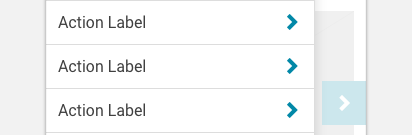

import NavItem from 'progressive-web-sdk/dist/components/nav-item'
import PropsTable from '../../../../src/components/propstable'
import Tabs from 'progressive-web-sdk/dist/components/tabs/tabs'
import TabsPanel from 'progressive-web-sdk/dist/components/tabs/tabs-panel'

<div class="component-intro">

A NavItem is used for the various links to product categories within the navigation.

The `NavItem` component renders a simple block link that's intended to be used
in other components. It's the default component used when the `NavMenu` component renders its list of navigation items.

</div>

<div onClick={(e) => {e.stopPropagation()}}>
<Tabs activeIndex={0} className="devcenter">
<TabsPanel title="Code" onClick={(e) => {e.stopPropagation()}}>

### JavaScript import

```jsx
import NavItem from 'progressive-web-sdk/dist/components/nav-item'
```

### SCSS import

```scss
@import 'node_modules/progressive-web-sdk/dist/components/nav-item/base';
```

### Props table

<PropsTable propMetaData={props.componentMetadata.childrenComponentProp} />

### Basic example

This example explains the most simple way to use the `NavItem` component:

```jsx react-live=true
<NavItem title="Home page" />
```

### With href prop

This prop can be used to render `NavItem` as a link:

```jsx react-live=true
<NavItem title="Home page" href="http://www.mobify.com" />
```

### With hasChild prop

Part of the `NavItem`'s purpose is to communicate its relationship within an overall navigation tree. For example, is the `NavItem` itself a "leaf" of the tree (has no children and is probably a link), or does it branch into more links (has children and is probably not a link)? The example below shows the `NavLink` when `hasChild` is `true` and `false`:

```jsx react-live=true
<div>
    <NavItem title="Has children, and thus has a chevron!" hasChild={true} />

    <NavItem title="No children, and thus no chevron" />
</div>
```

### With childIcon prop

You may want to swap the `NavItem`'s default `childIcon` from just a standard '>' character to something more interesting, such as an SVG icon:

```jsx react-live=true
<NavItem title="Has custom `childIcon`" hasChild={true} childIcon={<Icon name="chevron-right" />} />
```

### With beforeContent prop

A simple way to customize the `NavItem` is to supply content such as icons or images to the `beforeContent` prop:

```jsx react-live=true
<div>
    <NavItem title="My Profile" beforeContent={<Icon name="user" />} />

    <NavItem title="Search" beforeContent={<Icon name="search" />} />
</div>
```

### With content prop

The `content` prop can be used to override the default label.

```jsx react-live=true
<div>
    <NavItem
        title="This should be overridden"
        content="The custom content is visible, but not the title!"
    />

    <NavItem
        title="This should be overridden"
        content="But other props won't be overridden"
        beforeContent={<Icon name="caution" />}
        childIcon={<Icon name="caution" />}
        hasChild={true}
    />
</div>
```

### With navigate and selected props

The `navigate` prop is an `onClick` handler which invokes the `Nav` component's `onPathChange` callback. When a `NavMenu` renders its `NavItem`s, it automatically passes a handler to the `navigate` prop.

The `selected` prop is a boolean supplied by the parent `NavMenu`. It determines whether the item is "active".

While it is possible to use both `navigate` and `selected`, it's not recommended.

```jsx react-live=true
<div>
    <NavItem
        title="This custom click handler is not recommended"
        navigate={() => {
            alert('triggered: custom click handler')
        }}
    />

    <NavItem title="This item is selected, or 'active'" selected={true} />
</div>
```

Instead, understand that `navigate` and `selected` are passed values from `NavMenu` automatically. Notice that in the below example, it appears as if there are _no_ instances of `NavItem`, but in fact they are automatically rendered by `NavMenu`.

```jsx react-live=true
class StatefulExample extends React.Component {
    constructor() {
        this.state = {
            path: '/'
        }
    }

    changePath(path, isLeaf) {
        window.alert('This callback is invoked when navigate() gets called!')
        this.setState({path: path})
    }

    render() {
        const root = {
            title: 'Demonstration',
            path: '/',
            children: [
                {
                    title: 'Clicking triggers navigate and enables selected',
                    path: '/a/'
                },
                {
                    title: 'Clicking triggers navigate and enables selected',
                    path: '/b/'
                },
                {
                    title: 'Clicking triggers navigate and enables selected',
                    path: '/c/'
                }
            ]
        }

        return (
            <Nav root={root} path={this.state.path} onPathChange={this.changePath.bind(this)}>
                <NavMenu />
            </Nav>
        )
    }
}
```

### Rendering custom NavItems in a NavMenu

If you want to use your own custom `NavItem`s, you can use the `NavMenu`'s `itemFactory` callback. Refer to the [`NavMenu` documentation](NavMenu) for details.

</TabsPanel>
<TabsPanel title="Design" class="markdown">

### Related components
- [Nav](Nav)
- [NavHeader](NavHeader)
- [NavMenu](NavMenu)
- [NavSlider](NavSlider)

### Screenshot



### Potential uses

-   `NavItems` are grouped together to form the navigation of a site.
-   They can be used to hold links for product listing pages, and to reveal a deeper set of links within the `NavMenu`.

### Accessibility

-   If you're using a background color, make sure that the category heading passes color contrast guidelines. Grey on Grey is very difficult to read unless the contrast is very high.

### Best practices

-   It's best to visually differentiate `NavItems` that lead to a page, from those that lead to another set of navigation items. `NavItems` that lead to another set of items typically have a right chevron positioned at the end of the row.
-   Differentiating text size or background color can help to create a visual hierarchy throughout the navigation tiers.
-   Make sure any important supporting text such as "View all" stands out by using a heavier weight.

</TabsPanel>
</Tabs>
</div>
