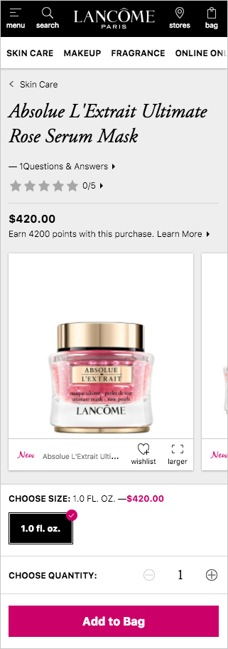

import Tabs from 'progressive-web-sdk/dist/components/tabs/tabs'
import TabsPanel from 'progressive-web-sdk/dist/components/tabs/tabs-panel'

The product detail page is designed to present the user with complete product information before adding to cart. Every product on the site should have a PDP template, it holds all the information the user may require in their decision to buy.

This is a template made up of several components. The structure should be the same for every product so that the user learns where to find the information they are looking for, and to reduce time spent on implementation.

<Callout type="info">
This is a design pattern made up of several components.
</Callout>

 {e.stopPropagation()}}>
<Tabs activeIndex={0} className="devcenter">
<TabsPanel title="Design" onClick={(e) => {e.stopPropagation()}}>

### Common Components

- [Banner](Banner)
- [Carousel](Carousel)
- [CarouselItem](CarouselItem)
- [Stepper](Stepper)
- [Accordion](Accordion)
- [Button](Button)
- [Select](Select)
- [SkeletonBlock](SkeletonBlock)
- [ProductZoom](ProductZoom)
- [ProductOptions](ProductOptions)
- [Review](Review)
- [ReviewSummary](ReviewSummary)
- [Rating](Rating)
- [Scroller](Scroller)

### UI Kit

### Potential uses

- Transitioned to most commonly from a product list page (PLP)
- Usually the final step before beginning the checkout process
- The page where a user is taken to after choosing to view a product

### User Interactions

This can vary greatly depending on client’s business logic

#### View product images
Cycle through multiple images on a single product

#### Enlarge product image
Tap on an image to see the it full screen

#### Select product options
Select the size/color etc. of a product before adding to cart

#### Specify quantity
Increase/decrease number of items to add to cart

#### Add to cart
Places that product in the cart to begin the checkout process

#### Add to wishlist
User can save the item for later by placing it in the wishlist

#### Get directions to nearest store
If item is available for in store pickup, the user can view directions to their nearest store on a map

#### View full description
User can expand the content to read more about the product

#### Read reviews
User can expand content to reveal a full list of reviews for the product

#### View related products
User can see, and navigate to, items that relate to the product

#### Share
User can email a link to this product or share the url on a social media channel of their choosing

#### View shipping options
User can expand the content to view general shipping and returns information

### Usage Tips & Best practices

- This page is what sells the item to the user, therefore it should be visually engaging
- A review summary should be placed high up the page, along with number of reviews that go into making that summary, tapping on this would anchor to the reviews section
- The purchasing options should be placed together and next to the add to cart button
- Selecting a product option (such as color) often switches the product image, therefore these two UI elements should be placed close together
- If product options change the final price, this should be made clear by placing the price next to the add to cart button
- Product options that are unavailable should be presented in a disabled state so that the user knows they can return later when that option is back in stock
- As soon as a user decides to buy they need to be able to find the add to cart button easily, this should be the most prominent piece of UI on the page
- If stock levels are available these should be presented near the quantity selection
- Product descriptions can be long and the text should be collapsable by the user
- A product can have a large number of reviews, present only a small number of these on the PDP, with an action to view more
- Related products should be presented at the end of the PDP, after a user has had a chance to view all the product information
- Transition states should be utilized when a user taps ‘add to cart’ to show that an action is taking place
- When the item is added the cart there needs to be a clear success state containing an option to go to the checkout

### Variations & States

#### Added to cart
After a user adds an item to cart they should be given a clear success state with options to go straight to the checkout or go back to the PDP

#### Full screen images
Images in full screen should be given a single action to close the image and go back to the PDP

### Example Implementations

#### Lancome

#### Crabtree & Evelyn

</TabsPanel>
</Tabs>

