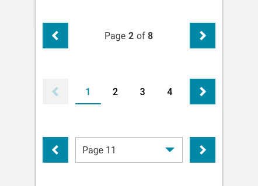

import Pagination from 'progressive-web-sdk/dist/components/pagination'
import PropsTable from '../../../../src/components/propstable'
import Tabs from 'progressive-web-sdk/dist/components/tabs/tabs'
import TabsPanel from 'progressive-web-sdk/dist/components/tabs/tabs-panel'

<div class="component-intro">

Pagination is a way of breaking down large listings into smaller, more digestible chunks and allowing the user to step through them in sequential (or random) order.

</div>

<div onClick={(e) => {e.stopPropagation()}}>
<Tabs activeIndex={0} className="devcenter">
<TabsPanel title="Code" onClick={(e) => {e.stopPropagation()}}>

### JavaScript import

```jsx
import Pagination from 'progressive-web-sdk/dist/components/pagination'
```

### SCSS import

```scss
@import 'node_modules/progressive-web-sdk/dist/components/pagination/base';
```

### Props table

<PropsTable propMetaData={props.componentMetadata.childrenComponentProp} />

### Basic example

```jsx react-live=true
class StatefulExample extends React.Component {
    constructor() {
        this.state = {
            currentPage: 1
        }
    }

    changePath(newPage) {
        this.setState({currentPage: newPage})
    }

    render() {
        return (
            <Pagination
                onChange={this.changePath.bind(this)}
                currentPage={this.state.currentPage}
                pageCount={5}
                showCurrentPageMessage={false}
            />
        )
    }
}
```

### With no page buttons

```jsx react-live=true
class StatefulExample extends React.Component {
    constructor() {
        this.state = {
            currentPage: 1
        }
    }

    changePath(newPage) {
        this.setState({currentPage: newPage})
    }

    render() {
        return (
            <Pagination
                onChange={this.changePath.bind(this)}
                currentPage={this.state.currentPage}
                pageCount={8}
                showPageButtons={false}
            />
        )
    }
}
```

### With first and last buttons

First and Last buttons can also be added to `Pagination`. The `firstButton` and `lastButton` props accept an object that describes the buttons:

-   The contents of the `text` attribute will be shown inside the button.
-   Anything in the `props` attribute will be passed down to the button itself.

Similarly, `nextButton` and `prevButton` can also be customized in this way.

When any of the buttons are clicked, the function passed via the `onChange` prop will be called. It will be passed the selected page number.

```jsx react-live=true
class StatefulExample extends React.Component {
    constructor() {
        this.state = {
            currentPage: 1
        }
    }

    changePath(newPage) {
        this.setState({currentPage: newPage})
    }

    render() {
        return (
            <Pagination
                onChange={this.changePath.bind(this)}
                currentPage={this.state.currentPage}
                pageCount={5}
                showCurrentPageMessage={false}
                prevButton={{
                    props: {icon: 'chevron-left', title: 'Previous', className: 'pw--tertiary'}
                }}
                nextButton={{
                    props: {icon: 'chevron-right', title: 'Next', className: 'pw--tertiary'}
                }}
                firstButton={{
                    text: 'First'
                }}
                lastButton={{
                    text: 'Last'
                }}
            />
        )
    }
}
```

### With no next/previous buttons

Next and Previous buttons are shown by default. In order to hide these buttons, you can pass `null` for the `nextButton` and `prevButton` props.

```jsx react-live=true
class StatefulExample extends React.Component {
    constructor() {
        this.state = {
            currentPage: 1
        }
    }

    changePath(newPage) {
        this.setState({currentPage: newPage})
    }

    render() {
        return (
            <Pagination
                onChange={this.changePath.bind(this)}
                currentPage={this.state.currentPage}
                pageCount={5}
                showCurrentPageMessage={false}
                nextButton={null}
                prevButton={null}
            />
        )
    }
}
```

### With custom current page message

```jsx react-live=true
class StatefulExample extends React.Component {
    constructor() {
        this.state = {
            currentPage: 1
        }
    }

    changePath(newPage) {
        this.setState({currentPage: newPage})
    }

    render() {
        return (
            <Pagination
                onChange={this.changePath.bind(this)}
                currentPage={this.state.currentPage}
                pageCount={8}
                showPageButtons={false}
                getCurrentPageMessage={(current, total) => `You are on page ${current} of ${total}`}
            />
        )
    }
}
```

### Showing subset of pages

If you have a lot of pages, you can show a subset of those pages with the `pagesToShow` prop.

```jsx react-live=true
class StatefulExample extends React.Component {
    constructor() {
        this.state = {
            currentPage: 1
        }
    }

    changePath(newPage) {
        this.setState({currentPage: newPage})
    }

    render() {
        return (
            <Pagination
                onChange={this.changePath.bind(this)}
                currentPage={this.state.currentPage}
                pageCount={20}
                pagesToShow={5}
                showCurrentPageMessage={false}
                firstButton={{
                    text: 'First'
                }}
                lastButton={{
                    text: 'Last'
                }}
            />
        )
    }
}
```

### Showing subset of pages with start and end

If you always want a certain number of pages to be visible at the start and end of the pagination, you can use the `pagesToShowAtStart` and `pagesToShowAtEnd` props. Note that `pagesToShow` must be greater than `pagesToShowAtEnd` and `pagesToShowAtStart` combined.

```jsx react-live=true
class StatefulExample extends React.Component {
    constructor() {
        this.state = {
            currentPage: 1
        }
    }

    changePath(newPage) {
        this.setState({currentPage: newPage})
    }

    render() {
        return (
            <Pagination
                onChange={this.changePath.bind(this)}
                currentPage={this.state.currentPage}
                pageCount={10}
                pagesToShow={5}
                pagesToShowAtStart={2}
                pagesToShowAtEnd={2}
                showCurrentPageMessage={false}
                firstButton={{
                    text: 'First'
                }}
                lastButton={{
                    text: 'Last'
                }}
            />
        )
    }
}
```

### With select pagination

```jsx react-live=true
class StatefulExample extends React.Component {
    constructor() {
        this.state = {
            currentPage: 1
        }
    }

    changePath(newPage) {
        this.setState({currentPage: newPage})
    }

    render() {
        return (
            <Pagination
                isSelect
                onChange={this.changePath.bind(this)}
                currentPage={this.state.currentPage}
                pageCount={4}
                showPageButtons={false}
                showCurrentPageMessage={false}
            />
        )
    }
}
```

### Custom select option text

```jsx react-live=true
class StatefulExample extends React.Component {
    constructor() {
        this.state = {
            currentPage: 1
        }
    }

    changePath(newPage) {
        this.setState({currentPage: newPage})
    }

    render() {
        return (
            <Pagination
                isSelect
                onChange={this.changePath.bind(this)}
                currentPage={this.state.currentPage}
                pageCount={4}
                showPageButtons={false}
                showCurrentPageMessage={false}
                getSelectOptionMessage={(current, total) => `Go to page ${current} of ${total}`}
                getCurrentPageMessage={(current, total) => `You are on page ${current} of ${total}`}
            />
        )
    }
}
```

</TabsPanel>
<TabsPanel title="Design" class="markdown">

### Screenshot



### Potential uses

-   Useful on large listings with many instances of similar items, such as search results pages or product listing pages.
-   Use them as an alternative to [lazy loading](LazyLoader).

### Accessibility

-   To aid the user's understanding of the first and last page in the list, apply a disabled state to buttons that are not tappable.
-   Don't hide the Previous buttons on page 1. Instead, apply a disabled state to the button.
-   Don't rely on color alone to differentiate the active page from the clickable pages. Consider adding an underline to the active page state, which will help colorblind users.

### Best practices

-   Pagination is a recognized pattern and should be considered standard UX when sectioning out a large number of items.
-   Pagination forces active user interaction, whereas lazy loading allows passive navigation. If you prefer to show the user as many results as possible, consider [lazy loading](LazyLoader) instead.
-   Pagination allows each set of items to have a sharable URL, and it increases findability of an item in a large list.
-   The disadvantage of pagination over a single page of results is that it creates an end point for users, which can create a natural exit point for browsing.
-   Mobify's UI Kit features a few UI alternatives to pagination. The decision of which alternative to use will depend on the length of the product catalogue and browsing behavior: if the catalogue typically contains a small number of pages (1-4), then the 'page-links' style works best. If the most common user behavior is to navigate non-sequentially, consider using the 'select' variation.

</TabsPanel>
</Tabs>
</div>
