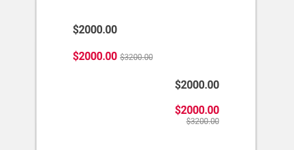

import Price from 'progressive-web-sdk/dist/components/price'
import PropsTable from '../../../../src/components/propstable'
import Tabs from 'progressive-web-sdk/dist/components/tabs/tabs'
import TabsPanel from 'progressive-web-sdk/dist/components/tabs/tabs-panel'

<div class="component-intro">

The `Price` component is used to show the difference between current and previous prices. Prices can be displayed in a row, or they can be stacked.

Related components: [Ledger](Ledger) and [Tile](Tile).

</div>

<div onClick={(e) => {e.stopPropagation()}}>
<Tabs activeIndex={0} className="devcenter">
<TabsPanel title="Code" onClick={(e) => {e.stopPropagation()}}>

### JavaScript import

```jsx
import Price from 'progressive-web-sdk/dist/components/price'
```

### SCSS import

```scss
@import 'node_modules/progressive-web-sdk/dist/components/price/base';
```

### Props table

<PropsTable propMetaData={props.componentMetadata.childrenComponentProp} />

### Basic example

```jsx react-live=true
<Price current="$2000" previous="$3200" />
```

### With isStacked

```jsx react-live=true
<Price isStacked current="$2000" previous="$3200" />
```

</TabsPanel>
<TabsPanel title="Design" class="markdown">

### Screenshot



### Potential uses

-   Within the product [Tile](Tile) component on a product listing page.
-   On a product details page, above or below the product name.
-   In the shopping cart to show the price of each item.
-   During checkout, wherever the user is presented a summary of the products being purchased.

### Accessibility

-   To communicate a previous price, make sure to use a strikethrough or the word "Was".
-   Don't rely only on color to differentiate a previous price from a sale price.
-   Long prices are easier to comprehend when separated by commas. Be sure to add a comma after every 3 characters. For example, $1000 should read $1,000.

### Best practices

-   If a website has sale pricing, use a neutral tone for the prices that are not on sale and a striking tone (typically red) to draw attention to sale items.
-   Sale pricing should always be accompanied by a previous price.
-   Differentiate previous prices using size, color and/or decoration, like a strikethrough.
-   Be clear with the dollar sign if the price is not in US dollars. For example, use CAD or CA\$ for prices in Canadian dollars.
-   Consider the spacing dedicated to pricing. Prices are controlled by the client and designers should be aware that some prices may vary extensively in number of characters.
-   European pricing may use commas instead of decimals.

</TabsPanel>
</Tabs>
</div>
