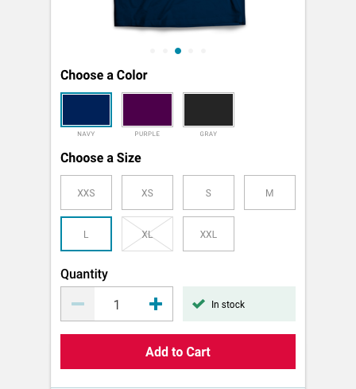
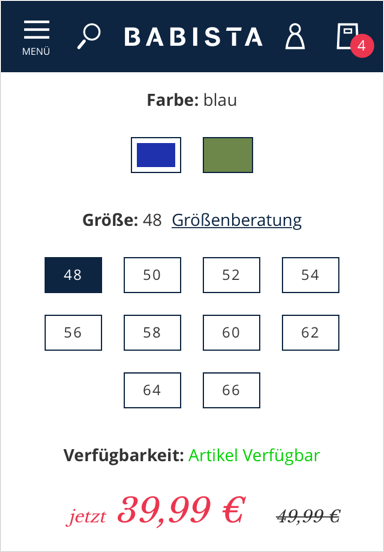

import PropsTable from '../../../../src/components/propstable'
import Tabs from 'progressive-web-sdk/dist/components/tabs/tabs'
import TabsPanel from 'progressive-web-sdk/dist/components/tabs/tabs-panel'

Product options give users the ability to customize their selection of the product in question by choosing size, color, quantity, etc.

<Callout type="info">
This is a design pattern made up of several components.
</Callout>

 {e.stopPropagation()}}>
<Tabs activeIndex={0} className="devcenter">
<TabsPanel title="Design" onClick={(e) => {e.stopPropagation()}}>

### Related Components

- [Swatch](#!/Swatch)
- [Field](#!/Field)
- [Stepper](#!/Stepper)
- [Feedback](#!/Feedback)

### UI Kit

### Potential uses

- When a product presents various choice options that a shopper can/must select before making purchase.
- The PDP is the most common place for these options to exist.
- Product options may also appear in the shopping cart to allow item refinement before purchase.

### User Interactions

- Tap on the desired color from a list of available options using the [swatch](#!/Swatch) component.
- Tap on the desired size from a list of available options using the [swatch](#!/Swatch) component.
- Select an option using a native select menu.
- Toggle quantity up and down using the + and - icons of the stepper component.
- Select a text input and manually add a quantity.

### Accessibility

- Don't rely solely on color or opacity to differentiate available from unavailable selections. Alter the state by using something like a diagonal line to act as a strikethrough.
- Do not rely solely on a change to border color to mark the chosen option as colorblind users cannot differentiate. Consider increasing the width of the border to mark this change in state.

### Usage Tips & Best practices

- Avoid drop down menu selectors for style, size, and quantity selection whenever possible. Better to provide visual selectors for size and style and +/- buttons for quantity selection.
- If quantity is at minimum value (usually 1) use a disabled state for the - buttons, and vice-versa for maximum.
- The [feedback](#!/Feedback) component can be utilized to reinforce to the user that the chosen selection is in or out of stock.
- If certain swatches are not available do not hide the option from the user, apply a disabled state to the option instead.
- If certain product options cause the price to change, this new price should be reiterated in view next to the options and below the add to cart button.

### Example Implementations

#### Lancome:

#### Paula's Choice:

#### Babista:

</TabsPanel>
</Tabs>

