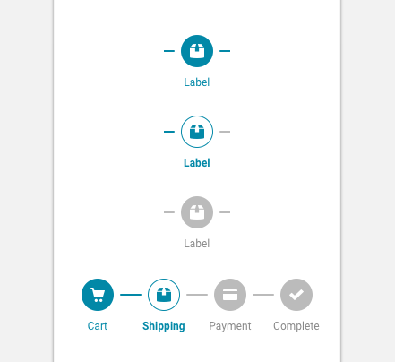

import ProgressSteps from 'progressive-web-sdk/dist/components/progress-steps/progress-steps'
import ProgressStepsItem from 'progressive-web-sdk/dist/components/progress-steps/progress-steps-item'
import PropsTable from '../../../../src/components/propstable'
import Tabs from 'progressive-web-sdk/dist/components/tabs/tabs'
import TabsPanel from 'progressive-web-sdk/dist/components/tabs/tabs-panel'

<div class="component-intro">

The `ProgressStep` component is commonly used in the checkout flow to show the user which step they are on, and the amount of steps remaining in the workflow.

</div>

<div onClick={(e) => {e.stopPropagation()}}>
<Tabs activeIndex={0} className="devcenter">
<TabsPanel title="Code" onClick={(e) => {e.stopPropagation()}}>

### JavaScript import

```jsx
import {ProgressSteps, ProgressStepsItem} from 'progressive-web-sdk/src/components/progress-steps'
```

### SCSS import

```scss
@import 'node_modules/progressive-web-sdk/src/components/progress-steps/base';
```

### Props table

<PropsTable propMetaData={props.componentMetadata.childrenComponentProp} />

### Basic example

```jsx react-live=true
<ProgressSteps>
    <ProgressStepsItem title="Shipping" href="#" />
    <ProgressStepsItem title="Payment" href="#" />
    <ProgressStepsItem title="Review" href="#" current />
    <ProgressStepsItem title="Complete" href="#" />
</ProgressSteps>
```

### With icons

```jsx react-live=true
<ProgressSteps>
    <ProgressStepsItem title="Shipping" href="#" icon="shipping" />
    <ProgressStepsItem title="Payment" href="#" icon="payment" />
    <ProgressStepsItem title="Review" href="#" icon="review" current />
    <ProgressStepsItem title="Complete" href="#" icon="check" />
</ProgressSteps>
```

### With disableIncompleteSteps

```jsx react-live=true
<ProgressSteps disableIncompleteSteps>
    <ProgressStepsItem title="Shipping" href="#" icon="shipping" />
    <ProgressStepsItem title="Payment" href="#" icon="payment" current />
    <ProgressStepsItem title="Review" href="#" icon="review" />
    <ProgressStepsItem title="Complete" href="#" icon="check" />
</ProgressSteps>
```

### With onClick

```jsx react-live=true
class StatefulExample extends React.Component {
    constructor() {
        this.state = {
            currentStep: 3
        }
    }

    updateStep(step) {
        this.setState({currentStep: step})
    }

    render() {
        return (
            <ProgressSteps>
                <ProgressStepsItem
                    onClick={() => this.updateStep(0)}
                    current={this.state.currentStep === 0}
                    title="Shipping"
                    icon="shipping"
                />
                <ProgressStepsItem
                    onClick={() => this.updateStep(1)}
                    current={this.state.currentStep === 1}
                    title="Payment"
                    icon="payment"
                />
                <ProgressStepsItem
                    onClick={() => this.updateStep(2)}
                    current={this.state.currentStep === 2}
                    title="Review"
                    icon="review"
                />
                <ProgressStepsItem
                    onClick={() => this.updateStep(3)}
                    current={this.state.currentStep === 3}
                    title="Complete"
                    icon="check"
                />
            </ProgressSteps>
        )
    }
}
```

</TabsPanel>
<TabsPanel title="Design" class="markdown">

### Related component
- [ProgressStepsItem](ProgressStepsItem)

### Screenshot



### Potential uses

-   Most commonly within the checkout flow, at the top of each page.
-   Within a configuration flow.
-   Any flow that has a set number of tasks, and where each task is a different page.

### Accessibility

-   Don't rely only on color changes to differentiate states. Additional states such as borders or bold text can be used to help colorblind users understand where they are within the workflow.
-   Don't rely on icons alone to describe the step. Always support the icons with a text label.
-   Do not allow the text size to fall below 8px.

### Best practices

-   Make sure that each [ProgressStepsItem](ProgressStepsItem) has active, completed, and disabled states.
-   Typically a progress step will contain the name of the step and either a supporting icon or a number to indicate the step.
-   Use icons when the number of steps is low and easy to comprehend. Consider using numbers when the number of steps is greater than 4.
-   A [Badge](Badge) component can be used to add a check mark to a completed step. However, in testing this has been shown to reduce the user's understanding that they can interact with the previous step.
-   Any `ProgressStep` which includes more than 5 items will prove difficult to space out on smaller screen sizes. Designers should attempt to consolidate tasks into no more than 4 or 5 steps.
-   It's important to include a "Complete" step at the end. This helps the user understand where the end is.

</TabsPanel>
</Tabs>
</div>
