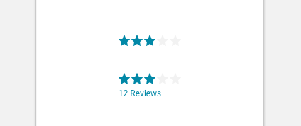

import Rating from 'progressive-web-sdk/dist/components/rating'
import PropsTable from '../../../../src/components/propstable'
import Tabs from 'progressive-web-sdk/dist/components/tabs/tabs'
import TabsPanel from 'progressive-web-sdk/dist/components/tabs/tabs-panel'

<div class="component-intro">

The `Rating` component is typically used to display a product's average user satisfaction level. It summarizes the ratings given by users in the product reviews section.

</div>

<div onClick={(e) => {e.stopPropagation()}}>
<Tabs activeIndex={0} className="devcenter">
<TabsPanel title="Code" onClick={(e) => {e.stopPropagation()}}>

### JavaScript import

```jsx
import Rating from 'progressive-web-sdk/dist/components/rating'
```

### SCSS import

```scss
@import 'node_modules/progressive-web-sdk/dist/components/rating/base';
```

### Props table

<PropsTable propMetaData={props.componentMetadata.childrenComponentProp} />

### Basic example

```jsx react-live=true
<div>
    <div className="u-margin-bottom">
        <Rating name="star" count={2.5} total={5} />
    </div>

    <div className="u-margin-bottom">
        <Rating className="pw--solid" name="star" count={2.5} total={5} />
    </div>
</div>
```

### With src

```jsx react-live=true
<div>
    <Rating
        count={2}
        total={7}
        className="pw--opaque"
        src="http://www.mariowiki.com/images/a/a1/Q_Block.png"
    />
</div>
```

</TabsPanel>
<TabsPanel title="Design" class="markdown">

### Screenshot



### Potential uses

-   On a product listing page as part of the product tile.
-   At the top of a product details page to deliver an 'at a glance' summary of the product's customer reviews.
-   Within the product review summary inside a product details page, to show the average satisfaction level of all customer reviews.
-   Within each product review on a product details page to display the satisfaction level from that particular customer.

### Accessibility

-   If you're using the `Rating` component as an anchor at the top of a product details page, make sure you clearly indicate that the number of reviews text is a link. (Use the link color, or an underline.)
-   It's not recommended to rely only on color or opacity to differentiate empty stars from filled stars. Consider using a border to improve accessibility for colorblind users.

### Best practices

-   Typically ratings are use a star icon, and it's best to be cautious about using any other icons. For example, a heart icon may be confused with adding to wishlist.
-   Users naturally associate stars with yellow or orange, but be careful about distracting users from the product itself, or the add to cart action. Consider a more subtle tone, such as the Lancome example below.
-   The ratings component is built to cope with decimal places and will visualize 3.2 stars differently to 3.5. If the product catalogue requires this fine level of separation for shoppers to effectively compare items, consider adding a text label to the star rating.
-   When summarizing reviews using `Rating`, be sure to include the number of reviews that have been incorporated, except on product listing page templates where space is minimal. Here it is not necessary to include the number of reviews as this extra content may clutter the UI.

</TabsPanel>
</Tabs>
</div>
