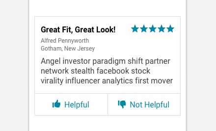

import Review from 'progressive-web-sdk/dist/components/review'
import PropsTable from '../../../../src/components/propstable'
import Tabs from 'progressive-web-sdk/dist/components/tabs/tabs'
import TabsPanel from 'progressive-web-sdk/dist/components/tabs/tabs-panel'

<div class="component-intro">

The `Review` component is used to show a review title, the review author's info, and a description. It also uses the `Rating` component to display users' satisfaction.

</div>

<div onClick={(e) => {e.stopPropagation()}}>
<Tabs activeIndex={0} className="devcenter">
<TabsPanel title="Code" onClick={(e) => {e.stopPropagation()}}>

### JavaScript import

```jsx
import Review from 'progressive-web-sdk/dist/components/review'
```

### SCSS import

```scss
@import 'node_modules/progressive-web-sdk/dist/components/review/base';
```

### Props table

<PropsTable propMetaData={props.componentMetadata.childrenComponentProp} />

### Basic example

```jsx react-live=true
<Review
    title="Great Fit, Great Look!"
    ratingProps={{
        className: 'pw--solid',
        count: 4,
        total: 5
    }}
    info={['Alfred Pennyworth', 'Gotham, New Jersey']}
    text="Angel investor paradigm shift partner network stealth facebook stock virality influencer analytics first mover"
/>
```

</TabsPanel>
<TabsPanel title="Design" class="markdown">

### Related components
- [Rating](Rating) 
- [ReviewSummary](ReviewSummary)

### Screenshot



### Potential uses

-   Listed within a set of product reviews on product detail pages.
-   Listed in a modal window from a product details page, after a user clicks to "Read reviews".

### Accessibility

-   Ensure the action buttons to give feedback on a review are clearly labelled as links by adding copy, icons, and/or using the site's link color.
-   If you're using thumbs up/thumbs down icons, ensure they're given text labels so that they're not confused with Facebook's Like button.

### Best practices

-   Be sure to check the contrast of text on background color to ensure it passes a11y guidelines. [Use this handy tool to guide you](http://www.contrastchecker.com).
-   A common pattern is for users to mark a review as helpful or not with a single tap.
-   Longer reviews may be expended by clicking on a "Read more" link.
-   Reviews will typically contain a [`Rating`](Rating), title, reviewer, reviewer location, description, and feedback buttons.
-   Some reviews will have multiple ratings for different product attributes.
-   Prioritize highlighting what's most useful to a shopper. Typically the review title and description is more important than the reviewer's name or location, so you should give the review title and description a larger prominence in text size and weight.
-   Reviews can be long or short. Consider restricting the copy and using a "Read More" link to preserve the balance of review tiles.

</TabsPanel>
</Tabs>
</div>
