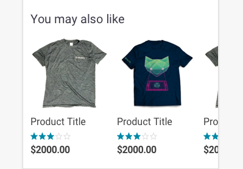

import Scroller from 'progressive-web-sdk/dist/components/scroller'
import PropsTable from '../../../../src/components/propstable'
import Tabs from 'progressive-web-sdk/dist/components/tabs/tabs'
import TabsPanel from 'progressive-web-sdk/dist/components/tabs/tabs-panel'

<div class="component-intro">

Scrollers allow multiple items to be grouped in a row and positioned off the screen, accessible by a sideways scrolling action.

The `Scroller` component is used to display content (items) side by side.
It allows user to scroll the overflowing content horizontally.

</div>

<div onClick={(e) => {e.stopPropagation()}}>
<Tabs activeIndex={0} className="devcenter">
<TabsPanel title="Code" onClick={(e) => {e.stopPropagation()}}>

### JavaScript import

```jsx
import Scroller from 'progressive-web-sdk/dist/components/scroller'
```

### SCSS import

```scss
@import 'node_modules/progressive-web-sdk/dist/components/scroller/base';
```

### Props table

<PropsTable propMetaData={props.componentMetadata.childrenComponentProp} />

### Basic example

```jsx react-live=true
<Scroller>
    <div className="u-color-brand"> This is the first item of scroller</div>
    <div> This is the second item of scroller</div>
    <div className="u-color-brand"> This is the third item of scroller</div>
</Scroller>
```

### With image

```jsx react-live=true
class Example extends React.Component {
    constructor() {
        this.cat1 =
            'http://media2.popsugar-assets.com/files/thumbor/' +
            'DBA3mv_owF0E2BoCrH_oaseQick/fit-in/500x500/filters:format_auto-!!-' +
            ':strip_icc-!!-/2015/07/13/281/n/1922243/953ff51d_edit_img_image_16' +
            '594958_1436816964_11378154_1591447017795211_1999564903_n/i/Homemad' +
            'e-Salmon-Popsicle-Cat-Treat.jpg'
        this.cat2 =
            'https://s-media-cache-ak0.pinimg.com/564x/72/4b/6d/724b6d' +
            'bf91c378a53d6890bb525c1aa9.jpg'
    }

    render() {
        return (
            <Scroller>
                <Image src={this.cat1} />
                <Image src={this.cat2} />
            </Scroller>
        )
    }
}
```

</TabsPanel>
<TabsPanel title="Design" class="markdown">

### Screenshot



### Potential uses

-   Useful for grouping related items on a product details page and positioning them horizontally.
-   On a homepage, to group related promotional images or navigational links and reduce the page height.
-   Anywhere it's possible to group related content horizontally in order to reduce the height of a page.

### Accessibility

-   If there are items positioned off the screen, don't assume that the user knows about them. Consider positioning the items so that a portion of the image is still visible.
-   If you're using the method above, consider the resolution of the devices used to serve the website. If the user is browsing on an Android, device their viewport may be larger than iOS users and the image may not cut off as intended.

### Best practices

-   Horizontal scrolling is a common pattern. It's an interaction which is recognizable by most users, and it encourages exploration.
-   Due to its small requirement of screen size, this pattern is commonly used for related items on a product details page as it doesn't distract users from the main action of purchasing the chosen product.
-   Scrolling is an inferior pattern if the items at the end of the list hold important content. These items are out of view and require an action to find them.
-   Scrollers are an effective pattern if the list has a hierarchy of importance - items at the beginning of the list will be visible to the user and naturally have more exposure than those at the end of the list.
-   If the list has no hierarchy then a superior pattern may be to stack the items rather than use `Scroller`.

</TabsPanel>
</Tabs>
</div>
