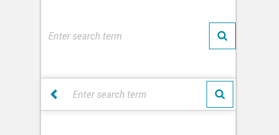

import Search from 'progressive-web-sdk/dist/components/search'
import PropsTable from '../../../../src/components/propstable'
import Tabs from 'progressive-web-sdk/dist/components/tabs/tabs'
import TabsPanel from 'progressive-web-sdk/dist/components/tabs/tabs-panel'

<div class="component-intro">

Search allows a user to retrieve a list of products related to a keyword or a string of keywords.

The `Search` component includes two variants: inline and overlay. It is commonly used in the page header.

</div>

<div onClick={(e) => {e.stopPropagation()}}>
<Tabs activeIndex={0} className="devcenter">
<TabsPanel title="Code" onClick={(e) => {e.stopPropagation()}}>

### JavaScript import

```jsx
import Search from 'progressive-web-sdk/dist/components/search'
```

### SCSS import

```scss
@import 'node_modules/progressive-web-sdk/dist/components/search/base';
```

### Props table

<PropsTable propMetaData={props.componentMetadata.childrenComponentProp} />

### Basic example

```jsx react-live=true
<Search />
```

### With custom button

Props given to `submitButtonProps` are passed to the internal `Button` component.

```jsx react-live=true
<Search
    submitButtonProps={{
        className: 'pw--secondary',
        text: 'submit'
    }}
/>
```

### With suggestions

<!----Start typing something into the search box in the example below to view suggestions. -->

```jsx react-live=true
class StatefulExample extends React.Component {
    constructor() {
        this.state = {
            termSuggestions: [{href: '#', children: 'test'}, {children: 'search'}],
            productSuggestions: [
                {
                    isSimple: true,
                    imageProps: {
                        src:
                            'https://i.pinimg.com/564x/72/4b/6d/724b6dbf91c378a53d6890bb525c1aa9.jpg',
                        width: '88px',
                        height: '88px',
                        alt: 'cat'
                    },
                    title: 'Product Title',
                    price: '$2000',
                    onClick: () => {
                        console.log('clicked')
                    }
                },
                {
                    isSimple: true,
                    imageProps: {
                        src:
                            'https://i.pinimg.com/564x/72/4b/6d/724b6dbf91c378a53d6890bb525c1aa9.jpg',
                        width: '88px',
                        height: '88px',
                        alt: 'cat'
                    },
                    href: '#',
                    price: '$2000',
                    title: 'Product Title2'
                }
            ]
        }
    }

    addSuggestions() {
        this.setState({
            termSuggestions: [{href: '#', children: 'test'}, {children: 'search'}],
            productSuggestions: [
                {
                    isSimple: true,
                    imageProps: {
                        src:
                            'https://i.pinimg.com/564x/72/4b/6d/724b6dbf91c378a53d6890bb525c1aa9.jpg',
                        width: '88px',
                        height: '88px',
                        alt: 'cat'
                    },
                    title: 'Product Title',
                    price: '$2000',
                    onClick: () => {
                        console.log('clicked')
                    }
                },
                {
                    isSimple: true,
                    imageProps: {
                        src:
                            'https://i.pinimg.com/564x/72/4b/6d/724b6dbf91c378a53d6890bb525c1aa9.jpg',
                        width: '88px',
                        height: '88px',
                        alt: 'cat'
                    },
                    href: '#',
                    price: '$2000',
                    title: 'Product Title2'
                }
            ]
        })
    }

    clearSuggestions() {
        this.setState({
            termSuggestions: null,
            productSuggestions: null
        })
    }

    render() {
        return (
            <Search
                termSuggestions={this.state.termSuggestions}
                productSuggestions={this.state.productSuggestions}
                onChange={this.addSuggestions.bind(this)}
                onClose={this.clearSuggestions.bind(this)}
                onClear={this.clearSuggestions.bind(this)}
                onClickSuggestion={this.clearSuggestions.bind(this)}
            />
        )
    }
}
```

### With the clear button hidden

When typing in the `Search` component, a "Clear" button will appear. (Test this using any other example on this page). If you want to keep it hidden, you can do so by setting `includeClearButton={false}`.

```jsx react-live=true
<Search includeClearButton={false} />
```

### With simultaneous page interactions allowed

The mask which overlays the page while focused on the `Search` component can be disabled by using the `allowPageInteractions` prop. Notice in the example below that focusing on the search input, no full page overlay mask is rendered, which allows you to interact with the rest of the page.

```jsx react-live=true
<Search allowPageInteractions />
```

### With isOverlay

`isOverlay` changes the `Search` component to not render on the page by default.

```jsx react-live=true
class StatefulExample extends React.Component {
    constructor() {
        this.state = {
            isOpen: false
        }
    }

    render() {
        return (
            <div>
                <Search
                    isOverlay
                    isOpen={this.state.isOpen}
                    onClose={() => this.setState({isOpen: false})}
                />
                <button onClick={() => this.setState({isOpen: true})}>Open search overlay</button>
            </div>
        )
    }
}
```

### With isOverlay and alternate input bar layout

The `isOverlay` version of the `Search` component can be customized with `replaceSearchWithClose`, which replaces the _search_ button with a _close_ button. The close button can then be further customized using `closeButtonProps`.

```jsx react-live=true
class StatefulExample extends React.Component {
    constructor() {
        this.state = {
            isOpen: false
        }
    }

    render() {
        return (
            <div>
                <Search
                    isOverlay
                    isOpen={this.state.isOpen}
                    onClose={() => this.setState({isOpen: false})}
                    replaceSearchWithClose
                    closeButtonProps={{
                        text: 'close'
                    }}
                />
                <button onClick={() => this.setState({isOpen: true})}>Open search overlay</button>
            </div>
        )
    }
}
```

</TabsPanel>
<TabsPanel title="Design" class="markdown">

### Related component
- [HeaderBar](HeaderBar)

### Screenshot



### Potential uses

-   Typically with two states: inline and focused. Inline appears globally within the page UI, and focused appears in a modal view with the page UI behind in a disabled state.
-   Typically accessible from the header bar, in the same place at all times throughout the user journey.
-   As an alternate navigation choice in user flows where information isn't available. For example, a 404 page may offer a search bar.
-   On search results pages as an option to search again.

### Accessibility

-   Search needs to be accessible from every page--users expect to find it in the header bar.
-   Even though most native keyboards will have a search button, it's recommended to include a submit button as part of the search component.
-   Include placeholder text to help guide the user. For example, "search product name or ID".

### Best practices

-   Auto-complete is a widely used pattern and should be considered when deciding to use inline or focused search.
-   Displaying the number of products that will appear for a query in the autocomplete state has been known to confuse users. Hide this data until its accuracy is confirmed through testing with real data.
-   A focused approach will work better for sites with suggested terms and suggested products, as it dedicates the entire page UI for the possibility of returning several results.
-   Avoid the practice of opening the search on the homepage and hiding it on inner pages. It implies that a user will arrive at the site via the homepage, when realistically search engines and social media can deep link users onto any page.
-   When the initial action of opening the search is triggered, the search bar should appear with the **native keyboard focused ready to type**. Having to tap into the field again may frustrate users.
-   To get the search keyboard to appear, typically you add a `type="search"` attribute to your input. However, in iOS8 and up you'll need to have a wrapping form with an action attribute (it doesn't matter what it's defined as).
-   Some operating systems will allow a native "Clear" button to be positioned at the end of the field. This is useful for users, and it should be enabled.
-   If you're using a focused search, consider how a user will return to the non-focused state. An "x" button to close the state may be confused with the native "Clear" action. Instead, use a left arrow as a Back action.

</TabsPanel>
</Tabs>
</div>
