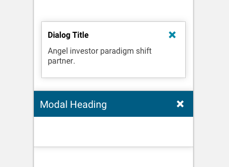

import Sheet from 'progressive-web-sdk/dist/components/sheet'
import Button from 'progressive-web-sdk/dist/components/button'
import PropsTable from '../../../../src/components/propstable'
import Tabs from 'progressive-web-sdk/dist/components/tabs/tabs'
import TabsPanel from 'progressive-web-sdk/dist/components/tabs/tabs-panel'

<div class="component-intro">

Sheets are modals that animate into view from one side of the screen to reveal more content. Typically, sheets are only displayed as a result of user-initiated action and persist until they're dismissed. Common uses for the `Sheet` component include dialog modals and sidebar navigations.

</div>

<div onClick={(e) => {e.stopPropagation()}}>
<Tabs activeIndex={0} className="devcenter">
<TabsPanel title="Code" onClick={(e) => {e.stopPropagation()}}>

### JavaScript import

```jsx
import Sheet from 'progressive-web-sdk/dist/components/sheet'
```

### SCSS import

```scss
@import 'node_modules/progressive-web-sdk/dist/components/sheet/base';
```

### Props table

<PropsTable propMetaData={props.componentMetadata.childrenComponentProp} />

### Basic example

The simplest way of adding a modal is to follow these steps:

1. Track whether the `Sheet` is open in the app state.
2. Create an action that sets the modal's open state to `true` or `false`.
3. Add the `Sheet` to the UI along with an interactive element, such as a button that can open it.

Let's walk through this simple example:

```jsx react-live=true
class StatefulExample extends React.Component {
    constructor() {
        // First we track in the state, whether the Sheet is
        // open or closed.

        this.state = {
            modalIsOpen: false
        }
    }

    // Second, we create a function which sets the Sheet's
    // state to open or close.
    toggleModal(bool) {
        this.setState({modalIsOpen: bool})
    }

    render() {
        return (
            // Lastly, we create the UI with the Sheet itself, as
            // well as a button that can be used to open the sheet.
            // Notice that we provide the Sheet an `onDismiss`
            // callback. If we didn't, there would be no way to
            // close the modal!

            <div>
                <Button onClick={() => this.toggleModal(true)}>Open Sheet</Button>

                <Sheet open={this.state.modalIsOpen} onDismiss={() => this.toggleModal(false)}>
                    <p>
                        This is the sheet.
                    </p>
                </Sheet>
            </div>
        )
    }
}
```

### Lifecycle callbacks

| Order | Open Callbacks | Explanation                                     |
| ----- | -------------- | ----------------------------------------------- |
| 1     | `onBeforeOpen` | Triggered by `Sheet` before it actually opens.  |
| 2     | `onOpen`       | Triggered by `Sheet` after it finishes opening. |

| Order | Close Callbacks | Explanation                                                                                                            |
| ----- | --------------- | ---------------------------------------------------------------------------------------------------------------------- |
| 1     | `onDismiss`     | Triggered by the user clicking on the "shade" backdrop. **Warning**: This callback will _not_ close the modal for you! |
| 2     | `onBeforeClose` | Triggered by `Sheet` before it actually closes.                                                                        |
| 3     | `onClose`       | Triggered by the `Sheet` after it finishes closing.                                                                    |

```jsx react-live=true
class StatefulExample extends React.Component {
    constructor() {
        this.state = {
            modalIsOpen: false
        }
    }

    toggleModal(bool) {
        this.setState({modalIsOpen: bool})
    }

    // The functions below will each call `alert()`,
    // which should help visualize where the function is
    // run relative to the other functions.
    beforeOpen() {
        alert('`onBeforeOpen` called')
    }

    open() {
        alert('`onOpen` called')
        this.toggleModal(true)
    }

    beforeClose() {
        alert('`onBeforeClose` called')
    }

    close() {
        alert('`onClose` called')
    }

    dismiss() {
        alert('`onDismiss` called, will run `toggleModal(false), or nothing else will happen!`')
        this.toggleModal(false)
    }

    render() {
        return (
            <div>
                <Button onClick={() => this.toggleModal(true)}>
                    Click To See Each Lifecycle Step
                </Button>

                <Sheet
                    open={this.state.modalIsOpen}
                    onBeforeOpen={this.beforeOpen.bind(this)}
                    onOpen={this.open.bind(this)}
                    onBeforeClose={this.beforeClose.bind(this)}
                    onClose={this.close.bind(this)}
                    onDismiss={this.dismiss.bind(this)}
                >
                    <Button onClick={() => this.toggleModal(false)} className="pw--primary">
                        Close Sheet (<code>toggleModal(false)</code>)
                    </Button>
                </Sheet>
            </div>
        )
    }
}
```

### With coverage prop

The `coverage` prop represents how much of the screen the modal will occupy. Note that the `coverage` prop takes in a percentage as a string, not a decimal. For example, use `50%` and not `0.5`.

```jsx react-live=true
class StatefulExample extends React.Component {
    constructor() {
        this.state = {
            coverage: '15%',
            modalIsOpen: false
        }
    }

    toggleModal(bool) {
        this.setState({modalIsOpen: bool})
    }

    render() {
        return (
            <div>
                <select
                    onChange={(e) => this.setState({coverage: e.target.value})}
                    style={{display: 'block'}}
                >
                    <option value="15%">15% Coverage</option>
                    <option value="40%">40% Coverage</option>
                    <option value="75%">75% Coverage</option>
                    <option value="100%">100% Coverage</option>
                </select>

                <Button onClick={() => this.toggleModal(true)}>Open Sheet</Button>

                <Sheet
                    open={this.state.modalIsOpen}
                    onDismiss={() => this.toggleModal(false)}
                    coverage={this.state.coverage}
                >
                    <Button className="u-width-full" onClick={() => this.toggleModal(false)}>
                        Close Sheet
                    </Button>

                    <p>
                        This is the sheet.
                    </p>
                </Sheet>
            </div>
        )
    }
}
```

### With duration prop

The `duration` prop controls the length of time it takes for the `Sheet` to animate open and close.

```jsx react-live=true
class StatefulExample extends React.Component {
    constructor() {
        this.state = {
            modalIsOpen: false,
            duration: 100
        }
    }

    toggleModal(bool) {
        this.setState({modalIsOpen: bool})
    }

    render() {
        return (
            <div>
                <select
                    onChange={(e) => this.setState({duration: Number(e.target.value)})}
                    style={{display: 'block'}}
                >
                    <option value="100">100ms</option>
                    <option value="500">500ms</option>
                    <option value="1000">1000ms</option>
                    <option value="2000">2000ms</option>
                </select>

                <Button onClick={() => this.toggleModal(true)}>Open Sheet With `duration`</Button>

                <Sheet
                    open={this.state.modalIsOpen}
                    onDismiss={() => this.toggleModal(false)}
                    duration={this.state.duration}
                >
                    <Button className="u-width-full" onClick={() => this.toggleModal(false)}>
                        Close Sheet
                    </Button>

                    <p>
                        This is the sheet
                    </p>
                </Sheet>
            </div>
        )
    }
}
```

### With effect prop

The `effect` prop defines which animation effect the `Sheet` will use on open and close. The different options behave as follows:

| Value          | Description                                             |
| -------------- | ------------------------------------------------------- |
| `slide-top`    | Slides into view from the top of the screen             |
| `slide-right`  | Slides into view from the right side of the screen      |
| `slide-bottom` | Slides into view from the bottom of the screen          |
| `slide-left`   | Slides into view from the left side of the screen       |
| `modal-center` | From the center of the screen, grows to fill the screen |

```jsx react-live=true
class StatefulExample extends React.Component {
    constructor() {
        this.state = {
            effect: 'slide-top',
            open: false
        }
    }

    render() {
        return (
            <div>
                <select
                    onChange={(e) => this.setState({effect: e.target.value})}
                    style={{display: 'block'}}
                >
                    <option value="slide-top">Slide Top</option>
                    <option value="slide-right">Slide Right</option>
                    <option value="slide-bottom">Slide Bottom</option>
                    <option value="slide-left">Slide Left</option>
                    <option value="modal-center">Modal Center</option>
                </select>

                <Button onClick={() => this.setState({open: true})}>Open Sheet</Button>

                <Sheet
                    open={this.state.open}
                    effect={this.state.effect}
                    onDismiss={() => {
                        this.setState({open: false})
                    }}
                >
                    <p>
                        This is the sheet Suspected discovery by he affection household of principle perfectly
                        he.
                    </p>
                </Sheet>
            </div>
        )
    }
}
```

## Example with footerContent prop

It's possible to pass the `Sheet` component a custom footer with the `footerContent` prop. A common use for this might be adding persistent navigation at the bottom of a navigation sidebar, adding fine print, or just about anything else you can imagine.

```jsx react-live=true
class StatefulExample extends React.Component {
    constructor() {
        this.state = {
            modalIsOpen: false
        }
    }

    toggleModal(bool) {
        this.setState({modalIsOpen: bool})
    }

    render() {
        // Here we define a custom footer for our modal
        const customFooter = <div style={{background: '#ff852c'}}>I am a custom footer!</div>

        return (
            <div>
                <Button onClick={() => this.toggleModal(true)}>
                    Open Sheet to see <strong>Custom Footer</strong>
                </Button>

                <Sheet
                    open={this.state.modalIsOpen}
                    onDismiss={() => this.toggleModal(false)}
                    footerContent={customFooter}
                >
                    <p>Notice below at the very bottom here there is a footer!</p>
                </Sheet>
            </div>
        )
    }
}
```

### With headerContent prop

Just like a custom footer, it's possible to pass the `Sheet` component a custom header via the `headerContent` prop. A common use for this is to provide the modal with a highly customized header.

```jsx react-live=true
class StatefulExample extends React.Component {
    constructor() {
        this.state = {
            modalIsOpen: false
        }
    }

    toggleModal(bool) {
        this.setState({modalIsOpen: bool})
    }

    render() {
        // Here we define a custom header for our modal
        const customHeader = (
            <div className="u-flexbox" style={{background: '#ff852c'}}>
                <div className="u-flex">I am a custom Header!</div>
                <div>
                    <Button onClick={() => this.toggleModal(false)}>Close</Button>
                </div>
            </div>
        )

        return (
            <div>
                <Button onClick={() => this.toggleModal(true)}>
                    Open Sheet to see <strong>Custom Header</strong>
                </Button>

                <Sheet
                    open={this.state.modalIsOpen}
                    onDismiss={() => this.toggleModal(false)}
                    headerContent={customHeader}
                ></Sheet>
            </div>
        )
    }
}
```

### With maskOpacity prop

The `maskOpacity` prop sets how dark the `Sheet`'s backdrop will be. This prop takes a decimal value. The example below allows you to select a `maskOpacity` value, and you can see the value in action by clicking the **Open Sheet** button.

```jsx react-live=true
class StatefulExample extends React.Component {
    constructor() {
        // Let's set this example's maskOpacity to the default
        // value of 0.5. You can adjust this with the
        // select element below.
        this.state = {
            maskOpacity: 0.5,
            modalIsOpen: false
        }
    }

    toggleModal(bool) {
        this.setState({modalIsOpen: bool})
    }

    render() {
        return (
            <div>
                <select
                    onChange={(e) => this.setState({maskOpacity: parseFloat(e.target.value)})}
                    style={{display: 'block'}}
                >
                    <option value="0">`0` mask opacity</option>
                    <option value="0.15">`0.15` mask opacity</option>
                    <option value="0.5" defaultValue>
                        default (`0.5`) mask opacity
                    </option>
                    <option value="0.85">`0.85` mask opacity</option>
                    <option value="1">`1` mask opacity</option>
                </select>

                <Button onClick={() => this.toggleModal(true)}>
                    Open Sheet with custom `maskOpacity`
                </Button>

                <Sheet
                    open={this.state.modalIsOpen}
                    onDismiss={() => this.toggleModal(false)}
                    maskOpacity={this.state.maskOpacity}
                >
                    <Button className="u-width-full" onClick={() => this.toggleModal(false)}>
                        Close Sheet
                    </Button>

                    <p>
                        This is the sheet
                    </p>
                </Sheet>
            </div>
        )
    }
}
```

### With prerender prop

By default, `Sheet` components hide their contents when they aren't active. However, there are occasions when it may be better for the contents to render regardless of the `Sheet`'s state.

For example, navigation components in a `Sheet` would be hidden from search engine crawlers. The `prerender` prop is a way to allow search engine crawlers to see the navigation, even when the navigation `Sheet` is inactive.

```jsx react-live=true
class StatefulExample extends React.Component {
    constructor() {
        this.state = {
            modalIsOpen: false
        }
    }

    toggleModal(bool) {
        this.setState({modalIsOpen: bool})
    }

    render() {
        return (
            <div>
                <Button onClick={() => this.toggleModal(true)}>Open Sheet</Button>

                <p>Use your browser inspector to inspect the pre-rendered content.</p>

                <Sheet
                    open={this.state.modalIsOpen}
                    onDismiss={() => this.toggleModal(false)}
                    prerender={true}
                >
                    <p>
                        Notice that this content renders to the DOM whether this modal is actually
                        active or not!
                    </p>
                </Sheet>
            </div>
        )
    }
}
```

### With shrinkToContent prop

Passing the `shrinkToContent` prop will make the modal shrink to the size of its content. This is commonly used for short messages, such as a thank you message after submitting a form.

```jsx react-live=true
class StatefulExample extends React.Component {
    constructor() {
        this.state = {
            modalIsOpen: false
        }
    }

    toggleModal(bool) {
        this.setState({modalIsOpen: bool})
    }

    render() {
        return (
            <div>
                <Button onClick={() => this.toggleModal(true)}>
                    Open the `shrinkToContent` Sheet
                </Button>
                <Sheet
                    open={this.state.modalIsOpen}
                    onDismiss={() => this.toggleModal(false)}
                    effect="modal-center"
                    shrinkToContent
                >
                    <h2>Demonstration of `shrinkToContent`</h2>
                    <p>Short content</p>
                </Sheet>
            </div>
        )
    }
}
```

### With title prop

`title` text is added to the `sheet` header as an `<h1>` element. This can be added even if you're passing components into the `headerContent` prop, in which case the `title` is added before the `headerContent`.

In either case, it's best to always provide at least an `<h1>` title in your `Sheet` components to ensure they're accessible to screen reader users.

```jsx react-live=true
class StatefulExample extends React.Component {
    constructor() {
        this.state = {
            modalIsOpen: false
        }
    }

    toggleModal(bool) {
        this.setState({modalIsOpen: bool})
    }

    render() {
        return (
            <div>
                <Button onClick={() => this.toggleModal(true)}>
                    Open Sheet to view custom title
                </Button>

                <Sheet
                    open={this.state.modalIsOpen}
                    onDismiss={() => this.toggleModal(false)}
                    title="See my custom title here!"
                >
                    <p>Notice the custom title above!</p>
                </Sheet>
            </div>
        )
    }
}
```

A `Sheet` can have both a `title` _and_ a `headerContent` prop. They will both be visible:

```jsx react-live=true
class StatefulExample extends React.Component {
    constructor() {
        this.state = {
            modalIsOpen: false
        }
    }

    toggleModal(bool) {
        this.setState({modalIsOpen: bool})
    }

    render() {
        const customHeader = (
            <div className="u-flexbox" style={{background: '#ff852c'}}>
                <div className="u-flex">I am a custom Header!</div>
                <div>
                    <Button onClick={() => this.toggleModal(false)}>Close</Button>
                </div>
            </div>
        )

        return (
            <div>
                <Button onClick={() => this.toggleModal(true)}>
                    Open Sheet to view custom title and custom headerContent
                </Button>

                <Sheet
                    open={this.state.modalIsOpen}
                    onDismiss={() => this.toggleModal(false)}
                    title="See my custom title here!"
                    headerContent={customHeader}
                >
                    <p>Notice that there is both a custom title and a custom header above!</p>
                </Sheet>
            </div>
        )
    }
}
```

</TabsPanel>
<TabsPanel title="Design" class="markdown">

### Screenshot



### Potential uses

-   A `Sheet` should overlay the main body area instead of displacing it.
-   A `Sheet` should be used to hold sub-tasks or messaging as part of a larger user journey.
-   Common uses for `Sheet` components include navigation drawers, informational dialogues, filtering on the product listing page, tooltips, estimating shipping in the shopping cart, and showing product reviews on a product details page.

### Accessibility

-   When you set the style for translucent layers, beware of the effect that contrast can have on cognitive load. If the opacity contrast is too fine, the main window may lose its focus.
-   If you're using an "x" icon for the close button, consider whether the user will be able to understand the icon. If there's any doubt, support the icon up with a text label.

### Best practices

-   A `Sheet` should always contain a **Close** button to return back to the original state.
-   If you're using `Sheet` as a modal dialogue, it should always have a primary action. This could simply be an action to close the window, or it could be navigational, such as a 'Proceed to checkout' action in an Added To Cart modal.
-   Use the [Lockup](Lockup) component on the container below any `Sheet` to ensure the user cannot scroll the content behind the modal.
-   To give context to the journey below, it's recommended that a `Sheet` occupies only a portion of the screen rather than the entire window.
-   It's possible to set a `Sheet` to display as full screen, but it may have a negative effect on a user's understanding of their place within a larger journey.
-   To determine the position of a sheet (top, right, bottom, left), consider the position of the button that activated the sheet. Typically, buttons placed on the left of the display will open a sheet from the left (a hamburger menu and navigation drawer, for example).
-   If you're using a 'short sheet' (positioned at the bottom of the screen), be cautious of the iOS Safari dead zone when placing items at the base of the modal. On Safari, tapping this space will cause the browser chromes to appear instead of initiating the action. This frustrates users. To work around the dead zone, add some non-clickable content below the action button to naturally push the button above the dead zone tap target.
-   When overlaying a `Sheet` over the top of the main content, use an opaque layer in order to focus attention on the modal while giving context to the page below.

</TabsPanel>
</Tabs>
</div>
