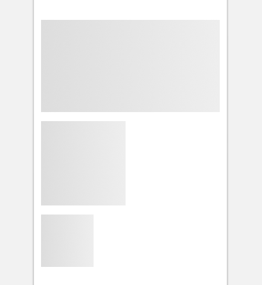

import SkeletonBlock from 'progressive-web-sdk/dist/components/skeleton-block'
import PropsTable from '../../../../src/components/propstable'
import Tabs from 'progressive-web-sdk/dist/components/tabs/tabs'
import TabsPanel from 'progressive-web-sdk/dist/components/tabs/tabs-panel'

<div class="component-intro">

Skeleton components are used to mimic content that may take a while to appear. Skeleton components are used in place of progress loaders to divert the user's attention away from the fact that they need to wait for content to load. They're also designed to communicate the basic structure of the loaded page.

</div>

<div onClick={(e) => {e.stopPropagation()}}>
<Tabs activeIndex={0} className="devcenter">
<TabsPanel title="Code" onClick={(e) => {e.stopPropagation()}}>

### JavaScript import

```jsx
import SkeletonBlock from 'progressive-web-sdk/dist/components/skeleton-block'
```

### SCSS import

```scss
@import 'node_modules/progressive-web-sdk/dist/components/skeleton-block/base';
```

### Props table

<PropsTable propMetaData={props.componentMetadata.childrenComponentProp} />

### Basic example

```jsx react-live=true
<SkeletonBlock width="50%" height="50px" />
```

## With custom styling

```jsx react-live=true
<SkeletonBlock style={{borderRadius: '100%'}} width="100px" height="100px" />
```

## With custom element type

```jsx react-live=true
<SkeletonBlock type="img" width="75px" height="75px" />
```

</TabsPanel>
<TabsPanel title="Design" class="markdown">

### Related components
- [SkeletonInline](SkeletonInline)
- [SkeletonText](SkeletonText)

### Screenshot



### Potential uses

-   Often used alongside [SkeletonText](SkeletonText) to mimic the visual hierarchy and structure of the loaded page.
-   Animation is commonly used to communicate to the user that something is in progress.
-   Use in place of inline loaders, progress bars, full screen spinners, or logos which indicate page load.
-   Example use cases: Facebook for iOS and Android, Slack app, Open Table app.

### Best practices

-   Skeleton components **should not** be used when the content being mimicked will be ready on page render or in a very short time afterwards.
-   Often, user interaction is locked while the skeleton renders the page. This is **not recommended**. The user should be able to move back to previous step if they choose.
-   The key to a good skeleton state is to make it look similar enough to the loaded page that the user doesn't notice any change between the two states. Choose a skeleton layout that depicts less UI than the final page.
-   As you design the skeleton, consider the size of the eventual content. Skeleton states should reflect the most likely layout.
-   To ensure the skeleton feels like a quick transition between states, don't replace too many elements with a skeleton state. Only show elements that communicate the key functions of the page.
-   Use monotone when designing skeleton states. Too much color or contrast will attract too much attention.
-   Images can also be blurred or lazy loaded. For example, medium.com uses these techniques in addition to skeletons.

</TabsPanel>
</Tabs>
</div>
