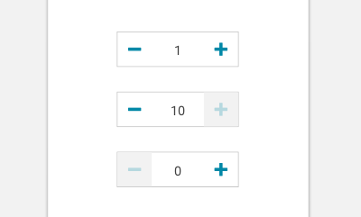

import Stepper from 'progressive-web-sdk/dist/components/stepper'
import PropsTable from '../../../../src/components/propstable'
import Tabs from 'progressive-web-sdk/dist/components/tabs/tabs'
import TabsPanel from 'progressive-web-sdk/dist/components/tabs/tabs-panel'

<div class="component-intro">

The Stepper is a type of input that contains a number, which can be incremented or decremented by clicking buttons. A common use for a stepper is a quantity picker on a product page.

Steppers are used to give the user a simple way to increase or decrease quantities by increments of one at a time.

</div>

<div onClick={(e) => {e.stopPropagation()}}>
<Tabs activeIndex={0} className="devcenter">
<TabsPanel title="Code" onClick={(e) => {e.stopPropagation()}}>

### JavaScript import

```jsx
import Stepper from 'progressive-web-sdk/dist/components/stepper'
```

### SCSS import

```scss
@import 'node_modules/progressive-web-sdk/dist/components/stepper/base';
```

### Props table

<PropsTable propMetaData={props.componentMetadata.childrenComponentProp} />

### Basic example

```jsx react-live=true
<Stepper label="Quantity" />
```

### Example With Icons

```jsx react-live=true
<Stepper incrementIcon="plus" decrementIcon="minus" />
```

Icons can be specified for the increase and decrease controls

### Example With Max and Min Values

```jsx react-live=true
<Stepper initialValue={3} minimumValue={2} maximumValue={6} />
```

You can bound the values of a stepper by passing in the `maximumValue` and/or
`minimumValue` props

### Example With Disabled State

```jsx react-live=true
<Stepper label="Quantity" disabled />
```

The `disabled` prop allows the rendering component to disable the stepper.

### Example With `useReduxForm`

You need to set `useReduxForm` prop to true to render a stepper that uses `redux-form` to manage its value.
Setting the prop to false, renders a stepper that manages it's value as an internal state and doesn't work with `redux-form`.
Integration with `redux-form` requires wrapping `Stepper` in a form. The
`name` of the input should be set on the `Stepper` in order for
values to be bound to the app state properly. `onIncreaseClick` and `onDecreaseClick` are triggered whenever increase and decrease buttons are clicked. It's up to the developer to decide how to change the quantity using the buttons.

```jsx static
const ReduxForm = require('redux-form');
const Redux = require('redux');
const ReactRedux = require('react-redux');
const React = require('react');

// Redux setup
const reducers = {
    form: ReduxForm.reducer,
};
const reducer = Redux.combineReducers(reducers);
const store = Redux.createStore(reducer);


// The form
const DemoForm = (props) => {
    const { handleSubmit } = props
    return (
        <div>
            <form onSubmit={handleSubmit}>
                <Stepper
                    useReduxForm
                    name="quantity"
                    onIncreaseClick={() => {alert('Increase the value')}}
                    onDecreaseClick={() => {alert('Decrease the value')}}
                />
            </form>
        </div>
    );
}

let StateDisplay = (props) => {
    return (
        <div>
            <h3>Form data</h3>
            <pre>
                {JSON.stringify(props.values, null, '  ')}
            </pre>
        </div>
    )
}

StateDisplay = ReactRedux.connect((state)=>{return {values: state.form.demo.values}})(StateDisplay)

const DecoratedForm = ReduxForm.reduxForm({
    form: 'demo', // a unique name for this form
    initialValues: {quantity: 0}
})(DemoForm);


<ReactRedux.Provider store={store}>
    <div style={{display: 'flex', flexDirection: 'column-reverse'}}>
        <div style={{flex: "1 0 auto"}}>
            <DecoratedForm />
        </div>
        <div style={{flex: "1 0 auto"}}>
            <StateDisplay />
        </div>
    </div>
</ReactRedux.Provider>
```

### Getting a reference to the Stepper instance

The Stepper uses a different internal component depending on if the `useReduxForm` prop is true or not. It is not possible to get a reference to this internal component by using the `ref` prop. Instead, you can use the `stepperRef` prop. This prop will be passed down to the internal component. It should be a `callback ref`: a function which will be passed the instance of the component when it is mounted. For more information about `callback refs`, see the [React documentation](https://reactjs.org/docs/refs-and-the-dom.html#callback-refs).

If `useReduxForm` is `false`, the `stepperRef` prop will be passed the instance of the inner `StatefulStepper` component. Normally, the `StatefulStepper` manages the value of the `Stepper` internally. However, you can manually change the value of the `StatefulStepper` after it has been rendered if necessary. Use the `stepperRef` prop to get the instance of the `StatefulStepper` component, then call its `setBoundedValue` function.

```js static
class CustomStepper extends React.Component {
    componentWillReceiveProps(nextProps) {
        if (this.props.initialValue !== nextProps.initialValue) {
            this.stepper.setBoundedValue(nextProps.initialValue)
        }
    }

    render() {
        return (
            <Stepper
                name="quantity"
                initialValue={this.props.initialValue}
                stepperRef={(ref) => { this.stepper = ref }}
            />
        )
    }
}
```

If `useReduxForm` is `true`, the `stepperRef` prop will be passed the instance of the `ReduxForm Field` used within the Stepper. For more information about using `ref`s with the `ReduxForm Field`, see the [ReduxForm documentation](https://redux-form.com/7.2.1/docs/api/field.md/#-code-withref-boolean-code-optional-).

</TabsPanel>
<TabsPanel title="Design" onClick={(e) => {e.stopPropagation()}}>

### Related Components

- [Field](#!/Field)
- [Button](#!/Button)
- [Icon](#!/Icon)

### UI Kit



*Symbol Path: form -> input -> Stepper*

### Potential uses

- As an alternative to select menus or input fields when selecting item quantity.
- When choosing quantity on a PDP.
- When adjusting quantity in the shopping cart.
- On any form where it makes sense to have a default value that typically increases by one increment at a time.

### User Interactions

- Tap on the + button to increase value by 1.
- Tap on the - button to decrease value by 1.
- If in the shopping cart when value=1, tapping on the - button with remove the icon from the cart.
- User can tap on the number value to specify an input using the native number pad.

### Accessibility

- If using a stepper in the shopping cart where value:0 removes the item, ensure there is a confirmation dialogue in place to prevent users accidentally tapping the - icon too many times losing their items.
- Disabled states should rely on more than color and opacity to differentiate from the active state.
- Ensure there is enough space allocated to the icons and the field parts of the component to conform with minimum tap targets (usually 44px).

### Usage Tips & Best practices

- Steppers are proven to be a more useful interaction than select menus or input fields for selecting quantity, and is a widely recognized pattern. Favor this over any alternatives.
- Do not use steppers where users are not likely to adjust increments by one each time. This will result in a poor user experience.
- Ensure disabled states are utilized when the value has reached maximum or minimum.
- Steppers should always default to 1 on PDPs (unless product inventory demands otherwise).
- Steppers on PDPs shouldn't ever have a 0 value. If item is out of stock use the [feedback](#!/Feedback) component to communicate this.
- Steppers in the shopping cart should be able to go down to 0, this would remove the item from the cart.

### Example Implementations

#### Lancome:


#### Merlin's Potions:


</TabsPanel>
</Tabs>
</div>