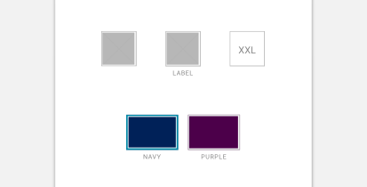

import Swatch from 'progressive-web-sdk/dist/components/swatch/swatch'
import SwatchItem from 'progressive-web-sdk/dist/components/swatch/swatch-item'
import Image from 'progressive-web-sdk/dist/components/image'
import PropsTable from '../../../../src/components/propstable'
import Tabs from 'progressive-web-sdk/dist/components/tabs/tabs'
import TabsPanel from 'progressive-web-sdk/dist/components/tabs/tabs-panel'

<div class="component-intro">

Swatches are used to display the variations of a product and to allow the user to select a variation before purchasing.

The `Swatch` component allows the user to select from a small list of options.

</div>

<div onClick={(e) => {e.stopPropagation()}}>
<Tabs activeIndex={0} className="devcenter">
<TabsPanel title="Code" onClick={(e) => {e.stopPropagation()}}>

### JavaScript import

```jsx
import {Swatch, SwatchItem} from 'progressive-web-sdk/dist/components/swatch'
```

### SCSS import

```scss
@import 'node_modules/progressive-web-sdk/dist/components/swatch/base';
```

### Props table

<PropsTable propMetaData={props.componentMetadata.childrenComponentProp} />

### Basic example

```jsx react-live=true
class StatefulExample extends React.Component {
    constructor() {
        this.state = {
            value: 's'
        }
    }

    render() {
        return (
            <Swatch
                label="Size"
                value={this.state.value}
                onChange={(value) => this.setState({value: value})}
            >
                <SwatchItem value="xs">XS</SwatchItem>
                <SwatchItem value="s">S</SwatchItem>
                <SwatchItem value="m">M</SwatchItem>
                <SwatchItem value="l">L</SwatchItem>
            </Swatch>
        )
    }
}
```

### With disabled

```jsx react-live=true
class StatefulExample extends React.Component {
    constructor() {
        this.state = {
            value: '100'
        }
    }

    render() {
        return (
            <Swatch label="Size" onChange={(value) => this.setState({value: value})}>
                <SwatchItem value="100">$100</SwatchItem>
                <SwatchItem value="150-200" disabled>
                    $150 - $200
                </SwatchItem>
            </Swatch>
        )
    }
}
```

### Color swatches

```jsx react-live=true
class StatefulExample extends React.Component {
    constructor() {
        this.state = {
            value: 'green'
        }
    }

    render() {
        return (
            <Swatch
                label="Color"
                value={this.state.value}
                onChange={(value) => this.setState({value: value})}
            >
                <SwatchItem label="Green" value="green" color="#E1EAD0" />
                <SwatchItem label="Yellow" value="yellow" color="#FFF9AD" />
                <SwatchItem label="Pinky Peach" value="peach" color="#FDD7C9" disabled />
                <SwatchItem label="Purple" value="purple" color="#D6CDE6" />
            </Swatch>
        )
    }
}
```

### Image swatches

```jsx react-live=true
class StatefulExample extends React.Component {
    constructor() {
        this.state = {
            value: 'mittens'
        }
    }

    render() {
        const cat1 =
            'http://media2.popsugar-assets.com/files/thumbor/' +
            'DBA3mv_owF0E2BoCrH_oaseQick/fit-in/500x500/filters:format_auto-!!-' +
            ':strip_icc-!!-/2015/07/13/281/n/1922243/953ff51d_edit_img_image_16' +
            '594958_1436816964_11378154_1591447017795211_1999564903_n/i/Homemad' +
            'e-Salmon-Popsicle-Cat-Treat.jpg'
        const cat2 =
            'https://s-media-cache-ak0.pinimg.com/564x/72/4b/6d/724b6dbf91c378a53d6890bb525c1aa9.jpg'
        const cat3 = 
            'https://s-media-cache-ak0.pinimg.com/564x/af/f7/43/aff743479fc29789d2231329453b1abc.jpg'

        return (
            <Swatch
                label="Cool Cat"
                value={this.state.value}
                onChange={(value) => this.setState({value: value})}
            >
                <SwatchItem label="Rex" value="rex">
                    <Image width="100px" src={cat1} alt="Rex" />
                </SwatchItem>
                <SwatchItem label="Mittens" value="mittens">
                    <Image width="100px" src={cat2} alt="Mittens" />
                </SwatchItem>
                <SwatchItem label="Shadow" value="shadow" disabled>
                    <Image width="100px" src={cat3} alt="Shadow" />
                </SwatchItem>
            </Swatch>
        )
    }
}
```

</TabsPanel>
<TabsPanel title="Design" class="markdown">

### Related component
- [SwatchItem](SwatchItem)

### Screenshot



### Potential uses

-   On a product details page within the [product options](ProductOptions) section to select size, color, or another variation before adding to cart.
-   On a product listing page, typically to show the availability of the product in other colors.
-   On a product listing page to toggle the product image, typically to quickly view that product image in a different color.
-   A more usable alternative for displaying product options than select menus.
-   Within the [filter](Filtering) menu, typically for the color filter interaction.

### Accessibility

-   Ensure active states are labelled by more than a change in color. For example, consider using a thicker border for active states, to help colorblind users.
-   Similarly, disabled states should rely on more than color and opacity to differentiate from the active and inactive states. Try using a diagonal line across the swatch.
-   No matter how small the value in the swatch, ensure it has a minimum height and width to conform with minimum tap targets (typically 44px).
-   If you're displaying color, always support a swatch with a text label.

### Best practices

-   Ensure swatches have an active, inactive and disabled state.
-   The [`Badge`](Badge) component may be overlaid on a swatch to communicate that product option's availability.
-   Don't hide out of stock options, instead use disabled states. This is important as users may wish to come back to check availability another time.
-   Only use swatches for product options when the values are short. When the product options have a lot of text, using multiple swatches can result in a cluttered layout and a poor user experience.
-   Swatches are more effective than select menus as they show all the available options upfront. However, consider the cognitive load of using swatches for products with a large number of options. In this case a select menu may improve the user experience.

</TabsPanel>
</Tabs>
</div>
