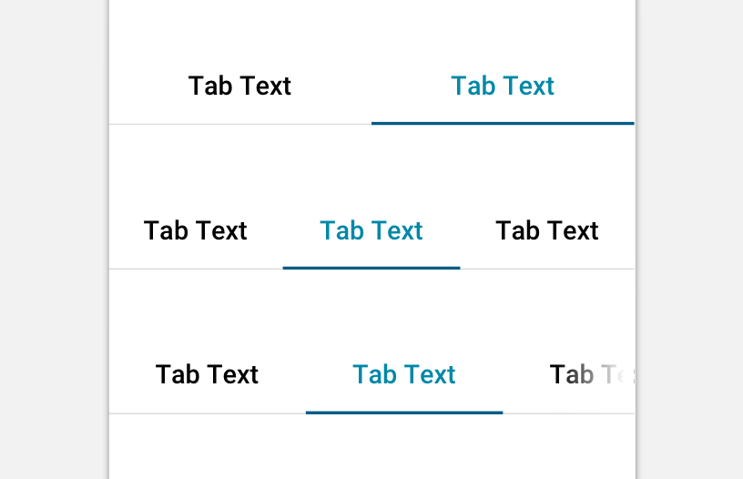

import Tabs from 'progressive-web-sdk/dist/components/tabs/tabs'
import TabsPanel from 'progressive-web-sdk/dist/components/tabs/tabs-panel'
import PropsTable from '../../../../src/components/propstable'

<div class="component-intro">

Tabs provide a compact way to navigate between different sections of content or functional parts of an interface. Tabs appears as a strip of horizontal buttons each attached to a content pane immediately below, allowing the user to reveal a single pane at a time.

The `Tabs` component is used to display tabbed navigation: a user can select a tab to view its related content.

</div>

<div onClick={(e) => {e.stopPropagation()}}>
<Tabs activeIndex={0} className="devcenter">
<TabsPanel title="Code" onClick={(e) => {e.stopPropagation()}}>

### JavaScript import

```jsx
import {Tabs, TabsPanel} from 'progressive-web-sdk/dist/components/tabs'
```

### SCSS import

```scss
@import 'node_modules/progressive-web-sdk/dist/components/tabs/base';
```

### Props table

<PropsTable propMetaData={props.componentMetadata.childrenComponentProp} />

### Basic example

```jsx react-live=true
<div>
    <Tabs activeIndex={0}>
        <TabsPanel title="Title A">
            <p>
                Content for tab A
            </p>
        </TabsPanel>
        <TabsPanel title="Title B">
            <p>
                Content for tab B
            </p>
        </TabsPanel>
        <TabsPanel title="Title C">
            <p>
                Content for tab C
            </p>
        </TabsPanel>
    </Tabs>
</div>
```

### With isScrollable

```jsx react-live=true
<div>
    <Tabs activeIndex={0} isScrollable>
        <TabsPanel title="Title A">
            <p>
                Content for tab A
            </p>
        </TabsPanel>
        <TabsPanel title="Title B">
            <p>
                Content for tab B
            </p>
        </TabsPanel>
        <TabsPanel title="Title C">
            <p>
                Content for tab C
            </p>
        </TabsPanel>
    </Tabs>
</div>
```

</TabsPanel>
<TabsPanel title="Design" class="markdown">

### Related components
- [TabsPanel](TabsPanel)

### Screenshot



### Potential uses

-   To split up any content sections under a single common context.
-   On the sign in page. For example, you can display the login form in one tab, and the "register as a new customer" form in the other.
-   On the shopping cart to divide items between 2 tabs: "ready to buy now" and "items saved for later".
-   In search results to split the products from other content or articles, all under a common search query.
-   In the checkout to divide the various methods of payment.
-   As an alternative to the [Accordion](Accordion) component.

### Accessibility

-   Distinguish the active and inactive tabs using more than just color. A common strategy is to use a bottom border on the active tab, along with an increase font size or weight.
-   If you're using icons, ensure there is a text label to aid comprehension.
-   Visually connect the tab bar to the content below. It can be helpful to match the background color of the pane to the background color of the active tab.

### Best practices

-   Tabs aren't ideal when the customer needs to compare information between tabs. Consider another approach if this is likely.
-   When deciding to use either `Tabs` or an `Accordion`, consider how many groups exist. Tabs may not fit on the screen when the number of divisions is greater than 4.
-   If the space taken up by the tab headings exceeds the width of the screen, consider using the overflow variation.
-   The overflow variation is _not_ recommended when the tab headings hidden off-screen are critical to the user experience. They're hidden from view, and so they may be missed. If this is a concern, consider using the `Accordion` component instead.
-   Tabs should always be shown with the first panel opened by default, unless specified by a previous action.
-   Tabs have a natural hierarchy where the first pane is more prominent than the closed panes. If this hierarchy is not suitable for the user experience on the page, consider another component.
-   Organize the panes so that they transition left and right like a carousel, mirroring the order of their corresponding tabs.
-   Keep tab headings concise. If necessary, use two lines instead of hiding text off-screen.
-   Avoid complex interaction journeys within tabs. Having too many additional actions within a tab can disorient users within their journey.
-   Don't nest tabs within tabs.
-   Be careful of using full-width dividers or background color switches within tab panes, as they could be mistaken as the end of the content in that tab.

</TabsPanel>
</Tabs>
</div>
