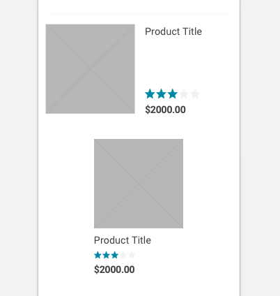

import Tile from 'progressive-web-sdk/dist/components/tile'
import PropsTable from '../../../../src/components/propstable'
import Tabs from 'progressive-web-sdk/dist/components/tabs/tabs'
import TabsPanel from 'progressive-web-sdk/dist/components/tabs/tabs-panel'

<div class="component-intro">

The `Tile` component is used wherever a group of components come together to form a repeatable product card.

</div>

<div onClick={(e) => {e.stopPropagation()}}>
<Tabs activeIndex={0} className="devcenter">
<TabsPanel title="Code" onClick={(e) => {e.stopPropagation()}}>

### JavaScript import

```jsx
import Tile from 'progressive-web-sdk/dist/components/tile'
```

### SCSS import

```scss
@import 'node_modules/progressive-web-sdk/dist/components/tile/base';
```

### Props table

<PropsTable propMetaData={props.componentMetadata.childrenComponentProp} />

### Basic example

```jsx react-live=true
<Tile
    href="#"
    imageProps={{
        src: 'https://i.pinimg.com/564x/72/4b/6d/724b6dbf91c378a53d6890bb525c1aa9.jpg',
        width: '88px',
        height: '88px',
        alt: 'cat'
    }}
    options={[
        {
            label: 'Color: ',
            value: 'Maroon'
        },
        {
            label: 'Size: ',
            value: 'XL'
        }
    ]}
    title="Product Title"
    quantityLabel="Quantity: "
    quantity={1}
    price="$2000"
/>
```

### With isSimple

```jsx react-live=true
<Tile
    isSimple
    imageProps={{
        src: 'https://i.pinimg.com/564x/72/4b/6d/724b6dbf91c378a53d6890bb525c1aa9.jpg',
        width: '75px',
        height: '75px',
        alt: 'cat'
    }}
    title="Product Title"
    price="$2000"
/>
```

### With isFull

```jsx react-live=true
<Tile
    isFull
    imageProps={{
        src: 'https://i.pinimg.com/564x/72/4b/6d/724b6dbf91c378a53d6890bb525c1aa9.jpg',
        width: '142px',
        height: '142px',
        alt: 'cat'
    }}
    ratingProps={{
        className: 'pw--solid',
        count: 3,
        total: 5
    }}
    title="Product Title"
    price="$2000"
/>
```

### With isColumn

```jsx react-live=true
<Tile
    isColumn
    imageProps={{
        src: 'https://i.pinimg.com/564x/72/4b/6d/724b6dbf91c378a53d6890bb525c1aa9.jpg',
        width: '142px',
        height: '142px',
        alt: 'cat'
    }}
    ratingProps={{
        className: 'pw--solid',
        count: 3,
        total: 5
    }}
    title="Product Title"
    color="Maroon"
    size="XL"
    quantity="1"
    price="$2000"
/>
```

### With isColumn and isFull

```jsx react-live=true
<Tile
    isColumn
    isFull
    imageProps={{
        src: 'https://i.pinimg.com/564x/72/4b/6d/724b6dbf91c378a53d6890bb525c1aa9.jpg',
        width: '296px',
        height: '296px',
        alt: 'cat'
    }}
    ratingProps={{
        className: 'pw--solid',
        count: 3,
        total: 5
    }}
    title="Product Title"
    color="Maroon"
    size="XL"
    quantity="1"
    price="$2000"
/>
```

</TabsPanel>
<TabsPanel title="Design" class="markdown">

### Related components
- [Image](Image)
- [Rating](Rating)
- [SkeletonText](SkeletonText)
- [SkeletonBlock](SkeletonBlock)

### Screenshot



### Potential uses

-   On a product listing page, to hold information about each product listed in a category.
-   On search results to hold information about each product returned from a search query.
-   In the shopping cart to hold information about the product which ahs been added to cart.
-   In the added to cart modal to confirm the item that has just been added.
-   In the checkout payment page to confirm the products which are soon to be purchased.
-   On the product details page, showing related items.
-   Anywhere else a product card may be repeated in a list.

### Accessibility

-   When placing several `Tile` components next to each other, ensure there is a clear difference between each `Tile` component. If this difference is not clear enough, some users may not connect the product titles to their corresponding images.
-   Users will typically click all elements of a `Tile` and expect to navigate to the product. To account for this, make sure the link attribute is wrapped around the entire `Tile`, not just the product title.

### Best practices

-   The `Tile` component has format variations depending on the page where it's going to be used. For example, product tiles in the checkout have smaller images, leaving more space for the key tasks of that page.
-   When sizing elements in the `Tile` component, consider the key user interaction on that specific page. For example, users browsing a product listing page will benefit from larger images, as it helps them compare items. In contrast, `Tile` components in an added to cart modal can use a smaller image, as the image serves to reassure users that the correct product was added.
-   When choosing which `Tile` variation to use on a product listing page, consider a few questions. Do the products generally have long titles or short titles? Longer titles tend to suit the Row variation. Is the user likely looking for more detail in the images? In that case, they will benefit from a full-width `Tile`.

</TabsPanel>
</Tabs>
</div>
