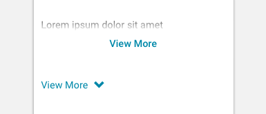

import Toggle from 'progressive-web-sdk/dist/components/toggle'
import Icon from 'progressive-web-sdk/dist/components/icon'
import PropsTable from '../../../../src/components/propstable'
import Tabs from 'progressive-web-sdk/dist/components/tabs/tabs'
import TabsPanel from 'progressive-web-sdk/dist/components/tabs/tabs-panel'

<div class="component-intro">

The `Toggle` component is commonly used to visually collapse its contents when a preset height threshold is exceeded. `Toggle` will show or hide the toggle button if the contents don't overflow past the threshold.

</div>

<div onClick={(e) => {e.stopPropagation()}}>
<Tabs activeIndex={0} className="devcenter">
<TabsPanel title="Code" onClick={(e) => {e.stopPropagation()}}>

### JavaScript import

```jsx
import Toggle from 'progressive-web-sdk/dist/components/toggle'
```

### SCSS import

```scss
@import 'node_modules/progressive-web-sdk/dist/components/toggle/base';
```

### Props table

<PropsTable propMetaData={props.componentMetadata.childrenComponentProp} />

### Basic example

```jsx react-live=true

<Toggle heightThreshold={30}>
    Lorem ipsum dolor sit amet, consectetur adipiscing elit, sed 
    eiusmod tempor incididunt ut labore et dolore magna aliqua. 
    Ut enim ad minim veniam, quis nostrud exercitation ullamco
    laboris nisi ut aliquip ex ea commodo consequat.
</Toggle>

```

### With customized label

```jsx react-live=true
<Toggle expandLabel={<Icon name="chevron-bottom" />} collapseLabel={<Icon name="chevron-top" />} heightThreshold={30}>
    Lorem ipsum dolor sit amet, consectetur adipiscing elit, sed 
    eiusmod tempor incididunt ut labore et dolore magna aliqua. 
    Ut enim ad minim veniam, quis nostrud exercitation ullamco
    laboris nisi ut aliquip ex ea commodo consequat.
</Toggle>
```

</TabsPanel>
<TabsPanel title="Design" class="markdown">

### Screenshot



### Potential uses

-   On a product details page where the product description has been truncated down to the first few lines, a toggle allows the user to view the full descriptions without leaving the page.
-   In the checkout, to hide non-required fields. A user can toggle these fields into view to supply the additional information.
-   Within any page where non-essential content needs to be removed from view (but still remain accessible) in order to remove distractions from the core task.

### Accessibility

-   Use helpful copy to make the `Toggle` more accessible. For example, adding "View more" works with truncated text, but it doesn't work for hidden form fields. For form fields, the `Toggle` should express the fields that will be revealed.

### Best practices

-   `Toggle` components can take the form of an icon, text, or both an icon and text. It's best practice to use both text and a directional arrow icon together.
-   Icons should dictate the direction of the toggle. Use a downward arrow when the toggled content is hidden, and an upwards arrow to hide content.
-   The Fade variation of the `Toggle` component uses a white to alpha gradient, which serves as a visual cue that there's more content to be shown. It works especially well with truncated text.
-   Don't use the Fade variation when hiding interactive elements, such as form fields.
-   Use animation to help show the user where the toggle has moved to, downwards or upwards.

</TabsPanel>
</Tabs>
</div>
