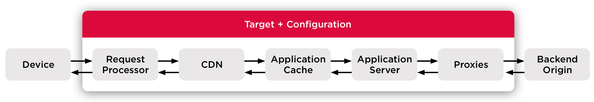

Mobify provides bundles and targets to deploy your application to the web using Mobify's cloud infrastructure.

A bundle contains your application’s code at a specific point in time. It is immutable: Once a bundle has been created, it cannot be changed. Your project can have multiple bundles, but each target can only have 1 bundle designated as _live_.

A target is the environment that your application runs in. Your project can have multiple targets, such as `staging`, `production`, or even something short-lived to test a feature, like `feature-branch-123`.

You can deploy a bundle to run on any target environment of your choosing.

## What's in a target?

Targets have the following parts: the Request Processor, CDN, Application Cache, App Server, and Proxies. Each one plays a special role in server-side rendering:

<figure class="u-text-align-center" style="background-color: #fafafa;">



<figcaption>
    The flow of server-side rendering for a Mobify application. Once rendered, client-side requests
    are made directly to the proxies.
</figcaption>

</figure>

## The App Server

The App Server renders your Progressive Web App (PWA) server-side. Under the hood, it’s an Express.js web server. Located within `<PROJECT_DIR>/ssr.js`, the App Server gets updated when you deploy a bundle to a target.

For a deeper dive, continue reading our [App Server Overview](/get-started/architecture/app-server-overview).

## Proxies

Proxies allow the App Server and browsers to fetch data from your backends in a simple, performant and observable way. Mobify’s proxies route requests for APIs through Mobify's CDN, which acts as an [HTTP proxy server](https://en.wikipedia.org/wiki/Proxy_server).

When you deploy, you can alter or change your proxies.

To learn more about Mobify's proxies, check out our How-To Guide on [using proxies](/how-to-guides/categories/server-side-rendering/using-proxies).

## The CDN

The CDN works to improve the speed of the App Server’s responses. It speeds things up using two techniques:

1. Caching your content. The CDN stores responses from the App Server, then uses them to fulfill subsequent requests.
2. Improving the physical proximity between requests and responses. The CDN caches pages in multiple regions around the world, enabling the pages to be stored closer to your application’s users.

The CDN is configurable using Mobify’s Request Processor.

## How caching works on the CDN

Mobify’s CDN caches responses to requests. The cached responses are indexed by the request URL (hostname, path and query string) plus whatever headers are configured to be forwarded to the origin. For the SSR server, only headers relating to device type (mobile, desktop or tablet) and request class are forwarded, so only those headers are used to look up cached responses.

URL fragments are ignored when looking up cached responses. For example: responses to requests for the URLs `www.example.com`, `www.example.com/path`, and `www.example.com/path?a=1` will all be cached separately, since the URLs are different. However, a request for `www.example.com/path#123` will match `www.example.com/path`, since fragments are ignored.

Once the request comes in, Mobify’s CDN first checks the cache: is a matching response found? If it is, the CDN can respond right away. (Note that expired responses disappear from the cache.)

A **cache hit** means that the CDN checked the cache for a matching response, and was able to find a matching response right away. This results in a very fast response.

A **cache miss** means that no matching response was found in the cache. In this case, the CDN needs to forward the request to the origin. (The Mobify Platform sets up several different origins: the SSR server, bundle files, and separate origins for any project-specific proxies that are configured.) This request flow is orders of magnitude slower than finding the resource in the CDN or Application cache.

The CDN cache is _temporary_, in that CDN-cached content may get evicted in favour of new, more frequently-accessed assets. There are several regional CDN caches to optimize the network response speed. In addition, the CDN Cache stores different versions of a page for mobile, tablet, and desktop. This allows us to serve different markup to these devices at the cost of having to render the page again for a different device type.

You can test if you’re getting a cache hit or miss in the HTTP response headers. Just look for the `x-cache header`, and you’ll either see “`x-cache: Miss from cloudfront`” or “`x-cache: Hit from cloudfront`”. To improve PWA performance, we need to **increase the percentage of CDN cache hits**.

To learn more, find our guide on [Using the CDN Cache to Maximize Performance](/how-to-guides/categories/performance/using-the-cdn-cache-to-maximize-performance).

## The Request Processor

The Request Processor is a serverless function that’s executed by the CDN. It changes how the CDN checks for objects in its cache, and it modifies how requests are routed from the CDN to the App Server. It’s designed to improve the CDN’s cache hit ratio. (The cache hit ratio is the percentage of requests that are fulfilled by the cache, rather than by the App Server.)

The scaffold contains an example request processor at `<PROJECT_DIR>/app/request-processor.js`. It exports a function `processRequest`:

```javascript
export const processRequest = ({path, querystring /* setRequestClass */}) => {
    return {path, querystring}
}
```

Implementing a request processor means modifying the `processRequest` function, returning an object with the `path` and `querystring` that should be passed to your app. Optionally, you may also mark requests for special handling using the `setRequestClass` function.

To learn more about using the request processor, check out our How-To Guides covering [A/B testing with the request processor](/how-to-guides/categories/server-side-rendering/changing-app-rendering-for-an-a-b-test), and [using the request processor to filter query strings](/how-to-guides/categories/performance/filtering-query-strings-to-improve-caching).

## Application Cache (App Cache)

The App Server uses the App Cache to store and fetch the result of slow operations.

Like the CDN, it also works to improve the App Server’s response speed by storing rendered pages. It’s designed as a backup caching system for the CDN: if there’s a cache miss on the closest regional CDN cache, then the App Server checks to see if the request is available from the App Cache. The App Cache functions as an **origin shield** for the App Server, shielding any unnecessary requests. It stores requests from the App Server and propagates some of them back, when needed.

For more information, read our guide on [Using the App Cache to Maximize Performance](/how-to-guides/categories/performance/using-the-app-cache-to-maximize-performance).

## URL Redirects

You can manage redirects for URLs hosted by Mobify in a variety of ways: though the Mobify Cloud user interface (see our guide to [Managing URL Redirects Using Mobify Cloud](/how-to-guides/categories/design/using-url-redirects)), the [Mobify Cloud API](/apis-and-sdks/mobify-cloud/), or by extending your project’s [App Server](/get-started/architecture/app-server-overview) code.