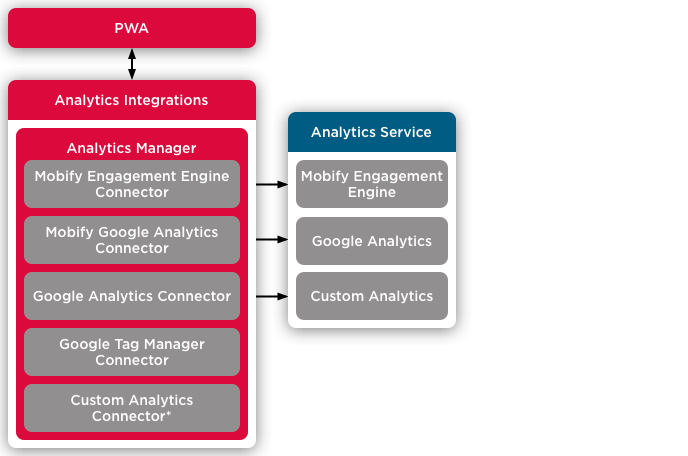

Mobify provides integrations for several ecommerce backends and analytics services. These integrations provide an abstraction layer between the application and the integrated service, which allows for streamlined development. If any of the integrated systems change, you will only need to change the integrations layer, rather than re-writing the entire application.

## Commerce Integrations

Mobify’s Commerce Integrations provide a layer of abstraction between your PWA and the ecommerce backend of your site, such as Salesforce B2C Commerce. Through commerce connectors (think of them as plug-ins), you get a standard interface to communicate with any ecommerce backend. A connector is a class whose methods standardize common actions to fetch and update ecommerce data – plus you can extend the class to work with your project’s unique backend.

<figure class="u-text-align-center" style="background-color: #fafafa;">

<figcaption>
    Commerce Integrations provide a layer of abstraction between your PWA and your site’s backend
    platform.
</figcaption>

</figure>

To start learning about using Commerce Integrations in your project, check out our [Commerce Integrations docs](/apis-and-sdks/commerce-integrations/overview).

## Analytics Integrations

[Analytics Integrations](/apis-and-sdks/progressive-web-sdk/analytics-integrations/interface) provides a layer of abstraction between your PWA and analytics providers, called the [Analytics Manager](/apis-and-sdks/progressive-web-sdk/analytics-integrations/analytics-manager). You can attach Connectors to the Analytics Manager that allow it to send data to any analytics provider, such as Google Analytics.

Analytics Integrations provides pre-built Connectors for:

- Google Analytics
- Google Tag Manager
- Mobify’s Engagement Engine

You can also create your own custom Connectors for any other analytics services.

<figure class="u-text-align-center" style="background-color: #fafafa;">

<figcaption>
    Analytics Integrations is an abstraction layer between your PWA and your site’s analytics
    platform or platforms.
</figcaption>

</figure>

To learn more, visit our [Analytics Integrations docs](/apis-and-sdks/progressive-web-sdk/analytics-integrations/overview).
