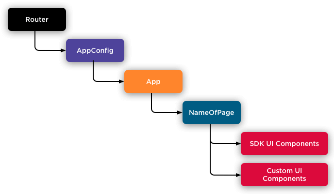

Let's walk through the React component hierarchy used in a Mobify application, starting with the Router and App components at the top of the hierarchy followed by a look at the UI components that you'll be including on your pages.

<figure class="u-text-align-center" style="background-color: #fafafa;">

<figcaption>
    Mobify applications are built from a hierarchy of React components with the Router component at
    the root.
</figcaption>

</figure>

## Router component

At the root of the hierarchy is an internal Router component which has its routes provided by the project. In a Mobify project, these routes get defined within the file `app/routes.jsx`.

## AppConfig component

Wrapping your App, the `_App-Config` is the entry point into the application. It provides functions to inject properties for Mobify's [Commerce Integrations](/apis-and-sdks/commerce-integrations/overview) connectors, or for state management.

## App component

The App component renders the app’s global UI, such as your site’s header, or its sidebar navigation. It’s defined in `app/index.jsx`. When any given route is rendered, it renders with App as its top-level component.

As a developer working with the Mobify Platform, you'll rarely need to edit the App component. You may do so during initial configuration of the site, or you may use it to modify the global level of your application.

This is where app-level elements, such as the SVG sprite sheet or the [SkipLinks](/apis-and-sdks/component-library/components/SkipLinks) component for accessibility are rendered. In addition, the App component handles offline mode detection, rendering an OfflineBanner component with an offline status screen if a page is not available.

## User interface components

Throughout your build, you’ll be working with the UI components included in Mobify's Progressive Web SDK, as well as building your own custom UI components. These UI components are the building blocks of your app and its pages.

Mobify’s UI components can be found in your project’s `src/components` directory. When using these components, you inherit a set of props and methods for pre-built UI features, designed for accessibility and lightning-fast performance. For example, you can customize a pre-designed Carousel, Banner, Image—or any of the 70+ components we offer. Check out the detailed documentation for each one in our [Component Library](/apis-and-sdks/component-library).

## Putting it all together

Now that we’ve seen each component in the hierarchy, let’s review how they build upon each other:

-   The Router component wraps the entire app and defines the URL routing for the app
-   The App component is rendered on all routes and manages the global UI
-   SDK components and custom components render the UI of the app and its pages

For more information about React, see the official [Getting Started](https://reactjs.org/docs/getting-started.html) documentation.