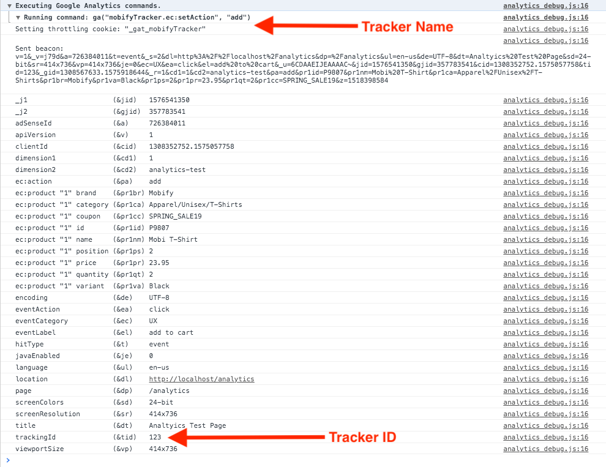
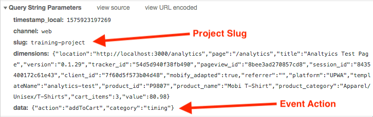

:::note
This article is intended for engineers building applications on the Mobify Platform. If you’re a data analyst, check out our article on [Validating Analytics During Launch](/how-to-guides/categories/analytics/validating-analytics-data-during-launch).
:::

## Introduction

Analytics are an essential component of a Progressive Web App (PWA) build, as they measure and validate the success of the PWA. For enterprise customers launching a PWA, an issue in analytics is significant, and it may lead to a delay in project launch.

In this article, we’ll introduce you to a reliable way to efficiently test your implementation of the [Analytics Integrations](/apis-and-sdks/progressive-web-sdk/analytics-integrations/overview) SDK. It’s best to do this well before project launch, and ideally, as frequently as possible during the build.

## Test that Google Analytics events are being sent correctly

You can test your analytics events using the [Google Analytics Debugger](https://chrome.google.com/webstore/detail/google-analytics-debugger/jnkmfdileelhofjcijamephohjechhna) Chrome extension, which is essentially a super-powered debugging tool.

1. [Download](https://chrome.google.com/webstore/detail/google-analytics-debugger/jnkmfdileelhofjcijamephohjechhna) the extension, then turn it on.

2. [Launch your local development server](/get-started#start-your-dev-server) from the command line.

3. Manually trigger [an event](/apis-and-sdks/progressive-web-sdk/analytics-integrations/types) you’d like to test, such as [`ADDTOCART`](/apis-and-sdks/progressive-web-sdk/analytics-integrations/types#module-colon-progressive-web-sdk-slash-dist-slash-analytics-integrations-slash-types-tilde-ADDTOCART).

4. In your browser, open [Chrome DevTools](https://developers.google.com/web/tools/chrome-devtools) and go to the **Console** tab, where you’ll find all of the event data printed. Look for any custom dimensions and ensure they’re being sent correctly by following these steps:

    a. The most important dimensions to check are the **Tracker Name**, and the **Tracker ID** (`trackingId`), as shown in the screenshot below. Review these dimensions to ensure that the events are being sent to the correct Google Analytics tracker.

    b. Check that events are being sent from the intended pages using the **`page`** and **`location`** dimensions.

<figure class="u-text-align-center" style="background-color: #fafafa;">

</figure>

## Test that Engagement Engine events are being sent correctly

Mobify supports projects with data-driven insights through a database of analytics, called the Engagement Engine. Verify that the Engagement Engine is instrumented correctly using DevTools’ **Network** tab:

1. Launch your local development server from the command line.

2. Manually trigger [an event](/apis-and-sdks/progressive-web-sdk/analytics-integrations/types) you’d like to test, such as such as [`ADDTOCART`](/apis-and-sdks/progressive-web-sdk/analytics-integrations/types#module-colon-progressive-web-sdk-slash-dist-slash-analytics-integrations-slash-types-tilde-ADDTOCART).

3. In your browser, open [Chrome DevTools](https://developers.google.com/web/tools/chrome-devtools) and navigate to the **Network** tab to see your network requests.

4. Filter the network requests to find only those which are relevant for Engagement Engine. Use the keyword `s.gif` in the **Network** tab’s search bar as a way to filter.

5. You will see a list of requests being sent to the Engagement Engine. For each of these requests, do the following:

    a. Scroll down to the **Query String Parameters** section within the request.

    b. Check the `slug` field, to see that the `slug` is for the intended project.

    c. Check the `data` field. Verify that it’s the correct action for the event that got sent.

    d. Check the `dimensions` field. This is project-specific and event-specific, but in general you’ll want to check that the data being sent from the application, such as price or product title, matches the `dimensions`.

<figure class="u-text-align-center" style="background-color: #fafafa;">

</figure>

That’s it! Now you can be sure that your application’s analytics data is being sent to your analytics platform/s correctly.
