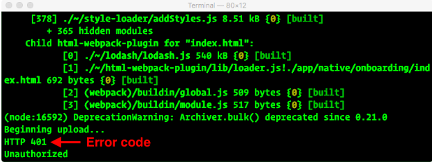
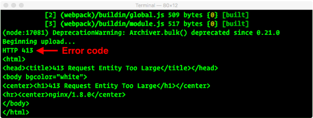

## Introduction

To deploy your app on the Mobify Platform, you need to push a code bundle to Mobify Cloud and deploy it to a target.

In this guide, you will learn how to:

- Set up your API key for Mobify Cloud
- Use the command line to push a bundle to Mobify Cloud
- Use the Mobify Cloud web interface to deploy a bundle to the production target

## Prerequisites

You must have a developer account on Mobify Cloud to push bundles and deploy to targets.

To request a Mobify Cloud account, contact [Mobify support](https://support.mobify.com). You will soon receive an email invitation with a link to join Mobify Cloud.

## Saving your credentials

<Callout type="info">

**Note:** If you already have a `.mobify` file in your home directory, you can skip this section.

</Callout>

Before you can push a bundle, you must authorize your computer with your Mobify Cloud credentials. To do this, you will run a command-line tool that we provide with every set of project files.

Before you run the command, you need to look up your Mobify Cloud API Key:

1. Log in to Mobify Cloud and go to [Account Settings](https://cloud.mobify.com/account/)
2. Copy the email address that appears in the field under **Update Account Information**
3. Scroll down to the section called **Authorize Your Computer To Push Bundles**

- If you are an existing Mobify Cloud user, click the **Reset API Key** button
- If you are a new Mobify Cloud user, click the **Generate your API Key** button

4. You will be asked to confirm resetting your API key. Click **OK**.
5. Copy the API key 

(The next time you come back to the Account Settings page in Mobify Cloud, the API key will not be displayed in full, so you would have to reset the API key to copy the full text of the API key.)

From the command line, go to your project directory and run the following command:

```bash
npm run save-credentials -- --user "$EMAIL" --key "$API_KEY"
```

In the example above, replace `$EMAIL` and `$API_KEY` with the email address and API key that you just copied from the Account Settings page. Keep the double quotes on either side of your `$EMAIL` and `$API_KEY`.

Verify that a file called `.mobify` has been successfully created in your home directory. (You will need to show "invisible" files to see it.)

Run the `save-credentials` script again on any other computers that you want to use for pushing bundles.

## Pushing a bundle

Pushing a bundle involves running a script that packages up your code into a Webpack bundle and uploads it to Mobify Cloud.

### Verifying project configuration

Before pushing your first bundle, verify that the `package.json` file in your project directory is configured correctly:

1. Log in to [Mobify Cloud](https://cloud.mobify.com)
1. In the left-side navigation, click **Settings**
1. Copy the ID inside the **Mobify Project ID** field
1. Paste it into the `name`, `projectSlug`, and `aJSSlug` fields in `package.json`
1. Verify that `mobify.ssrEnabled` is set to `true` in `package.json`

### Verifying proxy configuration

Verify that the following fields are set correctly for each item in the `mobify.ssrParameters.proxyConfigs` array within `package.json`:

1. `protocol`: depending on your configuration, set this to either `http` or `https`
2. `host`: set this to the hostname of your server
3. `path`: set this to the base path of your server

That’s it! Now you're ready to start pushing bundles!

### Running the push script

To push a bundle, go to the command line and run the following command from your project directory:

```bash
npm run push -- -m "custom message to help you recognize this bundle"
```

**Tip**: For a list of other options you can supply to the push script, run it with the `--help` option:

```bash
npm run push -- --help
```

## Publishing a bundle

For any site that uses the Mobify Platform, you can only designate **one bundle at a time** as published for each target. As a default, every project comes with a single target, called `production`. (If you need more than one target, contact [Mobify support](https://support.mobify.com).)

To publish a bundle that you have pushed to Mobify Cloud:

1. Log in to [Mobify Cloud](https://cloud.mobify.com/)
2. Click on the name of your project
3. In the left sidebar, click on **Bundles**
4. Find the bundle that you want to publish
5. Click the **Publish** button next to the bundle
6. Click **Confirm Publish**

You’ll know that publishing was successful when you see your bundle appear underneath the heading **Published Bundle**. (For your first deployment to a new target, the publishing process may take up to an hour to complete.)

## Troubleshooting

When a bundle is successfully pushed, you should see the message "Beginning upload..." followed by "Bundle Uploaded!" and a link to preview the bundle.

If something went wrong, you will likely see one of three different error messages after the “Beginning upload…” message.

Here’s how to troubleshoot all the possible error messages that you may encounter when pushing a bundle.

### HTTP 404 error

<figure class="u-text-align-center">


</figure>

With this type of error, either a project **does not exist with that name**, or you are **not authorized to change it**.

What to do:

1. Repeat the steps to push a bundle and make sure that the email address and API key settings you pass to the command line script match the settings in Mobify Cloud
2. Verify that your project appears on the Mobify Cloud home page under Projects
   - If your project does not appear, contact [Mobify support](https://support.mobify.com) to make sure that the project has been created and that you have been granted access to it as a team member
3. Open the project on Mobify Cloud and copy the string under Mobify Project ID
4. Open the `package.json` inside your project directory
5. Verify that the values for `name` and `projectSlug` both match the project ID string you copied in step 3

### HTTP 401 unauthorized error

<figure class="u-text-align-center">



</figure>

If your error message looks like this, you may not have permission to push bundles. (If your Mobify Cloud role is set to "Read Only," you will not be able to push bundles.) To remedy this error, contact [Mobify support](https://support.mobify.com) and ask to have your permission elevated to include pushing bundles.

### HTTP 413 request entity too large error

<figure class="u-text-align-center">



</figure>

You may get an HTTP 413 error if your bundle is too large. The maximum size for bundles is **37 MB**. To fix this error, check the size of your bundle by inspecting the build folder within your project. If your project is nearing this size or has already exceeded it, here’s what you can do to reduce it:

- Remove unused or unnecessary assets
- Scale down any images

Once you’ve reduced the size of your project files, try pushing the bundle again.
