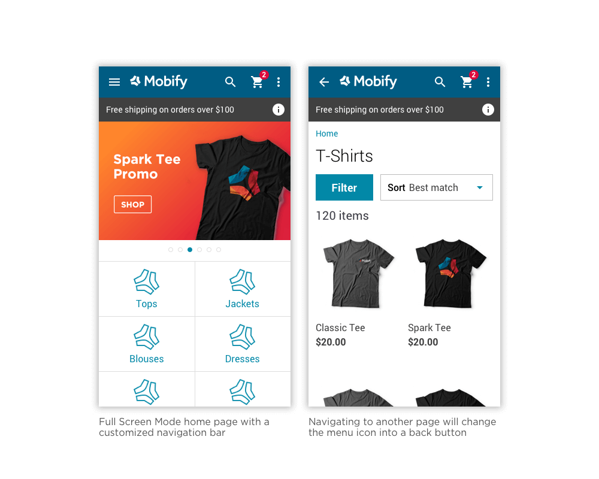
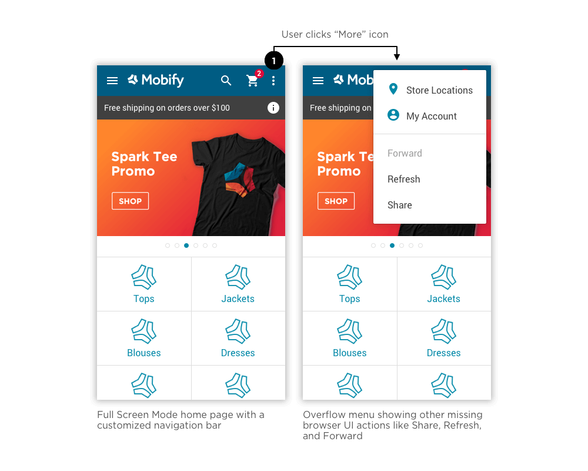
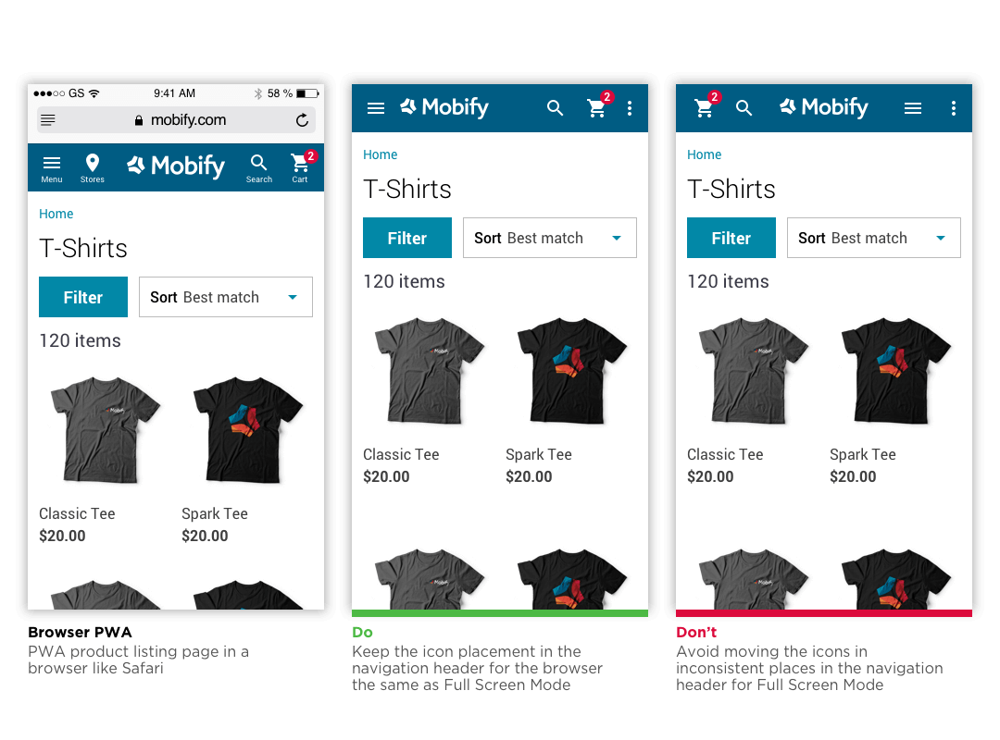

<Callout type='info'>

**Note**: The Designing App-Like Patterns series is intended for interaction designers. This series will show you how to use the Mobify Platform to design performant shopping experiences, with app-like user experience best practices.

</Callout>

Related Links:
* [HeaderBar](/apis-and-sdks/component-library/components/HeaderBar)
* [Nav](/apis-and-sdks/component-library/components/Nav)
* [Share](/apis-and-sdks/component-library/components/Share)

## Introduction

<Callout type="warning">

**Important:** Full Screen Mode will require some custom work for projects that have started past February 2019. In the meantime, this article gives you an overview of several best practices you can implement. Stay tuned for the addition of Full Screen Mode in upcoming releases!

</Callout>

Full Screen Mode is an experience available with Progressive Web Apps (PWAs) where the web app enters Full Screen without the browser UI. It’s important to note that not all browsers have this experience. For instance, Safari doesn't have a Full Screen API, but Chrome on Android, Firefox, and IE 11+ support Full Screen Mode.

Users can experience Full Screen Mode after launching a PWA from the home screen of their device, using [Add to Home Screen.](../guides/add-to-home-screen) Add to Home Screen allows the user to "install" a PWA to their home screen together with an app icon. The user can then launch the PWA in the same way they might launch an app, and access Full Screen Mode-- a focused experience without the browser bar.

Since the browser bar UI is removed to enable Full Screen Mode, it’s our job as designers to maintain the same UI functionality by making the PWA behave more like a native app. You will need to design actions that were previously in the browser UI including the ability for users to go back, go forward, refresh, and share.

In Mobify’s SDK, the interface elements that you will need to work with to achieve this include the [HeaderBar](/apis-and-sdks/component-library/components/HeaderBar), [Nav](/apis-and-sdks/component-library/components/Nav), and [Share](/apis-and-sdks/component-library/components/Share) components. In the next section, we’ll discuss strategies for how you can include these UI elements in your PWA’s Full Screen Mode. To read more about Full Screen Mode, check out [the Google Developer docs.](https://developers.google.com/web/fundamentals/native-hardware/fullscreen/)

## User interactions

### Giving an alternative to go back

The loss of the browser bar UI in Full Screen Mode means that the user no longer has a physical button for going back through the PWA. Some may argue that there is no need to have two different interactions, but they serve different purposes:  while the in-app back button can be used to navigate back to previous pages inside the PWA, the device back button can be used to navigate to previous apps.

A solution to consider is replacing the menu icon with a back button once the user progresses past the initial page. In this way, the user will still be able to find the back button in a highly interactive location in the PWA's interface.

### Overflow menu for more menu items

In addition to the back button, there are other actions that need to be implemented due to the loss of the browser bar UI, such as the ability to go forward, share, and refresh. However, there isn't enough space in the navigation header to fit all of this information.

<figure>

 

</figure>

An overflow menu (much like the Android options menu) can be used in the right corner of the navigation header to house these remaining browser actions. Here, you can also consider adding any other core items that users may want, such as loyalty program links. For the best user experience, disable all other actions on the page after the user opens the overflow menu, including scrolling. From there, tapping outside the menu closes the menu.

## Best practices

<figure>

 

</figure>

To imitate the experience of a native Android app, it’s best to move the alignment of the logo in the header bar to the left, next to the menu icon. Also, it’s ideal to remove labels from any icons in the header bar that mimic browser behavior, as seen in the example above. If the user is familiar with the Add to Home Screen feature, we can assume that they will be clear on what these icons mean.

<figure>

 

</figure>

### Keep actions consistent on the header bar

The top actions in the browser PWA navigation header bar should be consistent with the Full Screen Mode navigation header bar, aside from the addition of the overflow menu. To increase accessibility, the header bar should be stuck to the top of the browser to aid navigation backward and forward through the pages.

## Desktop support

It’s important to note that Full Screen Mode interactions have not yet been considered or tested on desktop, since desktop PWAs are still quite new to the Mobify Platform. Stay tuned for more updates on desktop best practices for Full Screen Mode in upcoming releases!
