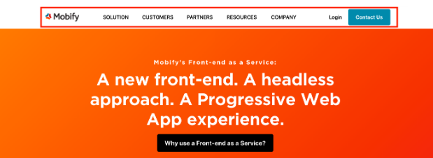

## Introduction

This tutorial will show you how to render components that adjust for the device, whether the user views the site on mobile, tablet, or desktop. As an example, consider the Mobify website.

On desktop, you’ll notice that we have a wide menu bar that stretches across the entire width of the page:

<figure class="u-text-align-center">

  

</figure>

Viewing the same Mobify site on a mobile device now, you’ll notice that the menu bar gets converted into a hamburger menu. All the original menu bar categories are now hidden inside the hamburger menu:

<figure class="u-text-align-center">

  

</figure>

## Rendering content to different devices

This tutorial will walk you through how to render content conditionally for different device breakpoints. We will be using the React-Responsive library's `MediaQuery` component.

First, add the following import statements to your file:

```javascript
import {getBreakpoints} from 'progressive-web-sdk/dist/utils/universal-utils'
import {VIEWPORT_SIZE_NAMES} from 'progressive-web-sdk/dist/ssr/constants'
import MediaQuery from 'react-responsive'
```

Next, get the breakpoints (only run this once) and get the viewport size names:

```javascript
const breakpoints = getBreakpoints()
const {SMALL, LARGE} = VIEWPORT_SIZE_NAMES
```

Now, pass these two new constants into the `MediaQuery` component:

```jsx
const MyExampleComponent = () => {(
    <div>
        <MediaQuery minWidth={breakpoints[SMALL]}>
            <span>Renders on small breakpoint</span>
        </MediaQuery>

        <MediaQuery minWidth={breakpoints[LARGE]}>
            <span>Renders on large breakpoint</span>
        </MediaQuery>
    </div>
)}
```

<Callout type="info">

**Note:** If you'd like to learn more about the React-Responsive library and the `MediaQuery` component, you can review the <a href="https://github.com/contra/react-responsive">React-Responsive documentation</a>.

</Callout>

### Customizing the breakpoints

Before any customization, the default breakpoint settings are:

- Small: 0px
- Medium: 600px
- Large: 960px
- X-Large: 1280px

You can customize the default settings within the function `setBreakpoints()`. For example, imagine that we want to set a new breakpoint called XSmall, and to adjust the existing breakpoints from their defaults:

```javascript
import {setBreakpoints} from 'progressive-web-sdk/dist/utils/universal-utils'
import {VIEWPORT_SIZE_NAMES} from 'progressive-web-sdk/dist/ssr/constants'

setBreakpoints({
    // Set new breakpoints
    XSMALL: 0,
    // And reuse the names of the old ones, but with your own values!
    [VIEWPORT_SIZE_NAMES.SMALL]: 300,
    [VIEWPORT_SIZE_NAMES.MEDIUM]: 600,
    [VIEWPORT_SIZE_NAMES.LARGE]: 900,
    [VIEWPORT_SIZE_NAMES.XLARGE]: 1400
})
```

## Next steps

After completing this tutorial, you've learned how to customize your PWA components for a different device size.

To continue your learning journey, try another one of our hands-on exercises in [Guides](../../).
