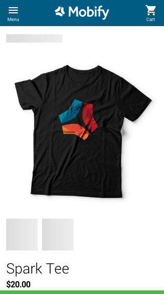
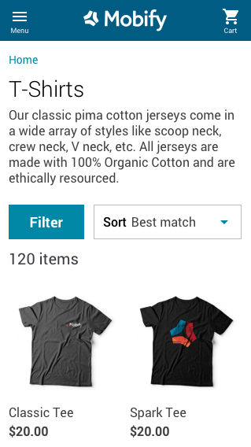
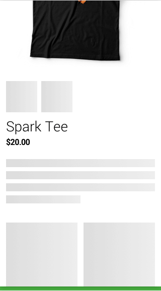
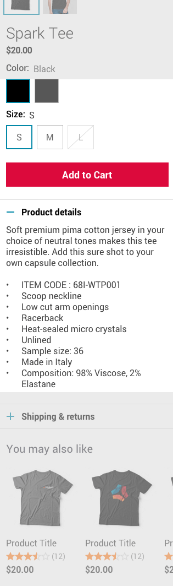

## Introduction

Placeholders are an important tool for achieving [instant page transitions](../guides/instant-page-transitions). Typically, placeholders are monotone basic shapes that take up the place of the actual content before it gets rendered. Placeholders are most commonly used for any content that is loaded over the network. In these cases, the page will render faster than the actual content can display, and it's important to tell the user that content is on its way.

There are three different placeholder components in Mobify's Progressive Web SDK that you can use: [SkeletonBlock](../../../apis-and-sdks/component-library/components/SkeletonBlock), [SkeletonInline](../../../apis-and-sdks/component-library/components/SkeletonInline), and [SkeletonText](../../../apis-and-sdks/component-library/components/SkeletonText).

To learn more about how placeholders influence a user's perception of page loading, you can read our blog post on [Designing for the Appearance of Speed](https://www.mobify.com/insights/designing-appearance-speed/).

## Core features

The core features of placeholders are:

-   Improving perceived performance
-   Communicating the basic page structure

### Improving perceived performance

**Skeleton component placeholders** are used in place of progress loaders in order to divert the user’s attention away from the fact that they need to wait for content to load. By providing a sense of movement and activity, placeholders can shift focus from the wait onto the content that users are waiting for.

However, placeholders are not always necessary. Placeholders should **not** be used in cases where the content they are mimicking will be ready on page render or in a very short time afterwards (less than a second). Only content that can take a longer amount of time should leverage a placeholder implementation.

### Communicating the basic page structure

A page's "skeleton" is the structure of placeholders that are shown while the page is loading. The key to achieving a good page skeleton is to make the skeleton look similar enough to the fully-loaded page, to the point that the user does not notice any change between the two states. When in doubt, choose a page skeleton that depicts less UI and information than the actual content. This prevents the skeleton from looking too busy.

The basic page structure can be created by using the SkeletonBlock, SkeletonInline, and SkeletonText components.

#### SkeletonBlock

[SkeletonBlock](../../../apis-and-sdks/component-library/components/SkeletonBlock) is used as a placeholder for larger chunks of information, such as images. The component can have custom height and width, allowing you to mimic the height and width of the actual content.

<figure class="u-flexbox u-flexbox-gutters u-align-top u-justify-between" style="background-color: #fafafa;">
    

        
        
Do

        

            Use SkeletonBlocks as a placeholder for each distinct piece of content, such as a product's image, name or price.
        

    

    

        
        
Don't

        

            Avoid using SkeletonBlock as a placeholder for big chunks of content.
        

    

    

        
        
Loaded content

        

            The product listing page after content has fully loaded.
        

    

</figure>

#### SkeletonInline

[SkeletonInline](../../../apis-and-sdks/component-library/components/SkeletonInline) can be used as a placeholder for inline pieces of content, such as the [Breadcrumbs](../../../apis-and-sdks/component-library/components/Breadcrumbs) component. In this component, only the _width_ can be customized.

<figure class="u-flexbox u-flexbox-gutters u-align-top u-justify-between" style="background-color: #fafafa;">
    

        
        
Do

        

            Set an appropriate width for SkeletonInline so that a user can recognize what the content is.
        

    

    

        
        
Don't

        

            Avoid making SkeletonBlock unrepresentative of the width of its placeholder content.
        

    

</figure>

#### SkeletonText

[SkeletonText](../../../apis-and-sdks/component-library/components/SkeletonText) can be used as a placeholder for multiple lines of text, such as paragraphs. For the best effect, make sure that SkeletonText reflects a limited amount of information before the full content loads. There’s no need to size SkeletonText exactly for the actual content, since the multiple lines of text are likely to vary for each page.

<figure class="u-flexbox u-flexbox-gutters u-align-top u-justify-between" style="background-color: #fafafa;">
    

        
        
Do

        

            Make SkeletonText reflect a modest amount of information until the content loads in.
        

    

    

        
        
Don't

        

            Avoid making SkeletonText reflect the exact size of the actual content. The content will likely be different lengths on each page.
        

    

    

        
        
Loaded content

        

            The product listing page after content has fully loaded.
        

    

</figure>

#### Placeholders can be flexible lengths on longer pages

On longer pages, placeholders don't have to be sized to match the actual length of the content. As an example, take a look at the partially-loaded product description page above, which shows a user scrolling partway down the page. In this case, the SkeletonText placeholder is considerably shorter than the product details content to be loaded, depicted to the right. For placeholders partway down the page, you can design a placeholder that’s shorter than the actual content, because the content will typically load almost immediately.

In fact, it’s likely that the content will load so quickly that these placeholders may not even be seen. In general, you only need to size a placeholder exactly if it’s replacing **initial page load** content. For initial page load placeholders, matching the sizing of the actual content will prevent the feeling of the content jumping on initial load.

<figure class="u-flexbox u-flexbox-gutters u-align-top u-justify-between" style="background-color: #fafafa;">
    

        
        
Do

        

            Placeholders don't have to be as accurate to the content's actual length on long pages.
        

    

    

        
    

</figure>

## Testing placeholders

One way of testing the page structure of your placeholders is to throttle the network. This extends the length of time that placeholders will be visible.

1. Load your PWA. Do not start on the page that contains the placeholders you plan to test. If you are using server-side rendering, no placeholders should be present on the first page load.
2. Open Chrome DevTools.
3. In Chrome DevTools, use the throttling options under the **Network** tab to set your network speed to Slow 3G.
4. Switch to the **Performance** tab and start a recording.
5. Navigate to the page which contains the placeholders you are testing.
6. Watch as the content loads. Does the page content "jump" at all as content loads? Do the placeholders resemble the content that is loaded in later?
7. If needed, you can also check the screenshots in the recording to look frame-by-frame for any issues.
