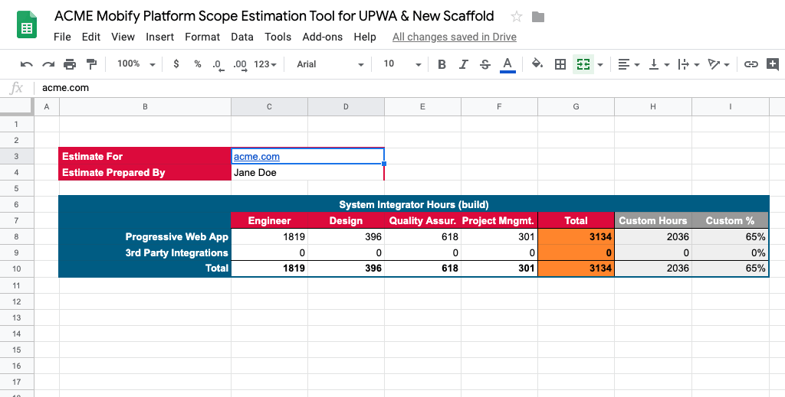
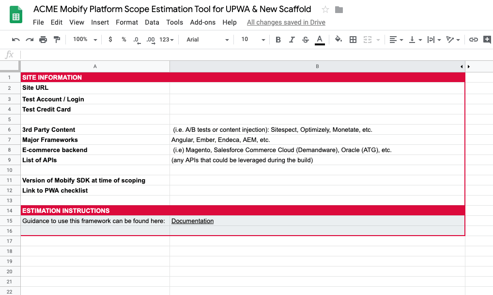
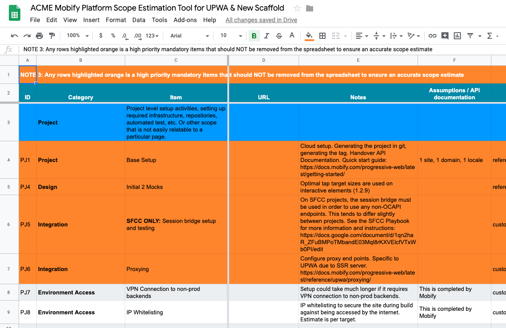
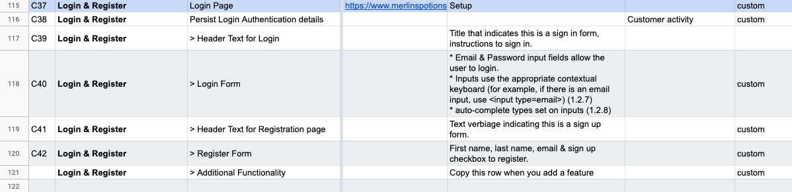

## Introduction

The Scope Estimation Tool is a template for scoping and estimating your new project on the Mobify Platform. Built as a web-based spreadsheet, the tool helps you estimate more accurately with formulas developed from Mobify’s experience with previous projects. To estimate your project’s scope, complete each tab within the spreadsheet with as much detail as possible, starting with the Cover Sheet.

:::note
Reach out to your Mobify contact to access the Scope Estimation Tool.
:::

## Setting up your estimate

### The Cover Sheet

The **Cover_Sheet** tab summarizes the overall estimate as you work through the sheets to follow.

<figure class="u-text-align-center" style="background-color: #fafafa;">

<figcaption>The Cover Sheet.</figcaption>

</figure>

Start by filling out the **Estimate For** and **Estimate Prepared By** cells at the top.

You don’t need to edit anything else on this sheet. The values under the **System Integrator Hours** table will be entered automatically as you complete the other sheets within the tool.

### The Site Information Sheet

Next, tackle the **Site_Information** tab. This sheet has two purposes. First, it helps you to capture key information from many areas of expertise across your company, including stakeholders, project managers, and designers. In addition, this sheet will help you gather test credentials for every part of the customer’s site. Having access to these credentials early on ensures a smooth transition from estimation to development.

As you complete this sheet, pay special attention to the details of your project’s ecommerce backend, any available APIs, and third-party scripts. These factors can really affect the scope of your estimate. Spending extra time now will help your team in the long run!

<figure class="u-text-align-center" style="background-color: #fafafa;">

<figcaption>The Site Information sheet.</figcaption>

</figure>

## Building your estimate

Your main estimation work will take place in the **PWA** and **3rd_Party_Integrations** tabs. In each tab, your task is to complete the information for each row, which represents a specific work task. Related tasks are grouped together under categories, such as Performance, UX, and Caching Strategy. Notice how tasks are broken into categories, which are displayed as a blue row as you scroll down the spreadsheet.

You’ll be prompted to provide the following information for each task:

| **Name**                            | **Type**           | **Description**                                                                                                                                                                                                                                                                     |
| ----------------------------------- | ------------------ | ----------------------------------------------------------------------------------------------------------------------------------------------------------------------------------------------------------------------------------------------------------------------------------- |
| **ID**                              | Identifier         | A unique identifier for easy reference. Allows for grouping of related category tasks.                                                                                                                                                                                              |
| **Category**                        | Text               | Categories of work required for the site build.                                                                                                                                                                                                                                     |
| **Item**                            | Text               | An individual work item.                                                                                                                                                                                                                                                            |
| **URL**                             | URL                | The location of the page.                                                                                                                                                                                                                                                           |
| **Notes**                           | Text               | Information that's relevant to the work item. Remove any default notes and replace them with comments that are relevant to your build.                                                                                                                                              |
| **Assumptions / API documentation** | Text               | Any assumptions, and/or links to relevant API documentation.                                                                                                                                                                                                                        |
| **Default**                         | Selector           | This field has two values to choose from in a dropdown: **custom** or **reference implementation**. Choose **reference implementation** if the project has a code reference to the pre-existing integration. Select custom if not, as the project will be a custom integration.     |
| **Scope**                           | Selector           | Choose either **in** or **out** to control whether the item is included in the estimate calculation for the initial build. Select **in** if the item is within scope to include it within the estimate. Choose **out** to ignore the item in the estimate.                          |
| **Integration Type**                | Selector           | Definition of the integration type: either **API**, **Parsers**, **iFrame**, or **N/A**. The most common options are **API** and **Parsers**. If a REST API exists for the functionality, select **API**. If not, select **Parsers** as this will require scraping of HTML content. |
| **Integration Complexity**          | Selector           | Level of integration complexity: **high**, **med**, or **low**.                                                                                                                                                                                                                     |
| **Integration Base**                | Hours              | Number of hours to set up.                                                                                                                                                                                                                                                          |
| **Integration Effort**              | Hours              | Number of hours for development integration effort.                                                                                                                                                                                                                                 |
| **Styling**                         | Hours              | Number of hours for styling.                                                                                                                                                                                                                                                        |
| **Design**                          | Hours              | Number of hours for design.                                                                                                                                                                                                                                                         |
| **QA**                              | Hours              | Number of hours for quality assurance.                                                                                                                                                                                                                                              |
| **PM**                              | Hours              | Number of hours for project management.                                                                                                                                                                                                                                             |
| **Total**                           | Hours (calculated) | Calculated field which adds up the previous six field values.                                                                                                                                                                                                                       |
| **Partner Ready**                   | Selector           | Is this item ready for partner development? **Y** for yes, or **N** for no.                                                                                                                                                                                                         |
| **Phase**                           | Selector           | Which phase of development? Select **1**, **2**, or **3**. All phases are included in the estimate as long as the **Scope** is **in**.                                                                                                                                              |

The **PWA** and **3rd-Party Integrations** sheets include a common list of work tasks that most projects require. To complete your estimation, you’ll want to further customize the tasks to suit your project.

:::note
Look for a category at the bottom of the sheet called **Customizations**. You can use this section for any additional work tasks that don't fit the existing categories.
:::

Once you’ve done that, delete any rows which are out of scope for your project except any orange rows. The orange rows are mandatory work tasks for all projects. They’re important building blocks for an accurate project estimate!

<figure class="u-text-align-center" style="background-color: #fafafa;">

<figcaption>The PWA sheet.</figcaption>

</figure>

<figure class="u-text-align-center" style="background-color: #fafafa;">

<figcaption>This is where we add an item.</figcaption>

</figure>

## Finishing your estimate

Now that you’ve completed the **PWA** and **3rd-Party Integrations** sheets, your estimates will automatically input to your **Cover Sheet**. Return to your **Cover Sheet** to view the total estimated hours for the project.

That concludes our guide on scoping and estimating! Please reach out to your Mobify contact with any questions.
