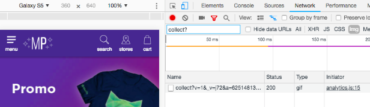
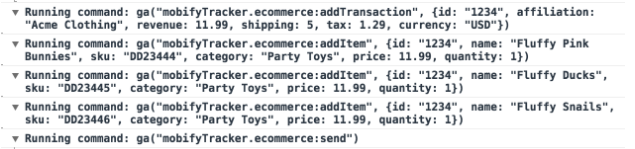
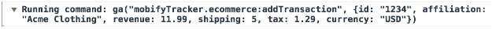
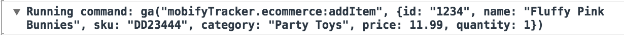
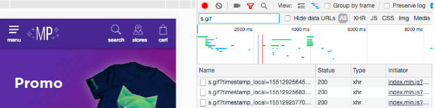
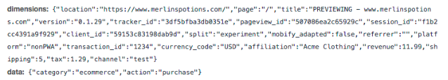

## Introduction

<Callout type="warning">
    <strong>Important:</strong> This guide is for A/B testing <strong>tag-loaded PWAs</strong>. For more information about A/B testing for server-side rendered PWAs, reach out to your Mobify account manager.
</Callout>

Setting up A/B testing is critical to your project’s success, as it’s the only way to precisely measure the impact of your PWA on revenue and shopper behavior. An A/B test is an experiment that compares your site's PWA with the existing experience. A/B testing is powerful because it’s fully randomized, and it’s precise. It eliminates other variables that may distort the results, such as seasonality, promotions, or product changes.

Setting up a well-executed A/B test is time-consuming undertaking, with many stages. In this guide, you will learn how to set up an A/B test from a code perspective. We will cover how to A/B test a tag-loaded PWA, using Mobify’s [split-test](https://github.com/mobify/split-test) library. Let’s dive in!

<Callout type="info">
    <strong>Note:</strong> Wondering what metrics you should be tracking and how to evaluate your A/B test? Take a look at <a href="https://www.mobify.com/insights/complete-guide-a-b-testing-progressive-web-app-2018/">The Complete Guide to A/B Testing Your Progressive Web App</a>.
</Callout>

This article will cover seven steps to setting up and managing your A/B test:

1. How to assign your traffic
2. How to serve different experiences to each bucket in your A/B test
3. Tracking your A/B test
4. Testing your A/B test implementation
5. Deploying your A/B test
6. How to adjust your A/B test
7. Ending the A/B test

As we go through these steps, we will build up example code for one of our most common use cases: A/B testing the PWA against the existing site. For this test, we split users into two groups: one that gets the PWA and another that gets the existing website.

### Essential skills

To follow along with this guide, it’s important that you have an intermediate to advanced level of experience with the following:

- Programming in JavaScript
- Experience with analytics systems
- Knowledge of A/B testing concepts

## Assign your traffic using split-test

Before you can start your A/B test, you will need to assign your site visitors into buckets to determine which version of the experiment they will see. We provide a library for doing this called `split-test`.

First, add `split-test` to your project:

```bash
npm install split-test --save-dev
```

Next, create a file called `split.js`. *By putting all of the A/B testing logic in this file, it will be easy to manage all your experiments from one place!*

In `split.js`, call `SplitTest.init` and pass it the configuration for your test:

```javascript
import SplitTest from 'split-test/src/split-test'

export const RATIOS = {
    pwa: 0.05,
    existing: 0.05,
    holdout: 0.90,
}

export const initSplitTest = () => {
    const splitTest = SplitTest.init(RATIOS, {
        // Namespace the test,
        // to avoid future conflicts
        namespace: 'pwa-ab-05',
    })
    return splitTest
}
```

The `split-test` library will assign a bucket for the current user and set a cookie that persists the bucket choice. The PWA can then use the utility `splitTest.getChoice()` or that cookie to customize the experience for the chosen bucket.

As a best practice when running an A/B test of the PWA, we recommend creating 3 buckets: **PWA, control, and holdout**.

- Users in the PWA bucket will receive the PWA
- Users in the control will receive the existing experience
- Users in the third bucket also receive the existing experience. In order to change the distribution of the assignments over the duration of the test, users in the holdout bucket can be assigned to the PWA condition, or to the control while users already in the PWA and control buckets should remain in their existing buckets.

For more information about how to change the experiment distribution, keep reading.

## Serve different experiences

Now that you have assigned your traffic into separate buckets, you can start creating different experiences for each bucket. When testing the PWA against the existing site, we will serve the PWA to one group and not the other.

### Serving the PWA

<Callout type="info">
    <strong>Note:</strong> This section relates to existing code within your project. Your code may be different from what’s in the example depending on how you have customized your project! This section should be taken as a general guide to what you could do; your actual implementation will differ.
</Callout>

Code within the file `loader.js` controls whether or not to load the PWA. You will want to update this file to check if the user is in the correct bucket to load the PWA, and to load the PWA conditionally, only for those users.

The file `loader.js` should already contain some code that checks some conditions before calling `loadPWA()`. Locate this code and update it to check the user’s bucket assignment, like in this example:

```javascript
// in loader.js
import {initSplitTest} from './split'

// Create in supported browsers
let splitTest
if (isSupportedPWABrowser()) {
    splitTest = initSplitTest()
    if (/googlebot/i.test(window.navigator.userAgent)) {
      // To keep SEO results consistent, Google Bot should only be served one version of the site.
      // You can choose to show GoogleBot either the PWA or the control site,
      // but the choice needs to persist for the entire duration of the split test.
      // This example serves GoogleBot the PWA bucket.
      splitTest.setChoice('pwa')
    }
}
const isInPWABucket = splitTest ? splitTest.getChoice() === PWA_BUCKET : false

if (
    // Load the PWA if the browser supports it and the route matches...
    (isInPWABucket && isSupportedPWABrowser() && isPWARoute())
) {
    // If we don't start to load the PWA, the existing site will continue to load as normal
    loadPWA()
}
```

Be sure to change the name of the bucket in the `splitTest.setChoice(bucketName)` function call above if the name of your bucket differs.

#### Reconfiguring Add to Home Screen

If a user is served the PWA, they may be prompted to add the app to their home screen. When they launch the PWA from this shortcut, you should keep them in the PWA bucket by changing the `start_url` property in `web/app/static/manifest.json`:

```json
{
  "name": "example.com",
  "short_name": "example.com",
  "start_url": "/?homescreen=1&split-test-force=pwa",
  "background_color": "#fff",
  "theme_color": "#4e439b",
  "display": "standalone",
  "icons": [
    {
      "src": "./img/global/app-icon-192.png",
      "sizes": "192x192"
    },
    {
      "src": "./img/global/app-icon-512.png",
      "sizes": "512x512"
    }
  ]
}
```

For more details on this feature, check out the [Configuring and Testing Add to Home Screen](add-to-home-screen) article.

## Tracking your A/B test

To track your A/B test, you’ll be using a combination of tools, including the Analytics Manager and Analytics Connectors. You can send data to as many tools as you like. By collecting the data in multiple tools, you can compare the results and ensure that each tool is tracking the A/B test correctly. We suggest that you implement tracking for:

1. Mobify's Google Analytics
2. Mobify's Engagement Engine
3. Customer Analytics

### Mobify's Google Analytics

To monitor and support projects’ performance, Mobify tracks PWA projects within Google Analytics.

When using Google Analytics, you must add the following custom dimensions to extract accurate results from the test:

1. **[A custom session-level dimension](https://support.google.com/analytics/answer/2709828?hl=en) to track the test bucket.** It’s extremely important that users stay within the same bucket for the duration of the test and that you analyze all metrics in terms of the user. For example, you should look at user conversion rate rather than session conversion rate because it’s the users that are being randomly split into groups, not the sessions.

2. **A custom session-level dimension to track a unique client ID for each user.** This is required so that you can calculate the standard deviation of any metrics that do not have a boolean outcome. For example, revenue per user is more than a yes/no value for each user. If you only care whether an action takes place or not, such as conversion, you can calculate the standard deviation without tracking individual users because the value for each user is either 1 or 0 (converted or did not).

<Callout type="info">
    <strong>Note:</strong> A user’s client ID is stored as a cookie. This means that if the user clears their cookies or that cookie expires, their client ID will change and they will be considered a different user within the test.
</Callout>

To track the PWA condition within Mobify’s Google Analytics, you will need to add the two custom dimensions to Mobify’s Google Analytics tracker. You can do this by passing a configuration object when initializing the Analytics Manager. For example:

```javascript
analyticsManager.init({
    projectSlug: AJS_SLUG,              // eslint-disable-line no-undef
    mobifyGAID: WEBPACK_MOBIFY_GA_ID,   // eslint-disable-line no-undef
    ecommerceLibrary: 'ec',
    debug: DEBUG,                       // eslint-disable-line no-undef
    splitTestTrackingConfig: {
        clientIDDimension: 3,
        bucketDimension: 4,
        bucketValue: 'experiment'
    }
})
```

This will enable A/B test tracking for Mobify's Google Analytics connector. The clientID will be sent as dimension 3, and the bucket value, `experiment`, will be sent as dimension 4. You can change the dimensions, although using 3 and 4 are recommended. Do not use 1 or 2, as those values are already used by Mobify's Google Analytics connector.

Next, ask your Mobify success team to set up the custom dimensions within [Mobify’s Google Analytics](https://support.google.com/analytics/answer/2709829). This will ensure the custom dimension is tracked correctly as soon as you launch your test. You will need to tell your Mobify success team which dimensions you.

Tracking the control condition tends to be a little more involved. To set that up, complete the following steps:

- Ask a Mobifyer to turn on desktop tracking for your project
- In split.js, create the following function:

```javascript
// in split.js

export const sendDesktopPageview = () => {
  window.Mobify.analytics.ua('mobifyTracker.set', 'customTask', (model) => {
      model.set('dimension3', model.get('clientId'))
      model.set('dimension4', splitTest.getChoice())
  })
  window.Mobify.analytics.ua('mobifyTracker.send', 'pageview')
}
```

- In loader.js, run the following code for the control condition (when the existing site is served):

```javascript
// in loader.js

waitForBody().then(() => {
    loadScriptAsPromise(
        {
            id: 'ajs',
            // Disable the automatic pageview event
            // so that we can set one manually
            // after the clientId has been set as a custom dimension
            src: `https://a.mobify.com/${AJS_SLUG}/a.js#npv=true`
        }).then(() => sendDesktopPageview())
    triggerSandyAppStartEvent(false, AJS_SLUG, PLATFORMS.NON_PWA)
})
```

- Update the file split.js so that when the user completes a transaction on desktop, a [Transaction event](https://developers.google.com/analytics/devguides/collection/analyticsjs/ecommerce#addTrans) gets sent. Here are a few tips we’ve found to be helpful as you do this:
  - Often, you can determine that a transaction has occurred by checking if the URL matches the URL of the order confirmation page
  - Many times, you can get the data to send the transaction event by parsing elements on the page
  - Be sure to wrap everything in a try-catch block and handle any exceptions. For an accurate A/B test, it is critical that an exception in this code does not negatively impact the desktop site.
  - Below is an example of what kind of data to send, and how to send it:

```javascript
// in split.js

const sendMobifyGATransaction = (transaction, transactionItems) => {
  window.ga('mobifyTracker.ecommerce:addTransaction', transaction)
  transactionItems.forEach((product) => {
      window.ga('mobifyTracker.ecommerce:addItem', product)
  })
  window.ga('mobifyTracker.ecommerce:send')
}

const sendTransaction = () => {
    const transaction = {
      id: '1234',
      affiliation: 'Acme Clothing',
      revenue: 11.99,
      shipping: 5,
      tax: 1.29,
      currency: 'USD'
  }

  const transactionItems = [
      {
          id: transaction.id,
          name: 'Fluffy Pink Bunnies',
          sku: 'DD23444',
          category: 'Party Toys',
          price: 11.99,
          quantity: 1
      }
  ]

  try {
      sendMobifyGATransaction(transaction, transactionItems)
  } catch (e) {
      // log the exception
  }
}
```

### Mobify's Engagement Engine

Mobify’s Engagement Engine is an analytics platform used to collect a variety of analytics events. To track a split test in Engagement Engine, you need to:

1. Send the split bucket to Engagement Engine
2. Implement transaction tracking on desktop

To send the split bucket to Engagement Engine:

1. Open split.js
2. At the top of the file, add the following comment. This will allow us to access some global flags, including the analytics ID for this project, AJS_SLUG:

```javascript
/* global AJS_SLUG, DEBUG */
```

3. In `initSplitTest`, add the following code after `splitTest` has been initialized:

```javascript
  // in split.js

// This snippet is from the Sandy Tracking Pixel.
// It allows us to queue commands for sandy before the script has finished loading.
/* eslint-disable */
(function(s,a) {
    s['SandyAnalyticsObject'] = a;
    s[a] = s[a] || function() {
        (s[a].q = s[a].q || []).push(arguments)
    }
})(window, 'sandy')
/* eslint-enable */

window.sandy('create', AJS_SLUG, 'auto')
window.sandy('set', 'split', splitTest.getChoice())
```

This will cause Engagement Engine to include the split bucket with every event it sends. This applies to both the PWA and the desktop site.

To track transactions on desktop in Engagement Engine:

1. In the file split.js, add a function to send the transaction data to Engagement Engine:

```javascript

// in split.js

// The format for Engagement Engine events is different
// from Google Analytics events
// so update the structure accordingly
const remapEngagementEngineTransaction = ({
  id,
  currency,
  ...rest
}) => ({
  transaction_id: id,
  currency_code: currency,
  ...rest
})

const remapEngagementEngineProduct = ({
  id,
  ...rest
}) => ({
  product_id: id,
  ...rest
})

const sendEngagementEngineEvent = (payload) => {
  if (DEBUG) {
      payload.channel = 'test'
  }
  // sandy is the name of the tracking client that sends data
  // to Engagement Engine
  window.sandy('send', 'event', payload)
}

// Utility for correctly formatting events
const createSandyPayload = (action, dimensions) => ({
  eventAction: action,
  eventCategory: 'ecommerce',
  ...dimensions
})

const sendMobifyEngagementEngineTransaction = (transaction, transactionItems) => {

  const remappedTransaction = remapEngagementEngineTransaction(transaction)

  // Send purchase events for each product in the order
  transactionItems.forEach((product) => {
      sendEngagementEngineEvent(createSandyPayload('purchase.product', {
          transaction_id: remappedTransaction.transaction_id,
          ...remapEngagementEngineProduct(product)
      }))
  })

  // Send the purchase event for the entire order
  sendEngagementEngineEvent(createSandyPayload('purchase', remappedTransaction))
}
```

2. Call `sendMobifyEETransaction` in the `sendTransaction` function like this:

```javascript
  const sendTransaction = () => {
    try {
        // ...

        sendMobifyGATransaction(transaction, transactionItems)
        sendMobifyEngagementEngineTransaction(transaction, transactionItems)
    } catch (e) {
        // ...
    }
}
```

### Sending data to other analytics platforms

Next, you will want to ensure that the split test will be tracked in your brand’s existing analytics. The implementation for this will differ depending on your brand’s analytics tools. Google Analytics is the most common, so we will use that as an example.

#### Your Brand’s Google Analytics

1. First, we need to create an analytics connector. Follow [these steps](../../../apis-and-sdks/progressive-web-sdk/analytics-integrations/overview#connectors) to create a new Google Analytics connector for your project. If your project is already using a Google Analytics connector, you can reuse that.
2. Open your analytics connector
3. Add the `splitTestTrackingConfig` object to the constructor, like this:
   ```javascript
   export default class MyGA extends GoogleAnalytics {
      constructor() {
          super('My GA', 'myTrackerName', {
              ecommerceLibrary: 'ec',
              splitTestTrackingConfig: {
                  clientIDDimension: 3,
                  bucketDimension: 4,
                  bucketValue: 'experiment-test'
              }
          })
   ```
4. Ask your brand’s analytics team to [set up the custom dimensions within your brand’s Google Analytics](https://support.google.com/analytics/answer/2709829). This ensures that you are able to see the custom dimension as soon as you launch your test. Keep in mind, it can take up to 24 hours for your custom dimension to apply if you add it after tracking begins.

For your brand’s Google Analytics, the client ID custom dimension is optional. When in doubt, if you plan to calculate standard deviation as part of your analysis, include it.

You will also need to add the custom dimensions to your tracking on the desktop site. Work with your brand’s analytics team to get this added. You may be able to use a Google Analytics [`customTask` to do this](https://www.simoahava.com/gtm-tips/use-customtask-access-tracker-values-google-tag-manager/).

## Testing your A/B test implementation

Moving on to quality assurance, there are three key objectives:

- Verify that the correct experience loads for each bucket
- Verify that users are being distributed correctly between buckets
- Test that the three analytics implementations are working correctly

### Verify the experience

To verify that the correct experience is served for each bucket, we want to provide a way to choose which bucket we are assigned. You can then check if the experience that is loaded is correct. It can also be used to opt into a particular experience when testing other things, such as performance of each experience. We highly recommend using a query parameter in the URL, which is easy for people testing on phones.

As an example, imagine that the URL for your website is www.example.com. If a user navigates to that page, they will be assigned a bucket by Split Test. If the user is a tester and wants to specify which bucket should be used, they can set the browser URL to `www.example.com?split-test-force=pwa` instead to choose the PWA experience.

Let's take a look at how we would do that:

```javascript
// in split.js

export const RATIOS = {
    pwa: 0.05,
    existing: 0.05,
    holdout: 0.90,
}

const getChoiceFromURL = () => {
   const searchParams = new URLSearchParams(window.location.search)
   const choice = searchParams.get('split-test-force')
   return RATIOS.hasOwnProperty(choice) ? choice : ''
}


export const initSplitTest = () => {
    const splitTest = SplitTest.init(RATIOS, {
        namespace: NAMESPACE,
    })

    const forcedChoice = getChoiceFromURL()
    if (forcedBucket) {
        splitTest.setChoice(forcedChoice)
    }

    return splitTest
}
```

Now, you can test your changes by using the query parameter. For example, manually set the bucket to the PWA condition, and check that the PWA loads. Test that the existing site appears when you manually set the bucket to the existing site.

### Verify the distribution

Generally, this can only be done after the smoke testing phase of the A/B test has started. Read on to Deploying for more information on how to test this.

### Test the analytics implementations
We can test each of the analytics implementations by using the following approach:
- Activate one of the experiences (either PWA or control)
- Perform an action (such as a pageview or purchase)
- Observe analytics logging or network traffic to check that the correct data was sent to the analytics platform

#### Google Analytics (Mobify and Brand)

To check that the Google Analytics implementations are working correctly, try the following steps for each analytics implementation:

**Verify pageview tracking**

<figure class="u-text-align-center">

  

</figure>

1. **Install** the Google Analytics Debugger Chrome Extension
2. **Open** the PWA within Chrome Developer tools
3. **Open** the console tab and **enter** ‘dimension’ into the filter. This will show you the Google Analytics logging related to the custom dimensions.

<figure class="u-text-align-center">


</figure>

4. **Examine** the data being passed to Google Analytics and check that it is correct.
   1. **Verify** that the request is going to the correct tracker. Each command that Google Analytics runs should contain the tracker name. If you are testing Mobify's Google Analytics implementation, this will be "`mobifyTracker`". For example: ga("`myTrackerName.send`","`pageview`")
   2. Next, **confirm** that the **client id** has been set correctly. To do so, record the value of **dimension3**, and compare this value to the cookie **_ga**. The cookie **_ga** should contain the value of dimension3.
   3. Finally, **check** that the split is being recorded correctly. Check that **dimension4** (or whatever dimension you chose) is set to the correct bucket for the current experience.
5. **Force** the split to the control bucket using the URL `?split-test-force=control`.
6. **Repeat** steps 3-4

**Verify transaction tracking**

1. **Install** the [Google Analytics Debugger Chrome Extension](https://chrome.google.com/webstore/detail/google-analytics-debugger/jnkmfdileelhofjcijamephohjechhna?hl=en)
2. **Open** the PWA within Chrome Developer tools
3. **Purchase** an item
4. **Open** the console tab and **locate** the logs for the Google Analytics ecommerce commands:

<figure class="u-text-align-center">



</figure>

5. **Verify** that the `ecommerce:addTransaction` command contains the correct information:
   1. The transaction id matches the backend data
   2. The revenue matches the grand total of the order (including tax, fee, shipping)
   3. Currency Code is included if available

<figure class="u-text-align-center">



</figure>

6. **Verify** that the `ecommerce:addItem` commands contain the correct information:
   1. Verify that there are the same number of `ecommerce:addItem commands` as there are products in the order
   2. The product details match the backend data

<figure class="u-text-align-center">



</figure>

7. **Force** the split to the control bucket using the URL `?split-test-force=control`
8. **Repeat** steps 3-6

#### Mobify's Engagement Engine

**Verify pageview tracking**

<figure class="u-text-align-center">



</figure>

1. **Open** the PWA within Chrome Developer tools.
2. **Open** the network tab and **enter** s.gif’ into the filter. This will show you all of the Engagement Engine requests.
3. **Click** on the request to see more information. From here, you can examine the query parameters being passed to Engagement Engine and check that the correct data is being passed.
   1. **Verify** that the request contains the split dimension. The query parameter dimensions contains an object. This object should contain a key called **split**. The value of split should contain the assigned bucket.
   2. **Force** the split to the control bucket using the URL `?split-test-force=control`
   3. **Repeat** steps 2-3

**Verify transaction tracking**

1. **Open** the PWA within Chrome Developer tools.
2. **Open** the network tab and **enter** s.gif’ into the filter. This will show you all of the Engagement Engine requests.
3. **Purchase** an item.
4. **Locate** the s.gif request that contains the purchase event. The query parameter data will be set to {"`category`":"`ecommerce`","`action"`:"`purchase`"}

<figure class="u-text-align-center">



</figure>

5. **Verify** that the query parameter **dimensions** contains the correct data:
   1. The transaction_id matches the backend data
   2. The revenue matches the grand total of the order (including tax, fee, shipping)
   3. The currency_code is included if available
6. **Locate** the s.gif request that contains the purchase product event. The query parameter data will be set to {"`category`":"`ecommerce`","`action`":"`purchase.product`"}

<figure class="u-text-align-center">


</figure>

7. **Verify** the purchase product event contains the correct data:
   1. The `transaction_id` matches the backend data.
   2. There are the same number of purchase product requests as there are products in the order.
   3. The product information matches the backend data
8. **Force** the split to the control bucket using the URL `?split-test-force=control`
9. **Repeat** steps 2-7

## Deploying

Because the logic for controlling the split lives within the PWA, you can deploy the split test, (and changes to the split test) by publishing a new bundle in Mobify Cloud.

Before you start the full A/B test, we recommend serving the PWA to a smaller ratio of your traffic in order to test that the test is working correctly. Typically, this means publishing a bundle that serves the PWA to 5% of your traffic.

Once this bundle is published, you should check that the traffic is being distributed correctly. Reach out to your brand’s analytics team and ask them how much traffic is being assigned to each experience. Verify that this matches the ratios that you set when configuring the A/B test. Reach out to your Mobify Success Team and they will perform the same check using Mobify's Google Analytics and Mobify's Engagement Engine.

## Changing the experiment distribution

If you want to change the ratio for your experiment’s assignments, you also need to change the namespace of the test itself. Otherwise, users who have already been assigned to a bucket will not be re-assigned to a new bucket, leading to incorrect ratios.

When testing the PWA against the existing site, we suggest starting with a small ratio of traffic assigned to the PWA bucket, then slowly increasing to a larger fraction of the traffic. This helps to avoid biasing against either experience. For example, if the user switches from a performant PWA to a slower desktop site later in the test, it could decrease their trust in the site and decrease their likelihood of purchasing. As you change the experiment distribution, users who have already been placed into the PWA bucket should remain in the PWA bucket. The same holds true for users in the control group. Only users in the holdout bucket can be assigned to a new bucket.

To manage experiment distribution changes, we recommend including some information about the distribution in the namespace of the test. This makes it easier to remember to change the name when updating the distribution, and helps in retrieving results for old versions of the test.

We recommend that you start with 5% of your traffic in the PWA bucket in order to test your site and ensure that everything is working correctly. Your distribution for this test might look like:
- 5% PWA
- 5% Control
- 90% Holdout

Once that testing is complete, we recommend moving straight to serving the PWA to 50% of your traffic. This is the stage you want to analyze when looking at your A/B test results. Your distribution for this test might look like:
- 50% PWA
- 50% Control
- 0% Holdout

After this stage we typically switch to 100% PWA traffic. As a result, we don’t need to maintain the holdout group as we will not be making further changes to the distribution.

For example, previously we named the test pwa-ab-05 because we were serving the PWA to 5% of users. To update this to 50%, we would need to update both the ratios, and the test name, like this:

```javascript
export const PWA_BUCKET = 'pwa'
export const CONTROL_BUCKET = 'existing'
export const HOLDOUT_BUCKET = 'holdout'
// Namespace is specific to current test,
// in order to avoid conflict with future tests
export const NAMESPACE_05 = 'pwa-ab-05'
export const NAMESPACE_50 = 'pwa-ab-50'
export const RATIOS = {
    [PWA_BUCKET]: 0.5,
    [CONTROL_BUCKET]: 0.5,
    [HOLDOUT_BUCKET]: 0,
}
```

When making changes, we also want to check the user’s state in the previous version of the split. In order to give more users a consistent experience, we only want to change the bucket of users that were in the holdout group. If a user was previously experiencing the PWA, they should continue to experience the PWA. The same holds for users in the control group. That might look sometime like this:

```javascript
import {getCookieValue} from 'progressive-web-sdk/dist/utils/utils'

// -split is added to the end of the cookie name
const oldBucket = getCookieValue(`${NAMESPACE_05}-split`)

if (oldBucket === PWA_BUCKET) {
    splitTest.setChoice(PWA_BUCKET')
}

if (oldBucket === CONTROL_BUCKET) {
    splitTest.setChoice(CONTROL_BUCKET')
}
```

If you change the ratios of the experiment multiple times, you will need to make these changes each time.

Once users enter the test by being placed into the PWA or control buckets, it’s important that they stay in their assigned buckets. Keep this in mind if you would like to change the bucket assignments as your test matures. If you decide to change the experiment distribution, for example, to send a higher ratio of your traffic to the PWA, then all users that are already in the experiment will stay in their buckets. To achieve the new ratio, new website visitors will be assigned to buckets according to the newly desired split.

In the example above, we set the holdout group to 0%. This means that we are assigning all users to either the PWA or to the control group. Because we want to keep users in their assigned buckets, this means that we cannot effectively change the experiment distribution after setting the holdout to 0%. If you’d like the flexibility to change the experiment distribution as the test matures, ensure that you leave some users in the holdout group.

<Callout type="info">
    <strong>Note:</strong> We mentioned this earlier, but it's worth stating again. The A/B test is persisted using a cookie. If the user clears their cookies, or if their split-test cookie expires, they will be treated like a new user the next time they load the PWA. This means they may be assigned a different bucket than the last time they visited the site. While we try to ensure that users have a consistent experience during the A/B test, we cannot guarantee it.
</Callout>

## Ending the A/B test

To end your A/B test, remove the code responsible for splitting your traffic from the PWA.

If desired, you can leave the tracking in place. For most PWAs, there will be a subset of pages or browsers that are not supported by the PWA. Users on these unsupported pages or browsers will always experience the existing site. Continuing to track these users even after the A/B test has ended can provide valuable information. It can help you identify other pages that would benefit from being added to the PWA, or devices with enough users to make them worth supporting.

## Next steps

By the end of this tutorial, you'll be well on your way to setting up your PWA's A/B test, from a code perspective.

To continue your learning journey, try another one of our hands-on exercises in [Guides](../../).
